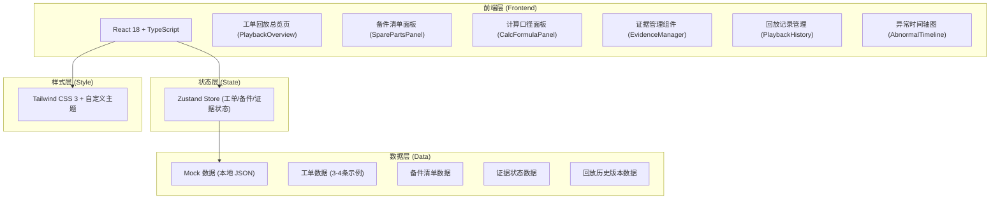
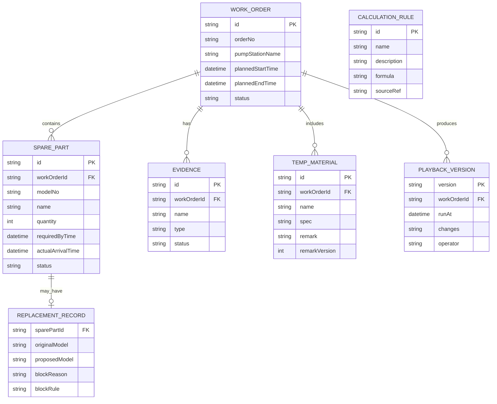

## 1. 架构设计


## 2. 技术描述
- 前端：React@18 + TypeScript + Vite
- 状态管理：Zustand（轻量，适合回放状态追踪）
- 样式：Tailwind CSS@3 + 自定义CSS变量主题
- 图表：原生 SVG 绘制异常时间轴甘特图（不依赖重型图表库，灵活控制交互）
- 路由：React Router DOM
- 初始化工具：vite-init，使用 react-ts 模板
- 后端：无，使用本地 Mock 数据（需求强调回放和补录，数据量小）
- 数据持久化：localStorage 存储补录备注和重跑版本

## 3. 路由定义
| 路由 | 用途 |
|------|------|
| / | 工单回放总览（默认路由，含所有面板） |
| /workorder/:id | 单工单详情回放 |

## 4. API 定义（无后端）
状态管理使用 Zustand，类型定义如下：

```typescript
// 工单状态
interface WorkOrder {
  id: string;
  orderNo: string;
  pumpStationName: string;
  plannedStartTime: string;
  plannedEndTime: string;
  actualStartTime?: string;
  actualEndTime?: string;
  status: 'smooth' | 'supplement' | 'abnormal';
  spareParts: SparePart[];
  evidences: Evidence[];
  tempMaterials: TempMaterial[];
}

// 备件
interface SparePart {
  id: string;
  modelNo: string;
  name: string;
  quantity: number;
  requiredByTime: string;
  actualArrivalTime: string;
  status: 'normal' | 'delayed' | 'replaced_blocked';
  replacement?: ReplacementRecord;
}

// 型号替换记录
interface ReplacementRecord {
  originalModel: string;
  proposedModel: string;
  blockReason: string;
  blockRule: string;
}

// 临时材料
interface TempMaterial {
  id: string;
  name: string;
  spec: string;
  remark: string;
  remarkUpdatedAt?: string;
  remarkVersion: number;
}

// 证据
interface Evidence {
  id: string;
  name: string;
  type: 'arrival_proof' | 'inspection_record' | 'photo';
  status: 'confirmed' | 'pending';
  uploadTime?: string;
  remark?: string;
}

// 回放历史
interface PlaybackVersion {
  version: string;
  runAt: string;
  changes: string[];
  operator: string;
}

// 计算口径
interface CalculationRule {
  id: string;
  name: string;
  description: string;
  formula: string;
  sourceRef: string;
}
```

## 5. 服务器架构图（无后端）
纯前端应用，无服务器层。状态管理通过 Zustand Store 统一管理，数据初始加载自 src/data/mockData.ts，补录和重跑版本存入 localStorage。

## 6. 数据模型
### 6.1 数据模型定义


### 6.2 Mock 初始数据
预置 4 条工单数据：
1. **顺利记录（1条）**：全部备件按时到货，证据齐全，无替换，临时材料备注完整
2. **补录记录（1条）**：1项临时材料备注待补，1项证据待上传
3. **异常记录（2条）**：
   - 异常1：2项备件到货晚于停机窗口（时间轴红色高亮）
   - 异常2：1项备件型号替换被拦截，附带详细拦截规则说明
