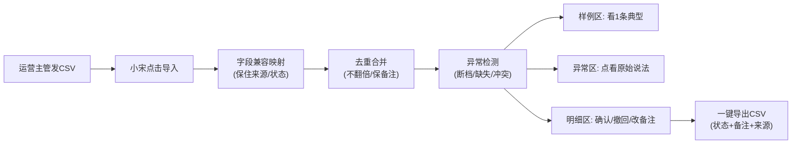

## 1. 产品概述

泵站巡检异常归因工具，帮助现场调度员在交接班时顺着备件清单说清"上一班改了什么"。工具以本地CSV导入为起点，通过字段兼容映射、去重保备注、状态流转三件事，让调度小宋不用翻文件、不用问人就能交接清楚。

- 核心问题：运营主管交来的备件清单字段名前后不一、重复导入记录翻倍、采样断档只给含糊警告、人工备注被覆盖、历史丢失
- 目标用户：现场调度（小宋，一线执行）、运营主管（清单来源）

---

## 2. 核心功能

### 2.1 用户角色

| 角色 | 使用方式 | 核心场景 |
|------|---------|---------|
| 现场调度（小宋） | 主使用人 | 导入当班清单 → 看异常 → 确认/撤回 → 导出交接结果 |
| 运营主管 | 数据提供方 | 生成并交来备件清单CSV（字段可能前后不一） |

### 2.2 功能模块

1. **主页面**：操作条（导入/确认/撤回/导出）+ 三段分区（样例区/异常区/明细区）
2. **字段映射层**：自动兼容运营主管的字段名变体，保住"来源文件"与"处理状态"两个锚点
3. **去重与保备注**：重复导入不翻倍、人工备注永不被覆盖、重跑保住历史备注
4. **断档追踪**：采样断档直接链到该条的"原始说法"（原始行原文），不是含糊的警告句
5. **导出**：CSV明细与当前状态对齐（含处理状态、人工备注、来源文件）

### 2.3 页面详情

| 页面名称 | 模块名称 | 功能描述 |
|---------|---------|---------|
| 主页面 | 顶部操作条 | 导入CSV、批量确认、撤回选中、一键导出（四个按钮，无多余入口） |
| 主页面 | 样例区（小宋视角1） | 默认展开1条已确认的典型交接样例，标红关键词：改了什么、原说法、备注 |
| 主页面 | 异常区（小宋视角2） | 顶部计数徽章 + 异常列表，三类异常：采样断档、字段缺失、状态冲突，每条可点看原始行 |
| 主页面 | 明细区（小宋视角3） | 表格展示所有记录，列含：备件编号、原始描述、来源文件、处理状态、人工备注、操作按钮 |
| 主页面 | 行操作 | 单条确认/撤回、编辑备注（不可被覆盖）、查看原始说法抽屉 |

---

## 3. 核心流程

小宋接班日常流程：
1. 运营主管发过来今日备件清单CSV，字段名可能是"备件编号"也可能是"物料号"
2. 小宋点击"导入CSV"，工具自动识别字段并写入本地存储
3. 工具先跑一遍去重：与现有同来源/同编号的记录合并，人工备注保留旧值
4. 小宋看"异常区"：断档的直接点进去看原始行原文，不用猜"到底哪断了"
5. 对处理完的行勾选确认，发现改错了就撤回
6. 下班前点"一键导出"，CSV明细与当前状态完全对齐，交给下一班

---

## 4. 用户界面设计

### 4.1 设计风格

- 主色：工业蓝 `#1E40AF`（泵站调度的稳重感）+ 警示橙 `#EA580C`（异常高亮）
- 辅助色：确认绿 `#15803D`，撤回灰 `#64748B`
- 按钮风格：方角微圆（2px圆角），2px边框，工业感
- 字体：标题用"思源黑体 Heavy"，正文用"思源宋体 Regular"（工业文档感，避开Inter/Roboto）
- 布局：顶部操作条 + 下方三栏竖向堆叠（样例区→异常区→明细区），左对齐不居中
- 图标：SVG线性图标，避免emoji（工业现场不花哨）

### 4.2 页面设计概述

| 页面名称 | 模块名称 | UI元素 |
|---------|---------|--------|
| 主页面 | 操作条 | 4个按钮横排：导入(蓝实心)、确认(绿描边)、撤回(灰描边)、导出(蓝描边)，右对齐放统计徽标 |
| 主页面 | 样例区 | 卡片样式，左边竖条蓝线，标题"接班样例（这条改了什么）"，内容3行：原值/新值/备注 |
| 主页面 | 异常区 | 3个分类标签页：断档(橙)、缺失(红)、冲突(紫)，每条可展开抽屉看原始CSV行原文 |
| 主页面 | 明细区 | 斑马纹表格，状态列用色标块，备注列可内联编辑且有"已锁定"小标 |

### 4.3 响应式

桌面优先（调度室用大屏），最小断点1024px，表格横向滚动不折行。触屏端按钮加高到44px。

---
