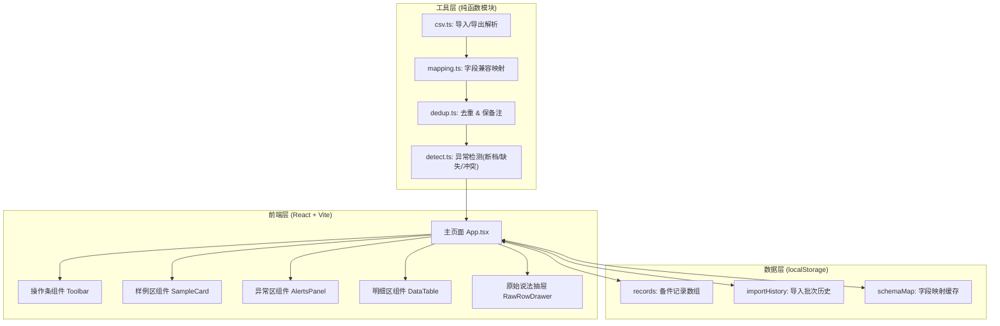
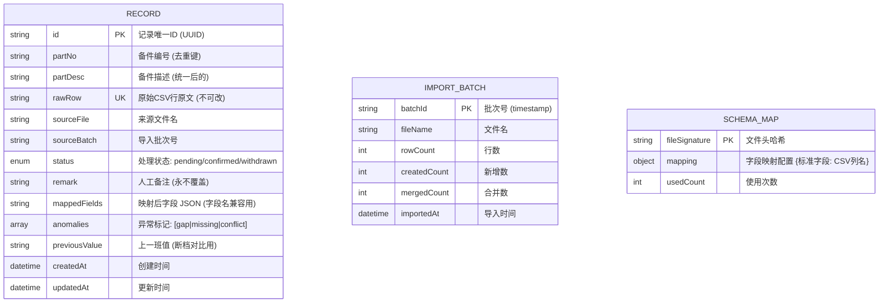
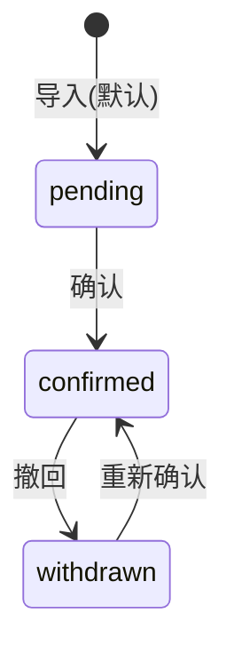

## 1. 架构设计

无后端、纯前端单页应用。数据全部持久化在浏览器 localStorage，导入/导出均为本地 CSV 文件，无外部服务依赖。



---

## 2. 技术描述

- **前端框架**：React 18 + TypeScript
- **构建工具**：Vite 5
- **样式**：Tailwind CSS 3.4
- **状态管理**：React useState + useReducer（规模小，无需 Redux）
- **持久化**：localStorage（封装 useLocalStorage hook）
- **CSV 解析**：papaparse 5.4（业内稳定、带类型声明）
- **后端**：无
- **数据库**：localStorage（key 前缀 `pump-station::*`）
- **字体**：Google Fonts — Noto Sans SC Heavy + Noto Serif SC Regular（通过 <link> 引入，工业文档风）

---

## 3. 路由定义

单页应用，仅 1 个路由：

| 路由 | 用途 |
|------|------|
| `/` | 主页面：操作条 + 样例区 + 异常区 + 明细区 |

---

## 4. 数据模型

### 4.1 数据模型定义



### 4.2 localStorage Key 约定

| Key | 类型 | 说明 |
|-----|------|------|
| `pump-station::records` | `Record[]` | 所有备件记录 |
| `pump-station::batches` | `ImportBatch[]` | 导入批次历史 |
| `pump-station::schemas` | `SchemaMap[]` | 字段映射记忆（下次同字段自动匹配） |
| `pump-station::version` | `string` | 数据版本号，用于后续迁移 |

---

## 5. 核心算法说明

### 5.1 字段兼容映射（mapping.ts）

维护标准字段别名表，导入时逐列做模糊匹配（包含+去空格+全半角归一），至少保证两个字段被识别：
- **来源字段** → `sourceFile`（从文件名注入，不依赖列）
- **处理状态** → `status`（若CSV无此列，默认 `pending`）

标准字段及其别名示例：
```
partNo:  备件编号 / 物料号 / 零件号 / PartNo / SKU
partDesc: 备件描述 / 名称 / 品名 / 规格型号
status:  处理状态 / 状态 / 审核状态 / Status
remark:  备注 / 人工备注 / 说明 / 交接说明
sampling: 采样值 / 读数 / 巡检值 / 采样
```

### 5.2 去重与保备注（dedup.ts）

去重键 = `partNo + sourceFile`（同一份文件的同一编号视为同一条）。合并策略：
- 若旧记录有 `remark`：新记录的 `remark` 丢弃，保留旧值（**永不覆盖**）
- 若旧记录的 `status == confirmed`：新记录 `status` 取旧值
- 其他字段：以新记录为准，但 `rawRow` 追加到历史数组（保留原始说法）
- 返回 `{ createdCount, mergedCount, skippedCount }` 用于提示

### 5.3 断档检测（detect.ts）

按 `partNo` 分组后按 `createdAt` 排序，相邻两条的 `sampling` 值：
- 差值 > 阈值 或 出现 null/空 → 标记 `gap`
- 异常记录附带 `gapDetail: { prevRowId, prevValue, currValue }`，点击可链到原始行

### 5.4 状态流转



---

## 6. 目录结构

```
src/
├── components/
│   ├── Toolbar.tsx         # 操作条：导入/确认/撤回/导出
│   ├── SampleCard.tsx      # 样例区
│   ├── AlertsPanel.tsx     # 异常区（三标签）
│   ├── DataTable.tsx       # 明细区表格
│   ├── RawRowDrawer.tsx    # 原始说法抽屉
│   └── StatusBadge.tsx     # 状态色标块
├── hooks/
│   └── useLocalStorage.ts  # localStorage 封装
├── lib/
│   ├── csv.ts              # papaparse 导入/导出
│   ├── mapping.ts          # 字段兼容映射
│   ├── dedup.ts            # 去重 + 保备注
│   ├── detect.ts           # 异常检测（断档等）
│   └── types.ts            # 类型定义
├── data/
│   └── seed.ts             # 种子样例数据（首次打开展示）
├── App.tsx
├── main.tsx
└── index.css
```
