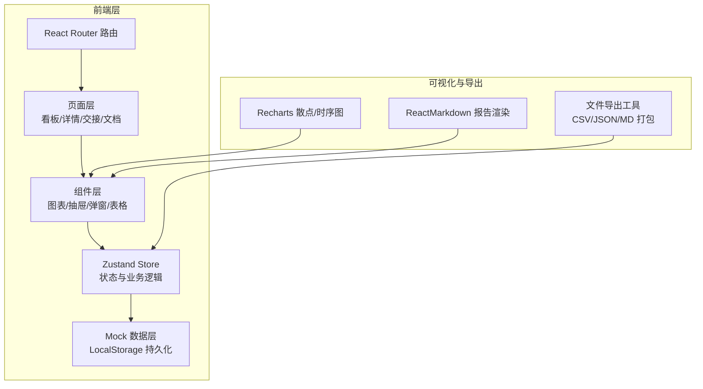
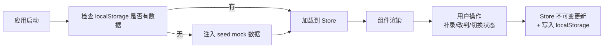
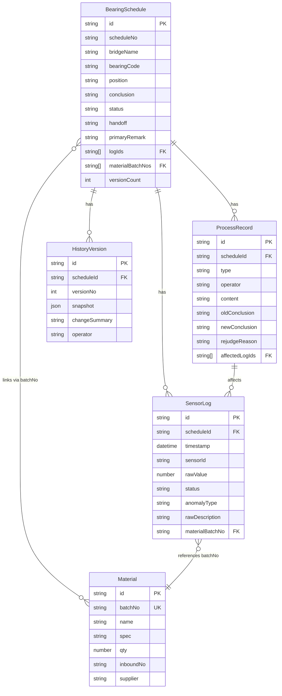

## 1. 架构设计

纯前端 React 应用，使用 zustand 管理全局状态（含 mock 数据层），无需后端即可完整演示所有业务流程。数据持久化使用 localStorage 模拟数据库。



## 2. 技术说明

- **前端**：React@18 + TypeScript + Vite + TailwindCSS@3
- **初始化工具**：vite-init（react-ts 模板）
- **状态管理**：zustand（含 immer 中间件简化不可变更新）
- **路由**：react-router-dom@6
- **图表**：recharts（ScatterChart + LineChart 复合）
- **图标**：lucide-react
- **Markdown**：react-markdown + remark-gfm
- **后端**：无（纯前端 mock）
- **数据库**：localStorage + 初始 seed 数据

## 3. 路由定义

| 路由 | 页面 | 用途 |
|------|------|------|
| `/` | 重定向到 `/schedules` | 默认入口 |
| `/schedules` | 排程看板页 | 散点图+状态卡+排程列表 |
| `/schedules/:id` | 排程详情页 | 大图+材料+日志+历史版本+补录入口 |
| `/handoff` | 交接状态看板 | 放行/缺材料双栏 |
| `/handover` | 收尾文档中心 | 日志+记录+Markdown三合一预览与导出 |

## 4. API 定义（前端 Store 接口，mock）

```typescript
// 核心实体类型
interface SensorLog {
  id: string;
  scheduleId: string;
  timestamp: ISO8601;
  sensorId: string;
  bearingCode: string;      // 支座编号
  rawValue: number;         // 原始值（不做均值平滑）
  status: 'normal' | 'anomaly' | 'gap';
  anomalyType?: 'over_threshold' | 'spike' | 'drift' | 'sensor_offline';
  rawDescription: string;   // 传感器日志原始说法（关键字段）
  materialBatchNo?: string; // 关联材料批次
  createdAt: ISO8601;
}

interface Material {
  id: string;
  batchNo: string;          // 材料批次号（追溯主键）
  name: string;             // 如"球形支座QZ-2000"
  spec: string;
  qty: number;
  inboundNo: string;
  supplier: string;
  scheduleIds: string[];
  receivedAt: ISO8601;
  remark?: string;          // 小包材料说明（后补）
}

interface ProcessRecord {
  id: string;
  scheduleId: string;
  type: 'note' | 'supplement' | 'rejudge';
  operator: string;         // 现场调度小宋/运营主管
  content: string;
  oldConclusion?: ScheduleConclusion;
  newConclusion?: ScheduleConclusion;
  rejudgeReason?: string;   // 改判原因（强制字段）
  affectedLogIds?: string[];
  timestamp: ISO8601;
}

interface HistoryVersion {
  id: string;
  scheduleId: string;
  versionNo: number;
  snapshot: {
    conclusion: ScheduleConclusion;
    remark: string;
    materialBatchNos: string[];
    status: ScheduleStatus;
  };
  changeSummary: string;
  operator: string;
  createdAt: ISO8601;
}

type ScheduleConclusion = 'normal' | 'anomaly' | 'pending' | 'rejudged_normal' | 'rejudged_anomaly';
type ScheduleStatus = 'draft' | 'reviewing' | 'handoff_ready' | 'handoff_missing' | 'closed';
type HandoffStatus = 'releasable' | 'missing_material' | 'pending';

interface BearingSchedule {
  id: string;
  scheduleNo: string;       // 如 BR-2026-06-001
  bridgeName: string;
  bearingCode: string;
  position: string;         // 如"3#墩右幅上游"
  conclusion: ScheduleConclusion;
  status: ScheduleStatus;
  handoff: HandoffStatus;
  primaryRemark: string;
  logIds: string[];
  materialBatchNos: string[];
  versionCount: number;
  createdAt: ISO8601;
  updatedAt: ISO8601;
}

// Store 方法签名
interface ScheduleStore {
  schedules: BearingSchedule[];
  sensorLogs: SensorLog[];
  materials: Material[];
  processRecords: ProcessRecord[];
  historyVersions: HistoryVersion[];
  
  // 查询
  getScheduleById: (id: string) => BearingSchedule | undefined;
  getLogsBySchedule: (scheduleId: string) => SensorLog[];
  getMaterialsBySchedule: (scheduleId: string) => Material[];
  getProcessRecordsBySchedule: (scheduleId: string) => ProcessRecord[];
  getVersionsBySchedule: (scheduleId: string) => HistoryVersion[];
  getHandoffGroups: () => { releasable: BearingSchedule[]; missing: BearingSchedule[]; pending: BearingSchedule[] };
  
  // 操作
  supplementNote: (scheduleId: string, payload: { content: string; operator: string }) => void;
  rejudge: (scheduleId: string, payload: {
    newConclusion: ScheduleConclusion;
    rejudgeReason: string;
    remark?: string;
    operator: string;
    affectedLogIds?: string[];
  }) => void;
  setHandoffStatus: (scheduleId: string, status: HandoffStatus, operator: string) => void;
  
  // 导出
  exportMarkdownReport: (scheduleId: string) => string;
  exportMaterialPackage: (scheduleId: string) => {
    'sensor_logs.csv': string;
    'process_records.json': string;
    'report.md': string;
  };
}
```

## 5. 服务器架构图

无后端。前端 zustand store 直接读写 localStorage，seed 数据在应用启动时注入。



## 6. 数据模型

### 6.1 数据模型 ER 图



### 6.2 初始 Seed 数据说明

预置 2 个小包演示排程：

**包 A（有异常+断档+补录改判完）**：
- 排程 BR-2026-06-001，青岩大桥 3#墩右幅支座
- 24 条传感器日志（20 条正常 + 2 条异常超限 + 2 条断档离线）
- 1 条补录备注 + 1 次改判（anomaly→rejudged_normal，原因：异常为传感器漂移已校准）
- 2 个历史版本
- 关联 1 批材料 QZ-2000-B20260512
- 交接状态：releasable

**包 B（待处理，缺材料）**：
- 排程 BR-2026-06-002，青岩大桥 5#墩左幅支座
- 24 条传感器日志（18 正常 + 4 异常尖峰 + 2 条断档）
- 0 补录，结论 anomaly
- 1 个版本
- 未关联材料批次（缺料）
- 交接状态：missing_material
