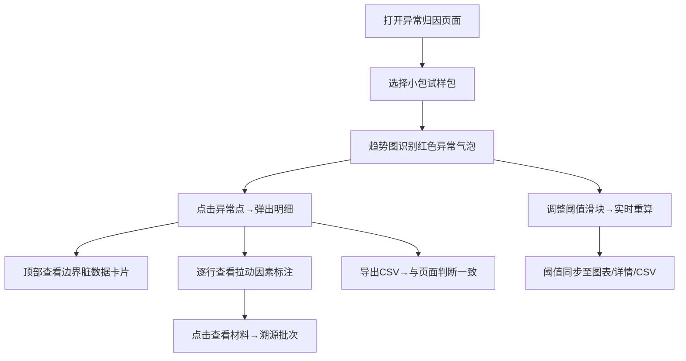

## 1. 产品概述
面向桥梁运维团队的异常归因分析工具，解决"异常被平均值掩盖"的核心痛点，帮助运营主管从宏观异常图表一路下钻定位到具体材料批次。
- 目标用户：运营主管（看趋势、追责任）、设备工程师老何（对明细、查材料）
- 产品价值：用"去均值掩盖"算法单独拎出边界脏数据，打通"异常点→明细→材料"的归因链路，阈值策略在页面/详情/CSV三处保持一致。

## 2. 核心功能

### 2.1 用户角色
| 角色 | 注册方式 | 核心权限 |
|------|----------|----------|
| 运营主管 | 无需注册（内部工具） | 查看异常归因图表、点击下钻明细、调整阈值、导出CSV |
| 设备工程师 | 无需注册（内部工具） | 查看材料明细、核对边界样本、确认脏数据来源 |

### 2.2 功能模块
1. **异常归因总览页**：趋势图表（含异常高亮）、阈值调节面板、汇总指标卡片
2. **异常明细弹窗**：被选中异常点的所有样本、拉动因素标注、边界样本单独区块
3. **材料溯源面板**：从明细行跳转至材料批次信息、供应商、入库记录
4. **CSV导出模块**：按当前阈值与页面判断完全一致输出明细文件

### 2.3 页面详情
| 页面名称 | 模块名称 | 功能描述 |
|----------|----------|----------|
| 异常归因总览页 | 趋势图表 | 时间序列折线+异常点红色描边气泡，鼠标悬停显示异常摘要，点击异常点下钻明细 |
| 异常归因总览页 | 阈值调节面板 | 滑块+数值输入联动，调整后立即重算并重绘图表，阈值数值同步显示在图表右上角水印、详情表头、CSV首行注释 |
| 异常归因总览页 | 汇总指标卡片 | 异常数/正常数/边界样本数/拉动占比，卡片点击联动对应筛选 |
| 异常归因总览页 | 试样包切换 | 下拉切换"小包试流程"（含1条边界脏数据）与"全量数据" |
| 异常明细弹窗 | 样本列表 | 表格展示该异常点的所有检测样本，每一行标注"拉动因素：偏离均值X%（贡献Y%）" |
| 异常明细弹窗 | 边界样本区块 | 顶部单独卡片展示被判定为脏数据/边界样本的记录，红色背景+异常原因文字 |
| 异常明细弹窗 | CSV导出按钮 | 按当前阈值与判断结果导出，文件名带时间戳与阈值标记 |
| 材料溯源面板 | 批次信息卡片 | 从明细行"查看材料"按钮展开，显示材料批号、供应商、入库日期、同批次其他异常记录 |

## 3. 核心流程
运营主管打开页面 → 默认展示"小包试流程"试样包 → 查看趋势图上的异常点（红色气泡） → 发现异常被单独标出而非淹没在均值里 → 点击异常点弹出明细 → 顶部先看到边界脏数据卡片 → 向下滚动查看每条样本的拉动因素标注 → 对可疑行点击"查看材料"溯源 → 回到总览调整阈值滑块 → 观察重算结果 → 点击"导出CSV"得到与页面判断一致的文件 → 设备工程师按README指引定位坏材料批次。

## 4. 用户界面设计
### 4.1 设计风格
- **主色**：深青蓝 `#0F3B4B`（工业/专业感），辅色：警示橙 `#FF6B35`、异常红 `#D72638`、正常绿 `#27A36E`
- **按钮风格**：直角微圆角（2px），实心按钮带细微下沉阴影，阈值滑块轨道渐变色
- **字体**：标题用 `Charter/Georgia` 衬线体（庄重），正文与数据用 `JetBrains Mono` 等宽字体（对齐数字）
- **布局**：三栏结构——左（阈值+试样包控制）、中（趋势图+汇总卡片）、右（材料溯源常驻面板）
- **图标风格**：线性图标 + 轻微工业感刻度线装饰，异常点用六角形警示徽章

### 4.2 页面设计概览
| 页面名称 | 模块名称 | UI元素 |
|----------|----------|--------|
| 总览页 | 趋势图表 | 深色图表区+浅色网格线，异常点六角形气泡，悬停时放大并显示3行摘要，点击后保持选中态 |
| 总览页 | 阈值面板 | 左侧深色侧栏，滑块带刻度，当前阈值以大号等宽字体显示，下方"已应用到图表/详情/CSV"三态勾选 |
| 总览页 | 汇总卡片 | 四张卡片横向排列，每张带小趋势图，异常数卡片红色渐变边框，点击时触发筛选联动 |
| 明细弹窗 | 边界样本区 | 弹窗顶部全宽红色条纹卡片，左侧六角感叹号图标，右侧样本详情+异常原因标签 |
| 明细弹窗 | 样本表格 | 斑马纹行，拉动因素列带彩色进度条（贡献占比可视化），最后一列"查看材料"按钮 |
| 材料溯源面板 | 批次卡 | 右侧常驻抽屉，半透明毛玻璃背景，批次号大号字体，下方供应商/入库/同批异常标签 |

### 4.3 响应性
- 桌面端（≥1280px）：三栏完整布局，弹窗居中
- 平板端（768-1279px）：阈值面板折叠为顶部横条，材料溯源面板转为底部抽屉
- 移动端（<768px）：单列滚动，图表优先展示，弹窗全屏

### 4.4 动画与细节
- 阈值调整后图表重绘：折线形变 400ms ease-out，异常气泡淡入 200ms
- 异常点点击：气泡脉冲涟漪 + 弹窗从点位置放大出现
- 边界脏数据卡片：红色呼吸灯边缘动画（暗示"需要关注"）
- 页面首次加载：卡片与图表按序 staggered reveal（50ms 间隔）
