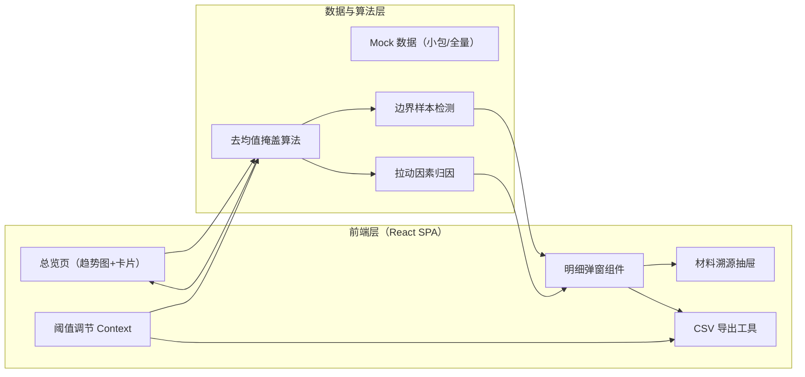
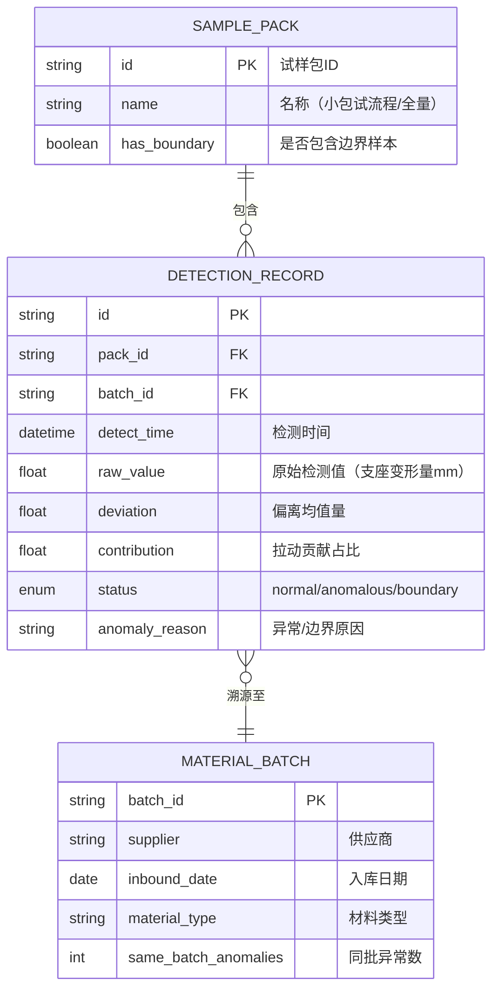

## 1. 架构设计
纯前端单页应用，无后端依赖，使用本地 Mock 数据模拟"小包试样包"与全量数据。核心算法在浏览器端执行，阈值状态通过 React Context 全局同步。



## 2. 技术说明
- **前端框架**：React@18 + TypeScript@5 + Vite@5
- **样式方案**：TailwindCSS@3（utility-first）+ CSS Variables（主题色）
- **图表库**：Recharts@2（基于 SVG，支持自定义图形元素，便于绘制六角形异常气泡）
- **状态管理**：React Context + useReducer（阈值、当前试样包、选中异常点）
- **图标**：Lucide React（线性图标库，符合工业感设计）
- **CSV 导出**：原生 Blob + 手动构建 CSV 字符串（不引入额外依赖，确保与页面判断逻辑完全共用）
- **初始化工具**：`npm create vite@latest . -- --template react-ts`

## 3. 路由定义
| 路由 | 用途 |
|------|------|
| `/` | 异常归因总览页（单页应用唯一入口，所有模块以组件形式挂载） |

## 4. 核心算法与数据模型

### 4.1 数据模型定义


### 4.2 "去均值掩盖"算法逻辑
1. 按时间窗口分组计算组内均值 μ
2. 计算每个样本的绝对偏差 |x - μ|
3. 对偏差做排序，取前 P95 分位作为初步异常候选
4. **关键反掩盖步骤**：若某样本偏差 > 2σ 但其所在组均值因该样本被拉高/拉低超过 15%，则单独标记为"强拉动异常"，不参与该组均值重算（迭代一次）
5. 边界样本判定：偏差处于阈值 ±5% 范围内，或 raw_value 缺失/字段异常 → 标记为 boundary 并单独区块展示

### 4.3 阈值同步机制
- 单一数据源：`ThresholdContext` 存放 `threshold: number`
- 订阅者：
  - 图表组件：读取 threshold 重绘异常气泡 + 右上角水印
  - 详情弹窗：读取 threshold 在表头显示 "当前阈值: X.X mm"
  - CSV 导出：在文件首行写入 `# 阈值: X.X mm | 生成时间: YYYY-MM-DD HH:mm`，每行 status 字段与页面完全一致
- 触发方式：滑块 onChange 防抖 150ms 后 dispatch 更新 Context

## 5. 目录结构
```
src/
├── App.tsx                    # 根组件，三栏布局
├── main.tsx
├── index.css                  # Tailwind + 主题变量 + 字体
├── context/
│   └── AppContext.tsx         # Threshold / Pack / Selection 状态
├── data/
│   ├── mockData.ts            # 小包试样包（含1条边界脏数据）+ 全量数据
│   └── types.ts               # TypeScript 类型定义
├── utils/
│   ├── anomalyAlgo.ts         # 去均值掩盖 + 边界检测 + 拉动因素计算
│   └── csvExport.ts           # CSV 构造与导出
├── components/
│   ├── ThresholdPanel.tsx     # 左侧阈值调节侧栏
│   ├── TrendChart.tsx         # 中部 Recharts 趋势图 + 异常气泡
│   ├── SummaryCards.tsx       # 汇总卡片组
│   ├── PackSelector.tsx       # 试样包切换下拉
│   ├── DetailModal.tsx        # 异常明细弹窗（含边界样本区）
│   ├── MaterialDrawer.tsx     # 右侧材料溯源抽屉
│   └── icons/                 # 六角形警示图标等自定义SVG
└── README.md                  # 2-3 步操作指引 + 坏材料定位入口
```
