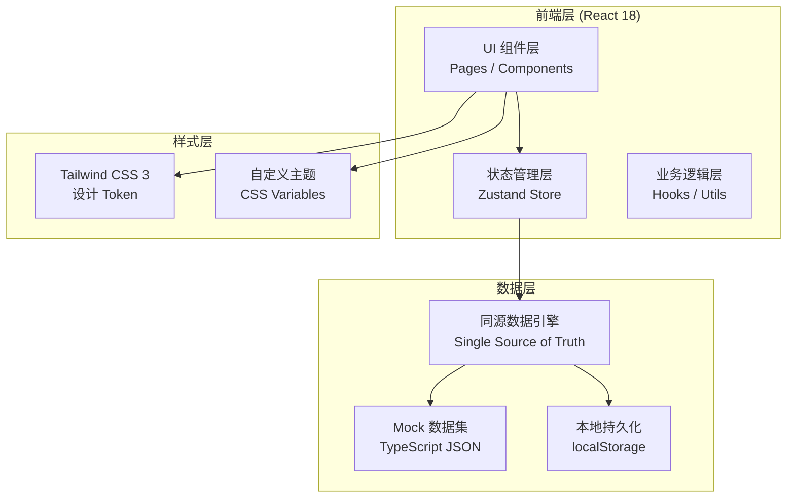
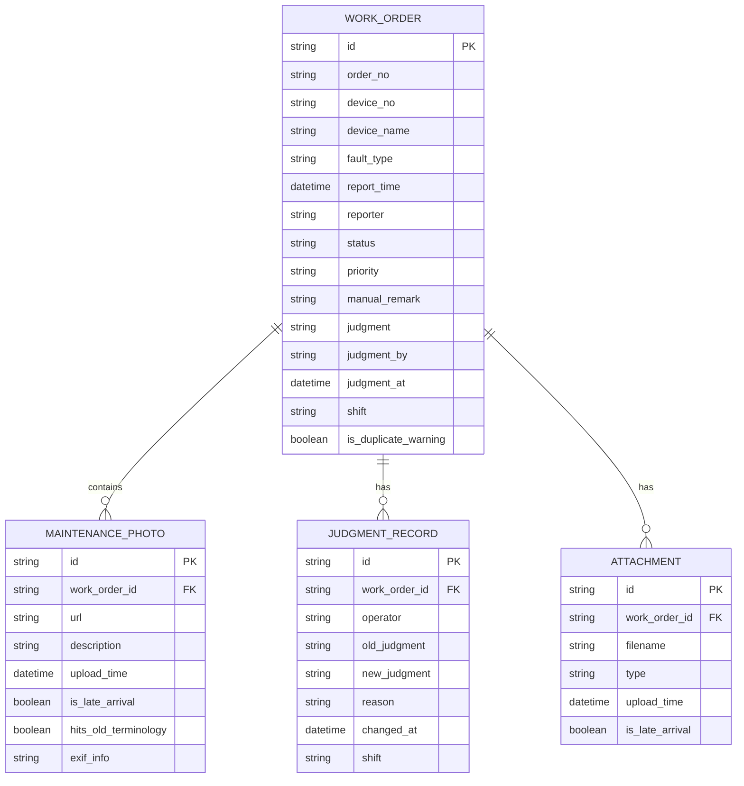

# 电梯故障工单回放系统 — 技术架构文档

## 1. 架构设计



## 2. 技术说明

- **前端框架**：React@18 + TypeScript + Vite
- **初始化工具**：vite-init（react-ts 模板）
- **状态管理**：Zustand（集中管理同源数据流）
- **路由**：React Router DOM（单页应用：主页 + 导入页 + 历史页）
- **样式方案**：Tailwind CSS 3 + 自定义 CSS 变量主题
- **图标库**：lucide-react（统一图标风格）
- **后端**：无后端，Mock 数据 + localStorage 持久化
- **数据模型**：TypeScript 接口定义 + JSON 模拟数据集

## 3. 路由定义

| 路由 | 页面组件 | 用途 |
|------|---------|------|
| `/` | `ReplayDashboard` | 工单回放主页：筛选/统计/明细/异常队列四合一 |
| `/import` | `ImportPanel` | 数据导入面板：重复检测+下一步处理+防覆盖 |
| `/history` | `JudgmentHistory` | 判断历史页：修改时间链+多班次视图 |
| `/handover` | `HandoverGuide` | 接班快速指引：三卡片极简入口 |

## 4. 数据模型

### 4.1 ER 图



### 4.2 核心数据接口定义

```typescript
// 工单状态
type OrderStatus = 'pending' | 'processing' | 'completed' | 'abnormal';
type Judgment = 'normal' | 'abnormal' | 'pending_review';
type Priority = 'low' | 'medium' | 'high' | 'critical';
type Shift = 'morning' | 'afternoon' | 'night';

interface MaintenancePhoto {
  id: string;
  workOrderId: string;
  url: string;
  thumbnail: string;
  description: string;
  uploadTime: string;
  isLateArrival: boolean;
  hitsOldTerminology: boolean;
  exifInfo?: {
    device?: string;
    gps?: string;
    originalTime?: string;
  };
}

interface JudgmentRecord {
  id: string;
  workOrderId: string;
  operator: string;
  operatorRole: 'reviewer' | 'supervisor';
  oldJudgment: Judgment | null;
  newJudgment: Judgment;
  reason: string;
  changedAt: string;
  shift: Shift;
}

interface WorkOrder {
  id: string;
  orderNo: string;
  deviceNo: string;
  deviceName: string;
  faultType: string;
  faultDescription: string;
  reportTime: string;
  reporter: string;
  status: OrderStatus;
  priority: Priority;
  manualRemark: string;
  judgment: Judgment;
  judgmentBy: string | null;
  judgmentAt: string | null;
  shift: Shift;
  isDuplicateWarning: boolean;
  duplicateAction?: 'skip' | 'merge' | 'overwrite';
  photos: MaintenancePhoto[];
  attachments: {
    id: string;
    filename: string;
    uploadTime: string;
    isLateArrival: boolean;
  }[];
  judgmentHistory: JudgmentRecord[];
}

interface FilterState {
  dateRange: [string, string] | null;
  deviceNo: string | null;
  status: OrderStatus | null;
  judgment: Judgment | null;
  shift: Shift | null;
  priority: Priority | null;
  hasLateArrival: boolean | null;
  hitsOldTerminology: boolean | null;
}

interface Statistics {
  total: number;
  normal: number;
  abnormal: number;
  pending: number;
  lateArrivalCount: number;
  oldTerminologyHits: number;
  duplicateWarnings: number;
}
```

### 4.3 同源数据流核心设计

**单一数据源原则**：筛选条件、统计数字、明细表、异常队列 **全部** 从同一份 `filteredWorkOrders` 派生，确保四个模块绝对一致。

```
筛选条件 (FilterState)
        ↓
  applyFilters(workOrders, filters)  → 单一派生函数
        ↓
filteredWorkOrders (同源数据)
   ├──→ calculateStatistics(filtered) → 统计卡片
   ├──→ filteredWorkOrders           → 明细表
   └──→ filtered.filter(isAbnormal)  → 异常队列
```

Zustand Store 结构：
```typescript
interface WorkOrderStore {
  // 原始全量数据
  workOrders: WorkOrder[];
  // 筛选状态
  filters: FilterState;
  // 同源派生（getter，非独立存储）
  get filteredWorkOrders(): WorkOrder[];
  get statistics(): Statistics;
  get abnormalQueue(): WorkOrder[];
  // Actions
  setFilters: (partial: Partial<FilterState>) => void;
  updateJudgment: (orderId: string, judgment: Judgment, reason?: string, operator?: string) => void;
  importWorkOrders: (newOrders: WorkOrder[]) => DuplicateResolutionResult;
  updateManualRemark: (orderId: string, remark: string) => void;
}
```

### 4.4 重复导入处理逻辑

```typescript
interface DuplicateResolutionResult {
  imported: number;
  skipped: number;
  merged: number;
  overwritten: number;
  warnings: DuplicateWarning[];
}

interface DuplicateWarning {
  deviceNo: string;
  existingOrderId: string;
  newOrderId: string;
  suggestion: 'skip' | 'merge' | 'overwrite';
  nextStepText: string;  // 下一步处理提示文案
}
```

处理规则：
1. 检测到 `deviceNo` 重复 → **不抛出错误**，收集到 `warnings` 数组
2. 返回结果中包含每个重复项的 `nextStepText`，UI 展示下一步处理卡片
3. 默认行为：`skip`（跳过，不翻倍），`manualRemark` 字段 **永不覆盖**
4. 用户可逐案选择：跳过 / 合并（照片和附件合并，保留较新判断）/ 覆盖（人工备注除外）

### 4.5 判断历史与多班次

每次主管修改判断时：
1. 必须填写 `reason`（必填校验）
2. 创建 `JudgmentRecord`，记录 `oldJudgment → newJudgment`
3. 记录 `shift`（早/中/夜班）和 `changedAt` 时间
4. 在详情抽屉和 `/history` 页展示完整时间链
5. 接班视图中，每个最终值都可展开查看"怎么来的"

## 5. 核心组件结构

```
src/
├── pages/
│   ├── ReplayDashboard.tsx      # 回放主页（四合一视图）
│   ├── ImportPanel.tsx          # 导入面板
│   ├── JudgmentHistory.tsx      # 判断历史页
│   └── HandoverGuide.tsx        # 接班快速指引
├── components/
│   ├── FilterBar.tsx            # 筛选条件栏
│   ├── StatisticsCards.tsx      # 统计卡片组
│   ├── WorkOrderTable.tsx       # 明细表格
│   ├── AbnormalQueue.tsx        # 异常队列面板
│   ├── OrderDetailDrawer.tsx    # 工单详情抽屉
│   ├── PhotoTimeline.tsx        # 照片时间线
│   ├── JudgmentSection.tsx      # 判断操作区（含主管原因输入）
│   ├── WarningBanner.tsx        # 旧说法/平均值警示条
│   ├── DuplicateResolution.tsx  # 重复处理卡片
│   ├── HistoryTimeline.tsx      # 判断历史时间链
│   ├── HandoverCards.tsx        # 接班三卡片
│   └── LateBadge.tsx            # 晚到附件徽章
├── store/
│   └── workOrderStore.ts        # Zustand 同源数据 Store
├── utils/
│   ├── filterEngine.ts          # 筛选引擎（单一派生函数）
│   ├── statisticsCalculator.ts  # 统计计算
│   ├── duplicateDetector.ts     # 重复检测与处理
│   └── mockData.ts              # Mock 数据集（含晚到附件案例）
├── types/
│   └── index.ts                 # 全局 TypeScript 类型
└── App.tsx / main.tsx / index.css
```

## 6. Mock 数据要点

Mock 数据集（`utils/mockData.ts`）必须包含：

1. **至少 15 条** 工单，覆盖各种状态/优先级/班次
2. **至少 3 条** 工单包含 `isLateArrival: true` 的照片或附件（晚到附件案例）
3. **至少 2 条** 工单的照片 `hitsOldTerminology: true`（旧说法识别测试）
4. **至少 2 组** 设备编号相同的工单（重复导入测试用）
5. **至少 4 条** `judgmentHistory.length >= 2` 的工单（主管修改历史测试）
6. 其中 1 条历史必须包含：审核员判正常 → 主管阿敏改异常（填原因）→ 下一班次又调整
7. 所有工单的 `manualRemark` 字段有内容（验证不被覆盖）
