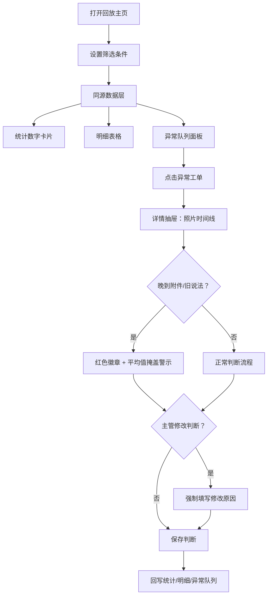

# 电梯故障工单回放系统 — 产品需求文档 (PRD)

## 1. 产品概述

面向维保主管阿敏及团队的电梯故障工单审核回放平台，解决维修照片证据追溯、异常判断一致性、重复导入数据混乱、跨班次交接不清等核心痛点。一套数据源贯穿筛选、统计、明细与异常队列，确保审核结果可溯源。

- 核心目标：让维保团队在回放工单时，证据可追、异常可查、判断可溯、交接可接
- 目标用户：维保主管阿敏、一线维保员、接班审核人员

---

## 2. 核心功能

### 2.1 用户角色

| 角色 | 登录方式 | 核心权限 |
|------|---------|----------|
| 维保主管（阿敏） | 账号登录 | 修改异常判断、写入修改原因、导出结果、查看历史修改链 |
| 维保审核员 | 账号登录 | 回放工单、标记异常、填写人工备注、导入工单数据 |
| 接班人员 | 账号登录 | 查看快速指引（样例/异常/导出）、浏览历史判断链 |

### 2.2 功能模块

1. **工单回放主页**：同源数据筛选区、统计数字卡片、明细表、异常队列四合一视图
2. **工单详情抽屉**：维修照片时间线、晚到附件标记、旧说法识别提示、平均值掩盖预警
3. **数据导入面板**：重复导入防翻倍、设备编号重复智能提示+下一步处理、人工备注防覆盖
4. **判断历史面板**：主管修改原因记录、多班次修改时间链、最终值对比展示
5. **接班快速指引**：样例工单定位、异常队列高亮、一键导出操作入口（3 条极简说明）

### 2.3 页面详情

| 页面名称 | 模块名称 | 功能描述 |
|---------|---------|----------|
| 工单回放主页 | 筛选条件区 | 时间/设备/状态/班组筛选，筛选结果直接驱动下方所有模块 |
| 工单回放主页 | 统计卡片 | 总工单数、正常数、异常数、待处理数，与明细表/异常队列完全同源 |
| 工单回放主页 | 明细表 | 完整工单列表，行点击打开详情抽屉，支持列排序 |
| 工单回放主页 | 异常队列 | 右侧固定面板，仅展示异常工单，点击直接跳转到对应明细行 |
| 工单详情抽屉 | 维修照片时间线 | 按上传时间排序展示照片，晚到附件红色徽章高亮 |
| 工单详情抽屉 | 旧说法识别 | 照片 EXIF/描述命中"旧说法"关键词时黄色警示条+平均值掩盖风险提示 |
| 工单详情抽屉 | 判断操作区 | 正常/异常切换，主管修改时强制填写原因 |
| 数据导入面板 | 上传区 | 拖拽/点击上传，实时检测设备编号重复 |
| 数据导入面板 | 重复处理提示 | 编号重复时不报错阻断，而是弹出"下一步处理"卡片（跳过/合并/覆盖字段选择） |
| 判断历史面板 | 修改时间链 | 每次判断修改记录操作人/时间/原因/原值→新值 |
| 判断历史面板 | 多班次视图 | 按班次分组显示修改，下一班可清楚看到每个最终值的演变过程 |
| 接班快速指引 | 三卡片布局 | 样例在哪 → 异常在哪 → 结果怎么导出，每卡不超过 2 行文字 + 1 个操作按钮 |

---

## 3. 核心流程

### 3.1 维保主管阿敏日常回放流程

阿敏打开回放主页 → 设置筛选条件 → 查看同源统计数字 → 从异常队列点击高优先级工单 → 查看维修照片时间线（注意晚到附件徽章）→ 识别旧说法警示 → 判断正常/异常（主管修改需填原因）→ 保存后自动回写统计与异常队列 → 批量导出结果。

### 3.2 重复导入流程

审核员上传新批次工单 → 系统检测设备编号重复 → 不报错阻断，弹出下一步处理卡：跳过重复 / 合并到现有工单 / 覆盖字段（默认保留人工备注）→ 用户确认 → 完成导入，正常记录不翻倍。

### 3.3 跨班次交接流程

接班人员登录 → 首页展示"快速指引"浮层 → 依次点击"样例工单"/"查看异常"/"导出结果"了解当日状态 → 查看判断历史面板中每条工单的修改链，理解最终值的决策背景。

---

## 4. 用户界面设计

### 4.1 设计风格

- **主色**：工业深蓝 `#1E3A5F`，传达专业与可靠性
- **辅色**：警示橙 `#F59E0B`（旧说法/平均值警示）、异常红 `#DC2626`（晚到附件/异常标记）、正常绿 `#059669`
- **中性色**：冷灰系 `slate`，从 50 到 900 营造层次
- **按钮风格**：硬朗直角微圆角（rounded-md），粗边框强调，悬停时轻微上浮
- **字体**：标题用 `JetBrains Mono`（等宽工业感），正文用 `Noto Sans SC`
- **布局风格**：控制台仪表盘式，左右分栏主从布局，左侧主内容区+右侧异常队列固定面板
- **图标风格**：lucide-react 线性图标，状态色填充

### 4.2 页面设计概览

| 页面名称 | 模块名称 | UI 要素 |
|---------|---------|--------|
| 工单回放主页 | 顶栏 | 深色导航条，系统名+当前班次标签+用户头像+快速指引按钮 |
| 工单回放主页 | 筛选条 | 浅灰底卡片，多字段横向排列筛选，应用按钮突出 |
| 工单回放主页 | 统计卡片区 | 4 张数字卡片，每张带趋势小箭头，背景淡色微渐变 |
| 工单回放主页 | 主内容区（左 75%） | 明细表 zebra 条纹，异常行左侧红色竖条标记 |
| 工单回放主页 | 异常队列（右 25%固定） | 垂直滚动列表，每项为紧凑卡片带优先级标签 |
| 详情抽屉 | 头图区 | 工单编号大字体+状态徽章+设备编号 |
| 详情抽屉 | 照片时间线 | 竖向时间轴，每条含照片缩略图+上传时间+EXIF信息 |
| 详情抽屉 | 警示条 | 旧说法警示：黄底黑边条+警告图标+"可能被平均值掩盖"文案 |
| 详情抽屉 | 判断区 | 大按钮组：正常/异常切换，主管模式下展开原因输入框 |
| 导入面板 | 上传区 | 虚线边框拖拽区，大上传图标 |
| 导入面板 | 重复处理卡 | 蓝边卡片，三个选项按钮，字段覆盖选择为折叠区 |
| 判断历史 | 时间链 | 竖向时间轴，每条记录带班次标签、操作人、原值→新值、原因 |
| 快速指引 | 三卡片 | 大图标+简短标题+2 行说明+操作按钮，顶部可关闭浮层 |

### 4.3 响应式

桌面端优先（≥1280px），左右分栏；平板端（768–1279px）异常队列改为底部 Tab；移动端（<768px）改为单栏滚动，异常队列为悬浮按钮展开抽屉。

### 4.4 动效设计

- 页面加载：统计卡片数字从 0 滚动到实际值
- 异常队列：新异常项从右侧滑入
- 详情抽屉：从右向左滑入覆盖
- 警示条：出现时轻微震动 + 黄色脉冲
- 按钮交互：悬停 translateY(-1px) + 阴影加深
- 照片时间线：滚动时逐条淡入
