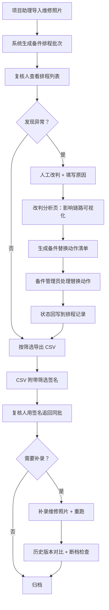

## 1. 产品概述

电梯故障备件排程系统，解决项目助理月底靠维修照片手工核对时「异常被平均值盖住」的问题。核心用户为项目助理小林、维修复核人、备件管理员。产品目标是让「一条人工改判为什么影响排程结论」讲得清、备件型号替换能落到可执行动作、补录重跑后历史不中断且导出口径一致。

## 2. 核心功能

### 2.1 用户角色

| 角色 | 登录方式 | 核心权限 |
|------|----------|----------|
| 项目助理 | 工号登录 | 创建排程批次、录入维修照片、导出排程表、补录后重跑 |
| 复核人 | 工号登录 | 人工改判排程结论、按筛选追回同一批记录、查看改判影响链路 |
| 备件管理员 | 工号登录 | 查看备件替换动作清单、标记处理进度 |

### 2.2 功能模块

1. **备件排程列表页**：批次筛选、排程记录表格、维修照片附件、人工改判入口、补录重跑、批次导出
2. **改判分析页**：人工改判原因录入、改判影响链路可视化、备件替换动作清单、历史版本对比
3. **导出与追回**：按筛选条件导出 CSV、通过导出时的筛选签名快速追回同一批记录

### 2.3 页面详情

| 页面名称 | 模块名称 | 功能描述 |
|----------|----------|----------|
| 备件排程列表页 | 批次筛选区 | 按日期段、电梯编号、批次号、是否人工改判、备件型号多条件筛选 |
| 备件排程列表页 | 排程记录表格 | 展示每条排程的电梯号、故障码、推荐备件、数量、状态、是否改判、改判人、改判时间 |
| 备件排程列表页 | 维修照片列 | 缩略图 + 点击放大，附带后补说明字段（暴露样例问题用） |
| 备件排程列表页 | 人工改判操作 | 修改备件型号/数量/结论，必须填写改判原因与影响说明 |
| 备件排程列表页 | 补录重跑按钮 | 对指定批次补录缺失维修照片后重新执行排程算法，保留历史版本 |
| 备件排程列表页 | 导出按钮 | 按当前筛选导出 CSV，附带筛选签名用于追回 |
| 改判分析页 | 改判总览卡片 | 该批次改判数量、影响排程数、异常被盖住风险提示 |
| 改判分析页 | 影响链路图 | 从「改判记录 → 影响的排程行 → 变动的备件型号/数量 → 最终月度汇总变化」的链式可视化 |
| 改判分析页 | 备件替换动作清单 | 列出每一条需要人继续处理的动作：替换哪个型号旧件→新件、去向仓库、处理人、截止时间、当前状态 |
| 改判分析页 | 历史版本对比 | 补录前后两次排程结果并排对比，高亮差异行，标注「历史未断/有断档风险」 |
| 改判分析页 | 后补说明面板 | 样例数据中故意放入一条人工改判 + 后补说明，展示问题暴露逻辑 |
| 追回页面（弹窗/嵌入） | 筛选签名输入 | 粘贴导出 CSV 中携带的筛选签名，一键还原当时筛选条件并定位同一批记录 |

## 3. 核心流程

**主流程**：项目助理导入维修照片 → 系统自动生成备件排程 → 复核人发现异常 → 人工改判并填写原因 → 改判分析页自动生成影响链路与备件替换动作 → 项目助理按筛选导出 CSV（含筛选签名）→ 复核人用签名追回同批记录 → 补录缺失照片后重跑 → 对比历史版本确认无断档。

## 4. 用户界面设计

### 4.1 设计风格

- **主色**：工业警示黄 `#E8A33D`（改判/异常强调）+ 深灰蓝 `#1F2A37`（底色），辅色用锈红 `#C84B31`（风险）和浅青 `#5FA8B9`（正常/已处理）
- **按钮风格**：方形切角（border-radius: 2px），2px 实色边框，悬停时内阴影下沉，营造工业控制台质感
- **字体**：标题用「思源黑体 Heavy」，正文用「JetBrains Mono」（表格数字对齐用等宽字体，避免平均值视觉造假）
- **布局风格**：顶部固定导航 + 左侧筛选抽屉 + 右侧主表格，表格占 70% 幅宽，突出「改判列」与「照片列」
- **图标**：lucide-react 线性图标，改判用 `AlertTriangle`，备件替换用 `ArrowLeftRight`，断档用 `Unlink`，追回用 `SearchCheck`

### 4.2 页面设计概览

| 页面名称 | 模块名称 | UI 元素 |
|----------|----------|---------|
| 备件排程列表页 | 批次筛选区 | 深色抽屉展开，多选标签 + 日期范围 + 文本搜索，筛选结果实时计数徽标 |
| 备件排程列表页 | 排程记录表格 | 斑马行 + 改判行整行黄色描边高亮，数字右对齐等宽字体，照片缩略图悬停放大 |
| 备件排程列表页 | 操作栏 | 固定底部，左对齐「补录重跑」、右对齐「导出 CSV」，中间显示当前批次状态标签 |
| 改判分析页 | 改判总览卡片 | 四张并排指标卡，异常卡用红色闪烁点状背景吸引注意 |
| 改判分析页 | 影响链路图 | 横向时间线布局，节点用色块 + 连接线，点击节点展开详情面板 |
| 改判分析页 | 备件替换动作清单 | 表格 + 行内处理状态切换，未完成行显示倒计时条 |
| 改判分析页 | 历史版本对比 | 左右双栏并排滚动，差异行底色对撞标记，顶部「断档风险」横幅 |

### 4.3 响应式

桌面端优先（≥1280px），平板（768-1279px）筛选区改为顶部折叠，移动端（<768px）表格改为卡片列表，链路图改为竖向瀑布流。

### 4.4 动效说明

- 改判保存后：影响链路节点依次淡入（stagger 120ms）
- 导出 CSV：筛选签名复制成功时按钮边框发光
- 补录重跑：进度条沿历史版本时间轴推进
- 异常风险提示：红色点状边框缓慢呼吸脉冲
