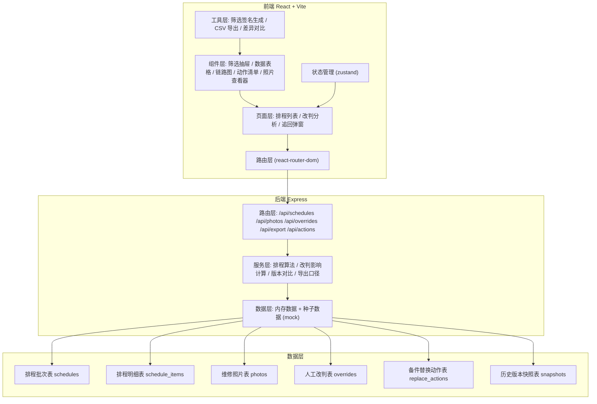
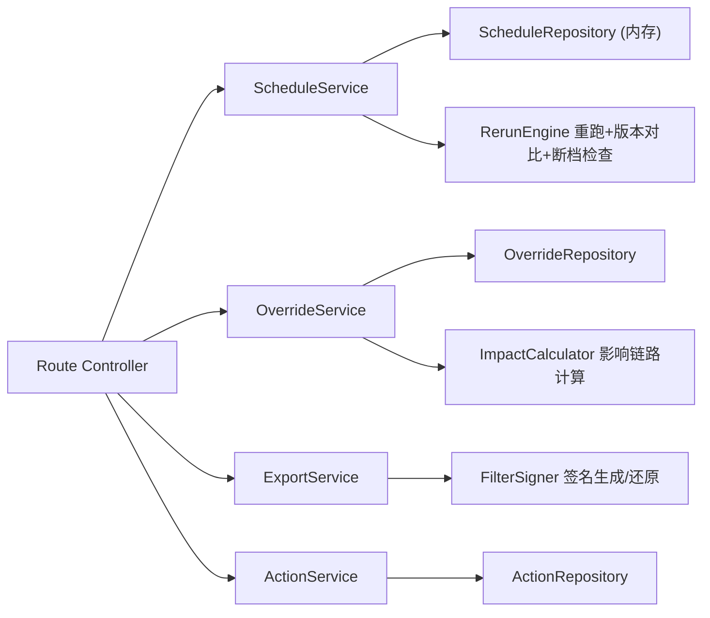
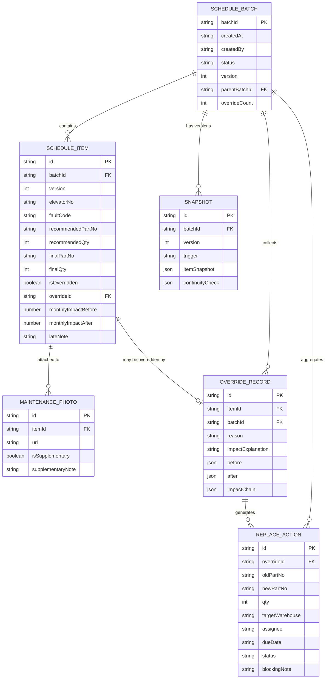

## 1. 架构设计



## 2. 技术说明

- **前端**: React@18 + TypeScript + Vite + tailwindcss@3 + react-router-dom@6 + zustand@4 + lucide-react + recharts
- **初始化工具**: vite-init (react-express-ts 模板)
- **后端**: Express@4 + TypeScript + cors
- **数据库**: 纯内存数据结构 + 种子数据 mock，按用户需求无需持久化
- **导出格式**: CSV + UTF-8 BOM（Excel 兼容）

## 3. 路由定义

| 前端路由 | 页面目的 |
|----------|----------|
| `/` | 排程列表页（默认首页） |
| `/analysis/:batchId` | 改判分析页（指定批次） |
| `/retrieve` | 追回页面（通过筛选签名还原） |

| 后端 API 路由 | 方法 | 目的 |
|--------------|------|------|
| `/api/schedules` | GET | 获取排程列表，支持 query 筛选 |
| `/api/schedules/:batchId` | GET | 获取单个批次详情 |
| `/api/schedules/:batchId/rerun` | POST | 补录后对批次重跑排程，生成新版本 |
| `/api/schedules/:batchId/snapshots` | GET | 获取该批次所有历史版本快照（用于对比） |
| `/api/photos` | POST | 上传维修照片（补录用） |
| `/api/photos/:id` | GET | 获取单张照片详情（含后补说明） |
| `/api/overrides` | POST | 提交人工改判（触发影响链路计算） |
| `/api/overrides/:id/impact` | GET | 获取某条改判的影响链路数据 |
| `/api/replace-actions` | GET | 获取备件替换动作清单（按批次筛选） |
| `/api/replace-actions/:id` | PATCH | 更新替换动作状态/处理人 |
| `/api/export/schedules` | POST | 按筛选条件导出 CSV，返回文件流 + 筛选签名 header |
| `/api/retrieve` | POST | 通过筛选签名还原筛选条件与匹配的记录 ID 列表 |

## 4. API 数据结构定义

```typescript
// ===== 核心实体 =====

interface ScheduleBatch {
  batchId: string;
  createdAt: string;
  createdBy: string;
  status: 'draft' | 'pending_review' | 'overridden' | 'rerun' | 'exported';
  version: number;
  parentBatchId?: string; // 重跑来源批次
  elevatorCount: number;
  itemCount: number;
  overrideCount: number;
  riskNote?: string;
}

interface ScheduleItem {
  id: string;
  batchId: string;
  version: number;
  elevatorNo: string;
  faultCode: string;
  faultDescription: string;
  recommendedPartNo: string;
  recommendedPartName: string;
  recommendedQty: number;
  finalPartNo: string;       // 改判后覆盖
  finalPartName: string;     // 改判后覆盖
  finalQty: number;          // 改判后覆盖
  isOverridden: boolean;
  overrideId?: string;
  photoIds: string[];
  lateNote?: string;         // 后补说明（样例故意暴露问题用）
  monthlyImpactBefore: number; // 改判前月度影响金额
  monthlyImpactAfter: number;  // 改判后月度影响金额
}

interface MaintenancePhoto {
  id: string;
  itemId: string;
  batchId: string;
  url: string;
  uploadedAt: string;
  uploadedBy: string;
  supplementaryNote?: string; // 后补说明字段
  isSupplementary: boolean;   // 是否为补录照片
}

interface OverrideRecord {
  id: string;
  itemId: string;
  batchId: string;
  createdAt: string;
  createdBy: string;          // 复核人
  reason: string;             // 改判原因（必填）
  impactExplanation: string;  // 影响说明（必填）
  before: { partNo: string; partName: string; qty: number };
  after:  { partNo: string; partName: string; qty: number };
  impactChain: ImpactNode[];  // 影响链路（后端计算后写入）
}

interface ImpactNode {
  id: string;
  level: 'override' | 'item' | 'part' | 'monthly_summary';
  label: string;
  detail: string;
  deltaValue?: number;        // 数值变动
  childrenIds: string[];
}

interface ReplaceAction {
  id: string;
  overrideId: string;
  batchId: string;
  oldPartNo: string;
  oldPartName: string;
  newPartNo: string;
  newPartName: string;
  qty: number;
  targetWarehouse: string;
  assignee: string;           // 处理人
  dueDate: string;
  status: 'pending' | 'in_progress' | 'done' | 'blocked';
  blockingNote?: string;      // 阻碍原因 = 坏材料该看哪里
}

interface Snapshot {
  id: string;
  batchId: string;
  version: number;
  createdAt: string;
  trigger: 'initial' | 'override' | 'rerun';
  itemSnapshot: ScheduleItem[];
  continuityCheck: {
    hasGap: boolean;
    gapDetails?: string;       // 断档说明
    missingItemIds: string[];
  };
}

// ===== 筛选签名 =====

interface FilterSignature {
  signature: string;          // base64(JSON.stringify(filters) + hash)
  filters: ScheduleListFilters;
  matchedItemIds: string[];
  exportedAt: string;
}

interface ScheduleListFilters {
  dateFrom?: string;
  dateTo?: string;
  elevatorNos?: string[];
  batchIds?: string[];
  isOverridden?: boolean;
  partNos?: string[];
  statuses?: ScheduleBatch['status'][];
}
```

## 5. 服务端分层架构



## 6. 数据模型

### 6.1 ER 图



### 6.2 种子数据要点

- 至少 3 个批次，其中批次 `B-2026-06-W2` 包含 **1 条故意放的人工改判样例**：推荐备件 `T-YK-003`（曳引轮油封）被复核人改判为 `T-YK-003-B`（兼容替代款），并附后补说明「现场油封卡槽磨损严重，原配规格无法压合，需换 B 款加厚」
- 同批次再放 1 条 **坏材料场景样例**：替换动作的 `blockingNote` 写明「仓库反馈新批次 T-YK-003-B 橡胶硬度不达标，需退回供应商 → 排查路径见 README 第 2 条」
- 批次 `B-2026-06-W1` 设置为 **补录重跑样例**：`parentBatchId` 指向更早版本，`continuityCheck` 标红 `hasGap: true` 用于验证断档提示
- 月度汇总故意构造「改判前平均值掩盖异常」的数字对比：改判前平均单梯备件 ￥420，改判后拉到 ￥515，链路图中高亮差值 ￥95 = 那条人工改判拉动

