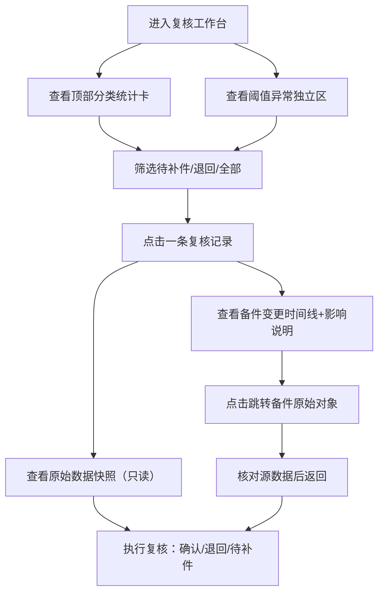

## 1. 产品概述
电梯故障报告复核系统，服务于安全员老唐及交接同事在月底/交接班时对电梯故障处理记录进行复核确认。核心解决：备件改名追溯不清、原始脏数据被覆盖、阈值临时调高混入正常结果、复核状态无分类等导致交接信息丢失的问题。

- 目标用户：安全员（复核人）、值班交接同事
- 核心价值：每条复核记录可追溯至备件清单原始对象，变更痕迹不抹除，异常操作独立归类

---

## 2. 核心功能

### 2.1 用户角色
| 角色 | 注册方式 | 核心权限 |
|------|----------|----------|
| 安全员（老唐） | 系统账号 | 查看全部、复核标记、退回、分类筛选、追溯原始对象 |
| 交接同事 | 系统账号 | 补录记录、查看复核状态、追溯原始对象 |

### 2.2 功能模块
1. **复核工作台（主页）**：顶部状态分类统计卡、筛选栏、复核记录列表、阈值异常独立区
2. **复核详情抽屉**：基础信息、备件变更时间线（含改名影响说明）、原始数据快照（不可编辑）、操作按钮
3. **备件原始对象跳转**：从复核记录内直接定位到备件清单源记录行

### 2.3 页面详情
| 页面名称 | 模块名称 | 功能描述 |
|----------|----------|----------|
| 复核工作台 | 分类统计卡 | 已确认/待补件/退回 三态数量，点击即筛选 |
| 复核工作台 | 筛选栏 | 按报告编号、电梯编号、日期范围、变更类型搜索 |
| 复核工作台 | 复核记录列表 | 卡片展示：编号+电梯+状态标签+关键变更摘要+时间 |
| 复核工作台 | 阈值异常独立区 | 单独分区列出所有"临时调高阈值"记录，不混入正常列表 |
| 复核详情抽屉 | 基础信息区 | 报告编号、电梯编号、上报人、故障类型、处理时间 |
| 复核详情抽屉 | 备件变更时间线 | 逐条显示：操作人、时间、变更前→变更后、**变更影响说明**（为什么改名影响结论） |
| 复核详情抽屉 | 原始数据快照 | 灰色只读区，保留上报时的原始备件清单JSON/表格，禁止修改 |
| 复核详情抽屉 | 溯源跳转按钮 | 点击后在新页签/模态定位到备件清单的原始行（高亮闪烁） |
| 复核详情抽屉 | 复核操作区 | 标记已确认 / 退回（填写原因） / 标记待补件 |

---

## 3. 核心流程
安全员老唐进入复核工作台 → 优先查看"阈值异常独立区"是否有临时调阈值记录 → 按分类卡切换到"待补件"→ 点开一条复核记录 → 查看原始数据快照确认数据是否被改动 → 查看备件变更时间线，阅读"改名影响说明"→ 点击"跳转备件原始对象"核对源数据 → 执行复核操作（确认/退回/待补件）。

---

## 4. 用户界面设计

### 4.1 设计风格
- **主色**：工业蓝 `#1e40af`（严肃、专业），辅色：琥珀 `#b45309`（待补件）、朱红 `#b91c1c`（退回/异常）、翠绿 `#047857`（已确认）
- **按钮风格**：方角 2px 圆角，粗边框 1px，按下有下沉感
- **字体**：标题 `Noto Serif SC`（宋体风，正式感），正文 `JetBrains Mono` + `PingFang SC`（数据可读性优先）
- **布局风格**：卡片网格 + 左侧筛选固定栏 + 右侧抽屉详情；"原始数据快照"采用灰底等宽字体带行号样式
- **图标**：lucide-react 线性图标，异常区使用橙色背景警示条纹

### 4.2 页面设计概述
| 页面名称 | 模块名称 | UI 元素 |
|----------|----------|----------|
| 复核工作台 | 分类统计卡 | 3张并排卡片：数字+状态名+下箭头筛选，各自状态色边框 |
| 复核工作台 | 阈值异常独立区 | 顶部橙色斜纹横幅标题、独立卡片列表、每条带⚠️图标、阈值变化量标签 |
| 复核工作台 | 复核记录列表 | 每行卡片：左侧报告编号+电梯编号竖排，中间状态色标签+变更摘要，右侧时间+展开箭头 |
| 复核详情抽屉 | 变更时间线 | 左侧时间轴竖线圆点，右侧每条显示：变更前（删除线）→ 变更后（加粗）+ 影响说明黄色提示框 |
| 复核详情抽屉 | 原始数据快照 | `bg-zinc-100` + `font-mono` + 行号 + 左上角"原始上报快照"印章水印 |
| 复核详情抽屉 | 溯源跳转按钮 | 蓝色描边按钮 + `external-link` 图标，点击后源行 3 次黄色闪烁高亮 |

### 4.3 响应式
- Desktop 优先：最小宽度 1280px，左侧 240px 筛选栏 + 中间 1fr 列表 + 阈值异常置顶
- 平板/移动：筛选栏折叠为顶部 Tab，阈值异常区折叠为手风琴

---

## 4.4 演示数据规格（3~4条）
| 编号 | 电梯编号 | 状态 | 变更类型 | 关键变更 | 影响说明要点 |
|------|----------|------|----------|----------|--------------|
| FT-20260601-003 | EL-12B | 待补件 | 备件改名 | "钢丝绳润滑脂A" → "通用钢丝绳脂" | 规格从 ISO VG100 降至 VG68，高温承载下降 22%，直接影响承重结论 |
| FT-20260602-007 | EL-08A | 已确认 | 正常记录 | 无变更 | 纯正常对照项 |
| FT-20260603-011 | EL-15C | 退回 | 阈值临时调高 | 载重报警阈值 125% → 150% | 独立区列出，触发 3 次超载未报，结论从"合格"改为"退回重检" |
| FT-20260604-015 | EL-03D | 待补件 | 补录记录 + 脏数据保留 | 原始上报"门机接触器"（型号缺字段）→ 补录型号 | 原始快照保留空字段，补录部分高亮区分，溯源可见 |
