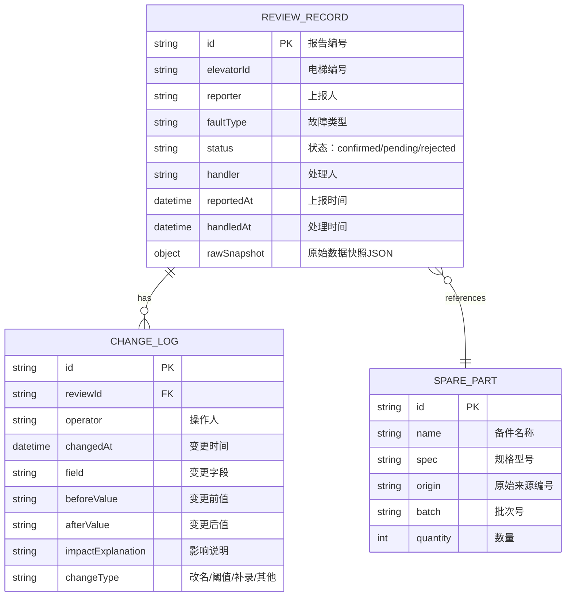

## 1. 架构设计

```mermaid
flowchart LR
    subgraph "前端 (React 18)
        U1["复核工作台 (Dashboard)"]
        U2["复核详情抽屉 (DetailDrawer)"]
        U3["备件溯源弹窗 (SparePartModal)"]
        U4["状态分类统计卡 (StatCards)"]
        U5["阈值异常区 (ThresholdAlertPanel)"]
        U6["变更时间线 (ChangeTimeline)"]
        U7["原始数据快照 (RawSnapshot)"]
    end
    subgraph "状态层 (Zustand)"
        S1["reviewStore - 复核记录状态"]
        S2["sparePartsStore - 备件清单状态"]
    end
    subgraph "模拟数据层"
        M1["Mock - 4条演示复核记录"]
        M2["Mock - 备件清单原始对象"]
    end
    U1 --> S1
    U2 --> S1
    U3 --> S2
    S1 --> M1
    S2 --> M2
```

## 2. 技术描述
- 前端：React@18 + TypeScript + TailwindCSS@3 + Vite
- 初始化工具：vite-init（react-ts 模板）
- 路由：react-router-dom（单页，仅有 / 主路由）
- 状态管理：zustand
- 图标：lucide-react
- 后端：无（纯前端 Mock 数据）
- 数据库：无，内存中以 TypeScript 数据结构模拟

## 3. 路由定义
| 路由 | 用途 |
|------|------|
| / | 复核工作台（主界面，含详情抽屉内嵌） |

## 4. 数据模型

### 4.1 数据模型定义



### 4.2 类型定义（TypeScript）

```typescript
type ReviewStatus = 'confirmed' | 'pending' | 'rejected';
type ChangeType = 'rename' | 'threshold' | 'supplement' | 'none';

interface ChangeLogEntry {
  id: string;
  operator: string;
  changedAt: string;
  field: string;
  beforeValue: string;
  afterValue: string;
  impactExplanation: string;
  changeType: ChangeType;
}

interface SparePart {
  id: string;
  name: string;
  spec: string;
  origin: string;
  batch: string;
  quantity: number;
}

interface ReviewRecord {
  id: string;
  elevatorId: string;
  reporter: string;
  faultType: string;
  status: ReviewStatus;
  handler: string;
  reportedAt: string;
  handledAt: string;
  changeLogs: ChangeLogEntry[];
  rawSnapshot: {
    spareParts: SparePart[];
    notes: string;
  };
  sparePartIds: string[];
  hasThresholdAdjustment: boolean;
  summary: string;
}
```
