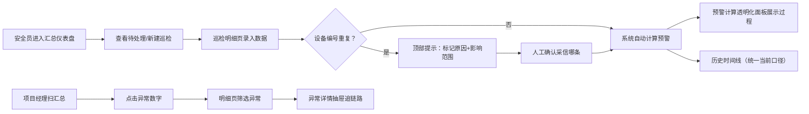

## 1. 产品概述

工厂管线阈值预警系统，解决安全员月底巡检表与系统报警口径不一致、人工核对耗时的痛点。面向安全员、项目经理、运维人员，提供透明化的预警计算过程、历史时间线回溯、异常追踪能力。

- 核心价值：让预警计算过程"看得见"，消除报警与人工备注的信息差
- 目标用户：一线安全员（巡检录入）、项目经理（汇总审阅）、非技术使用者

## 2. 核心功能

### 2.1 用户角色

| 角色 | 使用场景 | 核心诉求 |
|------|----------|----------|
| 安全员老唐 | 每日录入巡检数据、月底核对报警 | 数据入口顺手、异常原因明了、备注追溯清晰 |
| 项目经理 | 浏览汇总、追踪异常、评估风险 | 先看全局再钻取、数字变动有迹可循、口径统一 |
| 非技术人员 | 试用水晶预警功能 | 材料入口清楚、异常出口明白、公式单位不迷糊 |

### 2.2 功能模块

1. **汇总仪表盘页**：预警总览卡片、风险分布、趋势概览、快速入口
2. **巡检明细页**：巡检数据列表（含晚到附件、后补说明、重复设备标记）、人工确认区
3. **预警计算透明化面板**：公式展示、单位换算、边界值说明、计算过程分步演示
4. **历史时间线页**：按口径版本组织的历史预警、当前口径高亮、变动原因标注
5. **异常详情抽屉**：单条异常完整链路、关联巡检记录、影响范围提示

### 2.3 页面详情

| 页面名称 | 模块名称 | 功能描述 |
|----------|----------|----------|
| 汇总仪表盘 | 预警总览卡片 | 红/黄/绿三级预警数量、待人工确认数、本月较上月变动趋势 |
| 汇总仪表盘 | 风险分布条形图 | 按管线区域/设备类型的预警数量分布，点击跳转明细 |
| 汇总仪表盘 | 快速入口区 | 新建巡检、待处理异常Top5、口径说明文档入口 |
| 巡检明细 | 巡检记录表格 | 含设备编号、测量值、附件状态（晚到标记）、备注（后补标记）、异常状态列 |
| 巡检明细 | 重复设备检测条 | 顶部醒目提示条：重复设备编号列表、受影响记录数、需人工确认按钮 |
| 巡检明细 | 人工确认面板 | 展开后显示重复原因、计算冲突点、可选择采信哪条记录的操作 |
| 预警计算面板 | 公式卡片区 | 每个阈值项单独卡片：公式表达式、变量说明、单位标注、边界值上下限 |
| 预警计算面板 | 分步计算演示 | 以当前选中巡检记录为例，代入数值一步步展示计算过程和最终判定 |
| 历史时间线 | 口径版本分组 | 按"当前口径v2.3 / 历史口径v2.2 / 历史口径v2.1"折叠分组，当前版本默认展开 |
| 历史时间线 | 时间轴卡片 | 每条历史预警卡片：时间、数值、当时口径标记、与当前口径的差异说明 |
| 异常详情抽屉 | 完整链路 | 巡检原始数据 → 中间计算值 → 阈值判定 → 预警等级 → 历史变动记录 |

## 3. 核心流程

安全员打开系统后先看汇总仪表盘，确认当日待处理。进入巡检明细录入数据，系统自动检测设备编号重复并弹出人工确认提示。录入完成后预警自动计算，计算过程可在透明化面板查看。历史时间线统一使用当前口径展示，旧数据标注口径差异。项目经理先扫汇总卡片，点击异常数字跳转明细，通过异常详情抽屉追根溯源。

## 4. 用户界面设计

### 4.1 设计风格

- **主色调**：工业深蓝 `#1E3A5F`（专业沉稳），辅以警戒橙 `#FF7A45`（预警）、安全绿 `#34C759`（正常）、危险红 `#FF3B30`（超标）
- **辅助色**：信息蓝 `#007AFF`、重复/待确认黄 `#FFCC00`
- **按钮风格**：圆角 6px，主按钮用深蓝填充+白字，次按钮用深蓝描边
- **字体**：中文用"思源宋体"（标题）+ "思源黑体"（正文）；数字和单位用等宽字体"JetBrains Mono"增强可读性
- **布局风格**：卡片式 + 分区边线，顶部固定导航栏，左侧二级导航（桌面端）
- **图标风格**：线条粗细一致的线性图标，预警相关用实心填充图标强化视觉

### 4.2 页面设计概述

| 页面名称 | 模块名称 | UI 元素 |
|----------|----------|---------|
| 汇总仪表盘 | 预警总览卡片 | 4张并列卡片，左侧彩色竖条标识等级，数字大号加粗，下方小字显示环比变动，悬停阴影上浮 |
| 汇总仪表盘 | 风险分布图 | 横向条形图，按管线名称+数值排序，条形颜色对应预警等级，末端显示数字 |
| 巡检明细 | 巡检记录表格 | 斑马纹行，晚到附件用浅橙底+📎图标，后补说明用浅蓝底+💬气泡角标，重复行左侧加黄色边框 |
| 巡检明细 | 重复设备提示条 | 顶部全宽黄色条带，左侧⚠️图标，中间说明文字+受影响数量，右侧"立即确认"按钮，可折叠 |
| 预警计算面板 | 公式卡片 | 白底卡片+深蓝标题栏，公式用等宽字体浅色底块展示，变量下方表格，边界值用进度条可视化上下限 |
| 历史时间线 | 时间轴卡片 | 左侧垂直时间线圆点，右侧卡片，当前口径标签用蓝底白字pill，历史口径用灰底，差异用小字说明 |
| 异常详情抽屉 | 计算链路 | 步骤箭头连接的流程块，每块可展开看细节，异常环节用红色边框高亮 |

### 4.3 响应式

- 桌面端（≥1280px）：左侧二级导航常驻，表格全列展示，公式卡片3列排布
- 平板端（768–1279px）：导航收起为汉堡菜单，表格横向滚动，公式卡片2列
- 移动端（<768px）：汇总卡片纵向堆叠，表格改为卡片列表每行一条记录，时间线全宽

### 4.4 动效与交互

- 汇总数字加载：从0滚动到实际值的数字滚动动画
- 重复设备提示条出现：顶部下滑进入 + 轻微震动
- 异常详情抽屉：右侧滑入，遮罩淡入
- 巡检行悬停：背景色微变，操作按钮渐显
- 公式卡片展开/折叠：高度动画平滑过渡
- 时间线卡片：页面滚动时依次淡入上移（staggered reveal）
