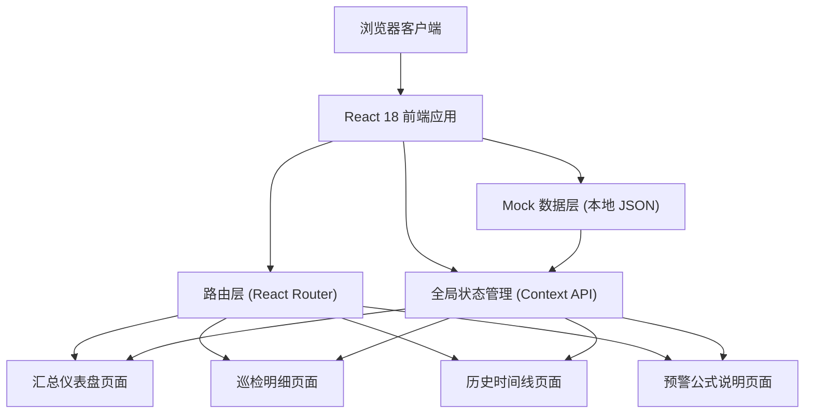
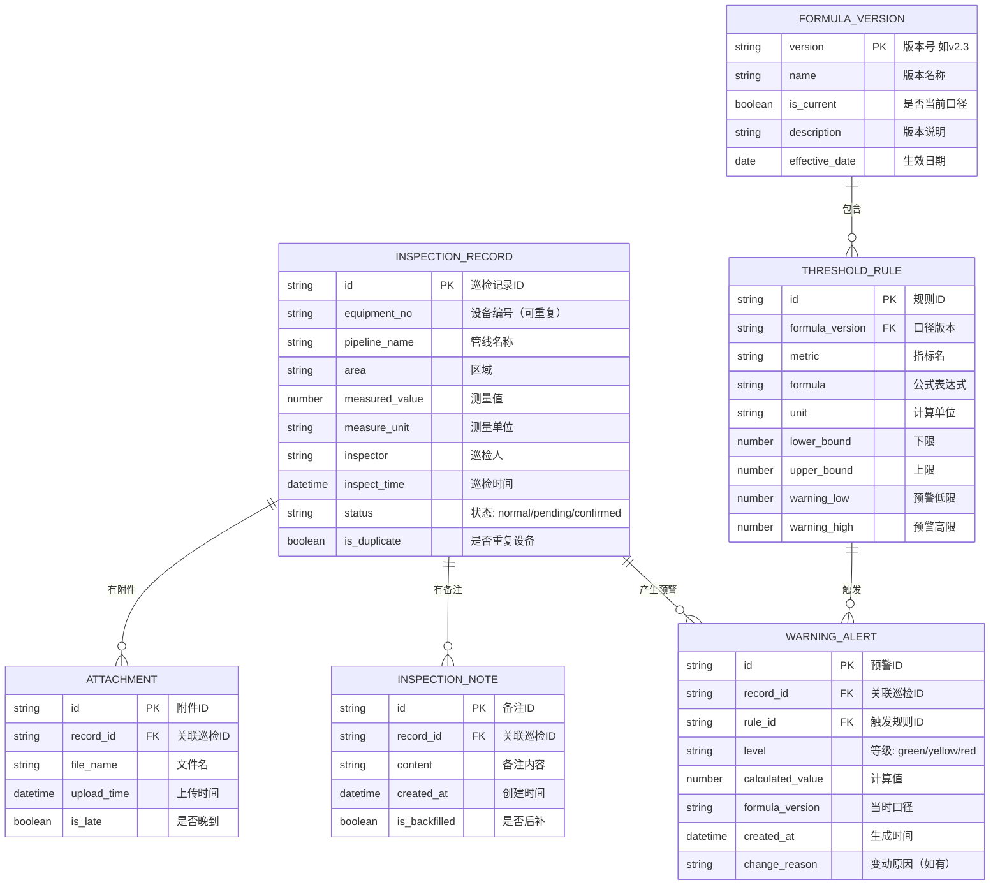

## 1. 架构设计



## 2. 技术描述

- **前端框架**：React 18 + TypeScript + Vite 5
- **样式方案**：TailwindCSS 3 + PostCSS（CSS 变量主题系统）
- **路由**：React Router v6（单页应用多页切换）
- **状态管理**：React Context API + useReducer（轻量级全局状态）
- **图表可视化**：纯 SVG + CSS 实现条形图（避免引入重型图表库）
- **动画**：Framer Motion（页面过渡、抽屉、时间线动效）
- **后端**：无后端，采用本地 Mock 数据模拟
- **数据持久化**：localStorage（保存人工确认记录、用户偏好）
- **字体**：Google Fonts 加载思源宋体、思源黑体、JetBrains Mono
- **初始化工具**：npm create vite@latest

## 3. 路由定义

| 路由路径 | 页面组件 | 页面目的 |
|----------|----------|----------|
| `/` | DashboardPage | 汇总仪表盘：预警总览、风险分布、快速入口（默认首页） |
| `/inspections` | InspectionsPage | 巡检明细：巡检记录列表、重复检测、人工确认 |
| `/timeline` | TimelinePage | 历史时间线：按口径版本分组的历史预警 |
| `/formula` | FormulaPage | 预警公式：阈值计算透明化、分步演示 |
| `/inspections/:id` | InspectionsPage | 巡检明细（带异常详情抽屉打开状态） |

## 4. 数据模型

### 4.1 数据模型定义



### 4.2 Mock 数据要点

巡检记录样例数据必须包含：
1. **晚到附件**：至少 1 条记录有 `is_late: true` 的附件，上传时间晚于巡检时间 2 天
2. **后补说明**：至少 1 条记录有 `is_backfilled: true` 的备注，创建时间晚于巡检时间 3 天
3. **设备编号重复**：至少 2 条记录使用相同的 `equipment_no`（如 `PL-A-007`），但测量值和巡检时间不同，用于触发人工确认流程
4. **三级预警全覆盖**：包含 red（超标）、yellow（预警）、green（正常）各若干条
5. **历史口径数据**：构造 v2.3（当前）、v2.2、v2.1 三个版本的阈值规则，用于时间线对比

## 5. 核心业务逻辑模块

| 模块文件 | 职责说明 |
|----------|----------|
| `src/utils/detector.ts` | 设备编号重复检测算法：扫描 records 按 equipment_no 分组，返回重复组及其影响范围 |
| `src/utils/calculator.ts` | 预警计算引擎：按口径版本代入阈值规则，分步计算并返回每一步的中间值 |
| `src/utils/unitConverter.ts` | 单位换算工具：支持 MPa↔bar、℃↔℉ 等常见工业单位换算 |
| `src/hooks/useInspections.ts` | 巡检数据 Hook：增删改查、重复检测、人工确认状态管理 |
| `src/hooks/useWarnings.ts` | 预警数据 Hook：按口径筛选、等级统计、趋势计算 |

## 6. 文件结构

```
src/
├── assets/              静态资源（背景纹理、SVG 图标）
├── components/
│   ├── layout/          Layout 组件（Header、Sidebar、PageContainer）
│   ├── dashboard/       仪表盘组件（StatCard、RiskBarChart、QuickEntry）
│   ├── inspection/      巡检组件（RecordTable、DuplicateBanner、ConfirmPanel）
│   ├── timeline/        时间线组件（VersionGroup、TimelineCard）
│   ├── formula/         公式组件（FormulaCard、StepByStepDemo、BoundaryBar）
│   └── common/          通用组件（Drawer、Badge、Tag、EmptyState）
├── data/                Mock 数据（inspections.ts、formulas.ts、warnings.ts）
├── hooks/               自定义 Hooks
├── pages/               页面组件（4 个页面文件）
├── types/               TypeScript 类型定义
├── utils/               工具函数（detector、calculator、unitConverter）
├── App.tsx              根组件（路由配置）
├── main.tsx             入口文件
└── index.css            全局样式（Tailwind 指令 + 主题变量 + 字体）
```
