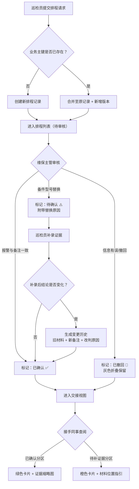

## 1. 产品概述

工厂管线备件排程系统，面向制造业工厂维保场景，解决备件更换排程中重复提交去重、状态追溯、交接沟通等痛点。核心目标是让维保主管和接手同事在灰度发布期间，能够清晰看到每一条排程记录的来龙去脉，减少临时解释成本。

## 2. 核心功能

### 2.1 用户角色

| 角色 | 注册方式 | 核心权限 |
|------|----------|----------|
| 维保主管（阿敏） | 系统内置 | 审核排程、标注撤回、查看全部记录、导出报告 |
| 巡检员 | 系统内置 | 提交巡检记录、试跑排程、补录证据 |
| 接手同事 | 系统内置 | 查看排程、区分已确认/待补、理解材料位置 |

### 2.2 功能模块

1. **排程列表页**：去重展示所有排程记录，撤回记录特殊标记，支持按状态/管线筛选
2. **排程详情页**：单条排程全视图，含报警与备注对比、待确认原因、变更历史时间线
3. **巡检试跑页**：模拟真实交接数据，强制包含一条撤回记录，演示去重逻辑
4. **交接视图页**：已确认与待补证据分区展示，材料位置可视化指引

### 2.3 页面详情

| 页面名称 | 模块名称 | 功能描述 |
|-----------|-------------|---------------------|
| 排程列表页 | 顶部导航栏 | 系统标题、角色切换、全局搜索、导出按钮 |
| 排程列表页 | 筛选统计卡 | 总条数、已确认数、待确认数、撤回数、待补证据数 |
| 排程列表页 | 去重记录列表 | 按业务主键合并相同请求，撤回记录灰色折叠展示，点击展开对比 |
| 排程列表页 | 重复提交预警 | 同一管线+同一备件+同一巡检周期提交2次以上时高亮提示 |
| 排程详情页 | 基本信息卡 | 管线编号、备件型号、计划更换时间、提交人、当前状态 |
| 排程详情页 | 报警与备注对比 | 左侧系统报警内容、右侧人工备注，差异项红色标记 |
| 排程详情页 | 待确认原因面板 | 备件型号替换时显示原型号→新型号、替换原因、确认入口 |
| 排程详情页 | 变更历史时间线 | 旧材料快照、新备注、改判原因、操作人、时间戳，按时间倒序 |
| 巡检试跑页 | 试跑数据集选择 | 默认加载"含撤回记录"数据集，可切换纯净数据集对比 |
| 巡检试跑页 | 提交模拟区 | 连续两次提交相同请求，展示去重前后数量变化 |
| 巡检试跑页 | 撤回记录嵌入 | 强制展示一条已撤回记录与正常记录并排对比 |
| 交接视图页 | 已确认分区 | 绿色背景卡片，列出所有已确认排程，附证据缩略图 |
| 交接视图页 | 待补证据分区 | 橙色背景卡片，列出待补项，每项标注缺什么材料、放哪 |
| 交接视图页 | 材料位置指引 | 备件仓库货架编号、文件柜抽屉号、二维码入口跳转 |

## 3. 核心流程

### 3.1 主流程说明

1. 巡检员提交管线备件排程请求 → 系统按「管线编号+备件型号+巡检周期」生成业务主键
2. 若主键已存在 → 自动合并到原记录，新增一条版本记录，列表只展示最新版
3. 维保主管审核：若报警与备注一致则确认；若备件型号替换则标记待确认并填写原因；若撤回则标记撤回状态（灰色折叠但保留）
4. 补录证据后结论变化：自动生成变更历史，保留旧材料/新备注/改判原因
5. 接手同事打开交接视图：一键区分已确认/待补，材料位置清晰指引

### 3.2 核心流程图

## 4. 用户界面设计

### 4.1 设计风格

- **主色调**：工业蓝 `#1e40af`（沉稳专业），辅助色：确认绿 `#16a34a`、待确认橙 `#ea580c`、撤回灰 `#6b7280`
- **按钮风格**：圆角 6px，高度 36px，hover 时微上浮 + 阴影加深，主按钮有渐变光泽
- **字体**：标题使用「思源黑体 Heavy」600 字重，正文「思源黑体 Regular」，数据表格用「JetBrains Mono」等宽对齐
- **布局风格**：卡片式分区 + 顶部固定导航，列表使用斑马行 + 悬停高亮，时间线用竖线连接节点
- **图标风格**：Lucide React 线性图标，状态用彩色 Badge + 图标组合（确认=对勾圆+绿，待确认=三角叹号+橙，撤回=叉圆+灰）

### 4.2 页面设计概览

| 页面名称 | 模块名称 | UI 元素 |
|-----------|-------------|-------------|
| 排程列表页 | 筛选统计卡 | 5 个数字小卡，hover 时数字微放大，底部有迷你趋势线 |
| 排程列表页 | 去重记录列表 | 每行左端状态色条，撤回行默认折叠为半高灰条，点击展开双版本对比 |
| 排程详情页 | 报警与备注对比 | 左右双栏 Split View，差异文字下划红色波浪线，差异点中间箭头连线 |
| 排程详情页 | 变更历史时间线 | 左侧竖线 + 彩色圆点节点，每个节点展开为卡片，旧材料用删除线样式 |
| 巡检试跑页 | 提交模拟区 | 左侧"提交前"计数、右侧"提交后"计数，中间大箭头，数字滚动动画 |
| 交接视图页 | 分区卡片 | 绿色/橙色大色块分区，分区标题带大图标，材料位置用货架示意图 + 编号高亮 |

### 4.3 响应式

- 桌面端优先（1440px 基准），三栏布局：导航 + 主内容 + 详情侧栏
- 平板端（1024px）切换为两栏：导航 + 主内容，详情页独立路由
- 移动端（<768px）单列堆叠，统计卡横向滚动，时间线改为左对齐紧凑型

## 5. 验收标准

1. 同一排程请求连续提交 2 次，列表计数不增加，版本记录 +1
2. 撤回记录在列表中以灰色折叠态展示，不参与"已确认"统计
3. 备件型号替换触发"待确认"时，详情页显著显示替换原因
4. 补录改判后，变更历史中能看到旧材料（删除线）、新备注、改判原因
5. 交接视图中"已确认"和"待补证据"分区颜色区分明显，待补项含位置信息
6. 巡检试跑页默认数据集包含至少 1 条撤回记录
