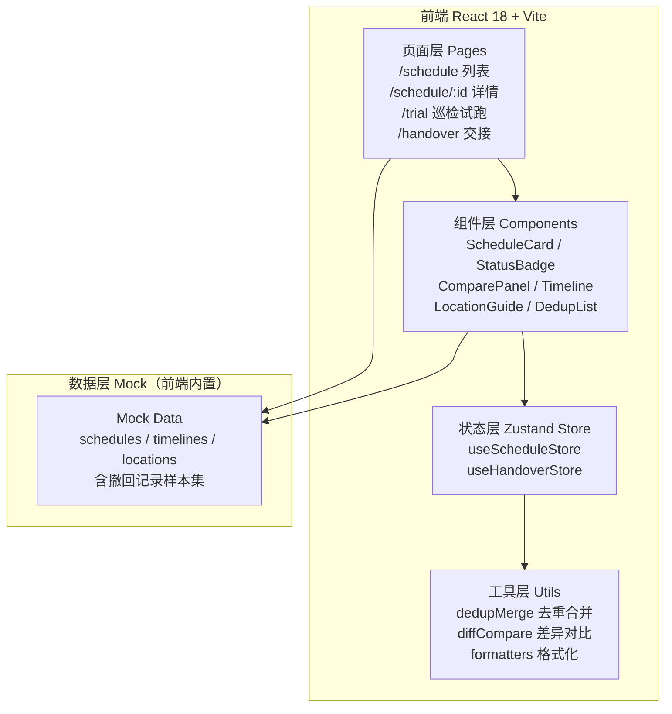
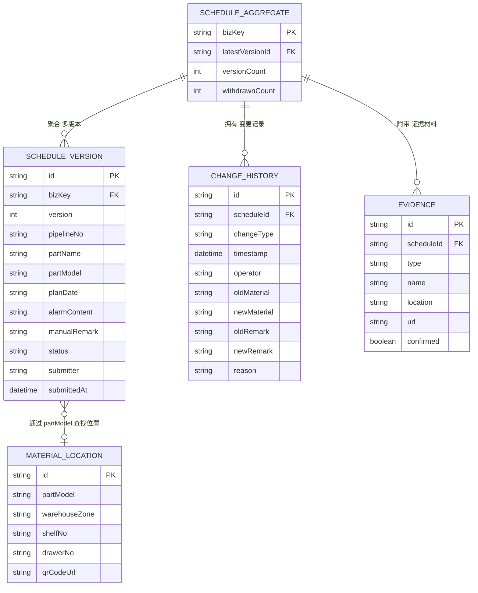

## 1. 架构设计



## 2. 技术描述

- **前端**：React@18 + TypeScript + tailwindcss@3 + zustand + react-router-dom@6 + lucide-react
- **初始化工具**：vite-init（react-ts 模板）
- **后端**：无（纯前端 Mock，所有数据由 zustand + 本地 JSON 提供，模拟异步操作）
- **图标**：lucide-react（严格遵循 icon_guidelines）
- **状态管理**：zustand（排程数据、筛选条件、交接视图状态）

## 3. 路由定义

| Route | 页面 Purpose |
|-------|--------------|
| `/` | 重定向到 `/schedule` |
| `/schedule` | 排程列表页：去重展示 + 筛选统计 + 撤回折叠 |
| `/schedule/:id` | 排程详情页：对比面板 + 待确认原因 + 变更时间线 |
| `/trial` | 巡检试跑页：提交模拟 + 含撤回数据集 + 去重演示 |
| `/handover` | 交接视图页：已确认/待补分区 + 材料位置指引 |

## 4. 数据模型

### 4.1 核心类型定义

```typescript
// 排程状态枚举
export type ScheduleStatus = 'confirmed' | 'pending' | 'withdrawn' | 'draft';

// 变更类型
export type ChangeType = 'create' | 'update' | 'withdraw' | 'confirm' | 'reject' | 'resubmit' | 'model_replace';

// 备件型号替换原因
export interface ModelReplaceReason {
  oldModel: string;
  newModel: string;
  reason: string;          // 替换原因说明
  reportedBy: string;
  reportedAt: string;
}

// 变更历史记录
export interface ChangeHistoryItem {
  id: string;
  scheduleId: string;
  changeType: ChangeType;
  timestamp: string;
  operator: string;
  oldMaterial?: string;    // 旧材料（删除线展示）
  newMaterial?: string;    // 新材料
  oldRemark?: string;      // 旧备注
  newRemark?: string;      // 新备注
  reason?: string;         // 改判/变更原因
}

// 证据材料
export interface EvidenceItem {
  id: string;
  type: 'photo' | 'doc' | 'report';
  name: string;
  location: string;        // 物理位置：货架/抽屉编号
  url?: string;            // 电子材料链接
  uploadedAt: string;
  confirmed: boolean;
}

// 单条排程（一个业务主键下可能有多条版本）
export interface ScheduleVersion {
  id: string;
  version: number;
  pipelineNo: string;      // 管线编号
  partName: string;        // 备件名称
  partModel: string;       // 备件型号
  planDate: string;        // 计划更换日期
  alarmContent: string;    // 系统报警内容
  manualRemark: string;    // 人工备注
  submitter: string;
  submittedAt: string;
  status: ScheduleStatus;
  modelReplace?: ModelReplaceReason;  // 型号替换（待确认原因来源）
}

// 去重后的排程聚合（列表页展示单位）
export interface ScheduleAggregate {
  bizKey: string;          // 业务主键 = pipelineNo + partModel + cycleId
  latest: ScheduleVersion;
  versions: ScheduleVersion[];
  changeHistory: ChangeHistoryItem[];
  evidences: EvidenceItem[];
  withdrawnCount: number;  // 已撤回版本数（用于判断是否有撤回）
}

// 巡检周期
export interface InspectionCycle {
  id: string;
  name: string;
  startDate: string;
  endDate: string;
}

// 材料位置
export interface MaterialLocation {
  id: string;
  partModel: string;
  warehouseZone: string;   // 仓库区域 A/B/C
  shelfNo: string;         // 货架编号
  drawerNo: string;        // 抽屉编号
  qrCodeUrl: string;       // 二维码链接
  contactPerson: string;   // 仓管联系人
}
```

### 4.2 数据模型 ER 图



### 4.3 Mock 数据设计要点

1. **排程样本集（12 条）**：
   - 已确认 × 5 条（正常）
   - 待确认 × 3 条（其中 2 条含备件型号替换原因）
   - 已撤回 × 2 条（折叠展示）
   - 草稿 × 2 条
   - 其中 1 条"待确认"故意设计成：系统报警写"A型密封圈磨损"，人工备注写"B型密封圈待确认更换"，触发差异高亮

2. **去重演示样本**：
   - 同一业务主键下设计 2 条版本（先提交→撤回→重新提交），用于列表页去重 + 版本展开对比

3. **巡检试跑强制样本**：
   - 独立数据集，固定包含 1 条撤回记录（PIPELINE-003 + 机械密封 M200），演示真实交接场景

4. **变更历史样本**：
   - 为 1 条排程设计完整链路：创建 → 型号替换待确认 → 补录证据 → 改判 → 确认，每步都有旧材料/新备注/原因

5. **材料位置样本（8 条）**：
   - 覆盖 A/B/C 三区，含货架编号 + 抽屉号 + 二维码占位图 + 仓管联系人

## 5. 核心工具函数

```typescript
// 1. 去重合并：按 bizKey 聚合，撤回版本保留在 versions 但不影响 latest
export function dedupAndAggregate(versions: ScheduleVersion[]): ScheduleAggregate[]

// 2. 差异对比：找出报警与人工备注的差异词数组（返回 diff spans）
export function diffAlarmVsRemark(alarm: string, remark: string): DiffSpan[]

// 3. 业务主键生成
export function buildBizKey(pipelineNo: string, partModel: string, cycleId: string): string

// 4. 状态计数统计
export function countByStatus(aggs: ScheduleAggregate[]): Record<ScheduleStatus, number>

// 5. 交接视图分区过滤
export function splitForHandover(aggs: ScheduleAggregate[]): { confirmed: ScheduleAggregate[]; pending: ScheduleAggregate[] }
```

## 6. 前端项目结构

```
src/
├── main.tsx              # 入口
├── App.tsx               # 路由配置
├── index.css             # Tailwind + 全局样式（设计 token）
├── types/
│   └── schedule.ts       # 所有类型定义
├── data/
│   ├── schedules.ts      # Mock 排程数据（含撤回）
│   ├── locations.ts      # Mock 材料位置
│   └── trialDataset.ts   # 巡检试跑专用数据集
├── store/
│   └── useScheduleStore.ts  # zustand 状态管理
├── utils/
│   ├── dedup.ts          # 去重聚合
│   ├── diff.ts           # 差异对比
│   └── formatters.ts     # 日期/状态格式化
├── components/
│   ├── layout/           # Navbar / Sidebar / Layout
│   ├── schedule/         # ScheduleCard / DedupList / ScheduleTable
│   ├── detail/           # ComparePanel / PendingReasonBox / ChangeTimeline
│   ├── trial/            # SubmitSimulator / DedupCounter / WithdrawnEmbedDemo
│   ├── handover/         # ConfirmedSection / PendingSection / LocationCard
│   └── common/           # StatusBadge / StatCard / EmptyState
└── pages/
    ├── ScheduleList.tsx
    ├── ScheduleDetail.tsx
    ├── TrialRun.tsx
    └── HandoverView.tsx
```
