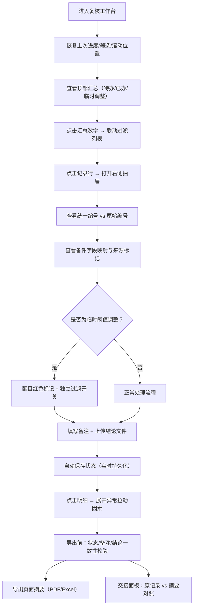

## 1. 产品概述
面向风电运维场景的复核管理系统，解决维保主管在风机叶片阈值预警复核中的效率痛点。核心解决设备编号不统一、进度易丢失、字段混乱、阈值调整记录混淆、汇总无法追溯、导出不一致、交接困难七大问题。
- 目标用户：维保主管（阿敏）及复核人员
- 核心价值：将零散的复核流程标准化、可追溯、可交接

## 2. 核心特性

### 2.1 用户角色
| 角色 | 说明 | 核心权限 |
|------|------|----------|
| 维保主管 | 复核任务负责人，如阿敏 | 全量操作、交接管理、导出汇总 |
| 复核人 | 执行具体复核的人员 | 处理单条记录、填写备注、上传结论 |

### 2.2 功能模块
1. **复核工作台**：设备列表、统一编号映射、进度持久化、页面摘要
2. **备件清单管理**：字段自动映射、来源追踪、处理状态保护
3. **阈值预警标记**：临时调整记录独立过滤、醒目标识
4. **异常明细联动**：汇总卡片与明细表双向高亮、下钻追溯
5. **导出中心**：状态/备注/结论一致性校验、页面摘要导出
6. **交接视图**：备件原始记录与页面摘要对照展示

### 2.3 页面详情
| 页面名称 | 模块名称 | 功能描述 |
|-----------|-------------|---------------------|
| 复核工作台 | 顶部摘要栏 | 显示待复核/已复核/临时调整数量，点击数量联动过滤列表 |
| 复核工作台 | 搜索筛选区 | 设备编号模糊搜索（自动归一化匹配）、状态筛选、仅看临时调整开关 |
| 复核工作台 | 预警记录列表 | 统一设备编号列、原始编号列（hover显示）、阈值对比列、处理状态列 |
| 复核工作台 | 右侧详情抽屉 | 选中记录的完整信息、备件原始字段、备注编辑、结论文件上传 |
| 复核工作台 | 进度条组件 | 总进度显示、自动保存上次滚动位置、恢复提示 |
| 字段映射配置 | 映射规则列表 | 备件字段名→系统字段的映射关系、来源标记、不可删除保护 |
| 阈值临时调整 | 独立标签页 | 所有被标记为"临时调高"的记录集中展示、审批信息显示 |
| 导出中心 | 导出预览 | 三列对照视图（状态/备注/文件结论）、一致性校验通过标记 |
| 交接面板 | 左右对照视图 | 左侧：备件清单原始记录；右侧：页面摘要和处理结论 |

## 3. 核心流程
维保主管阿敏登录系统后，系统自动恢复上次的处理进度、筛选条件和滚动位置。阿敏从统一的设备编号列表选择记录，右侧抽屉展示归一化字段与备件原始字段的对照。复核过程中，任何阈值临时调高的记录自动被标记并可一键切换到独立视图。汇总卡片的数字可点击联动过滤明细，明细行可展开查看"哪些指标拉动了异常结果"。完成复核后，导出前三列自动一致性校验。交接时，交接面板左右对照显示备件原话与处理结论摘要。

## 4. 用户界面设计

### 4.1 设计风格
- **主色**：工业深蓝 `#1e3a5f`（专业、可信赖）
- **预警色**：橙红 `#e85d3c`（阈值异常、临时调整）
- **成功色**：墨绿 `#2f7d4f`（已复核通过）
- **背景色**：浅灰 `#f4f6f9`（信息密度高、减少视觉疲劳）
- **按钮风格**：直角微圆角（2px）、实心主按钮配细边框描边
- **字体**：标题用思源黑体 Heavy，正文用思源宋体 Medium，数据列用等宽字体 JetBrains Mono
- **布局风格**：顶部固定导航 + 左侧筛选面板 + 中间数据表格 + 右侧抽屉详情（四栏式工业布局）
- **图标风格**：Lucide 线性图标，1px 线宽，尺寸统一 16px

### 4.2 页面设计概述
| 页面名称 | 模块名称 | UI 元素 |
|-----------|-------------|----------|
| 复核工作台 | 顶部摘要栏 | 三个彩色统计卡片（悬停微上浮 + 阴影加深）、数字字体放大加粗 |
| 复核工作台 | 搜索筛选区 | 胶囊形输入框、分段控件切换状态、滑杆开关控制"仅看临时调整" |
| 复核工作台 | 数据表格 | 斑马纹行、固定表头、选中行左侧竖线高亮、临时调整行整行淡红背景 |
| 复核工作台 | 右侧抽屉 | 从右滑入动画（300ms ease-out）、半透明遮罩、分组折叠面板 |
| 字段映射配置 | 映射表格 | 左列（备件字段）灰色斜体、右列（系统字段）黑色加粗、中间箭头图标 |
| 阈值临时调整 | 独立标签页 | 徽章标红"临"字、每行显示审批人+审批时间、可展开审批理由 |
| 异常明细展开 | 内嵌面板 | 指标雷达图/条形图、用箭头图标标注"↑拉动异常"的具体因素 |
| 导出预览 | 三栏对照 | 等高三列、用绿色对勾/红色叉号表示一致/不一致、底部导出按钮 |
| 交接面板 | 左右对照 | 50%/50% 分栏、中间竖线可拖拽、关联字段用虚线连接 |

### 4.3 响应式
- Desktop-first 设计，最小支持宽度 1280px
- 平板端：右侧抽屉改为底部弹出
- 移动端：表格改为卡片列表模式，筛选折叠为下拉
- 所有交互元素触摸尺寸 ≥ 44px

### 4.4 动效细节
- 页面加载：摘要卡片逐条渐入上浮（stagger 100ms）
- 行选中：左侧 3px 宽度蓝线从 0 宽度展开动画
- 抽屉打开：遮罩淡入（150ms）+ 内容右滑进入（300ms cubic-bezier(0.16, 1, 0.3, 1)）
- 自动保存提示：右上角 toast 滑入，2秒后滑出
- 进度恢复：页面加载后 500ms 显示"已恢复至上次位置"的淡入提示条
