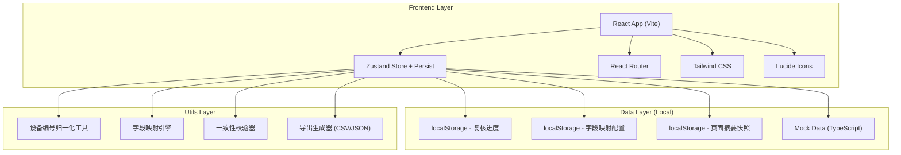
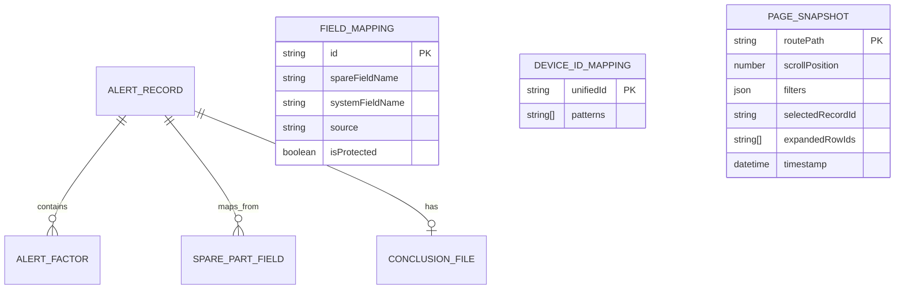

## 1. 架构设计
纯前端 SPA 架构，使用 localStorage 持久化模拟后端，实现零依赖部署。



## 2. 技术说明
- **前端框架**：React@18 + TypeScript@5 + Vite@5
- **状态管理**：Zustand@4 + persist 中间件（localStorage 持久化）
- **样式方案**：Tailwind CSS@3.4（自定义主题色扩展工业蓝/预警橙）
- **路由方案**：React Router DOM@6（HashRouter，适配静态部署）
- **图标库**：Lucide React@0.344
- **初始化工具**：vite-init（react-ts 模板）
- **后端方案**：无后端，使用 Mock 数据 + localStorage 持久化
- **数据存储**：浏览器 localStorage（存储复核进度、字段映射、页面摘要）

## 3. 路由定义
| Route | 页面用途 |
|-------|----------|
| `/workbench` | 复核工作台（主页，默认路由） |
| `/field-mapping` | 字段映射配置页 |
| `/temp-adjustment` | 阈值临时调整独立页 |
| `/export` | 导出中心（一致性校验+导出） |
| `/handover` | 交接面板（左右对照视图） |

## 4. API 定义（无后端，使用 Store Actions）

### 4.1 Zustand Store TypeScript 定义

```typescript
// 设备编号归一化后的预警记录
interface AlertRecord {
  id: string;
  unifiedDeviceId: string;        // 统一设备编号 (如: W2023-FJ-0145)
  originalDeviceIds: string[];     // 原始编号数组 (写法不统一的各种写法)
  source: string;                  // 来源标记 (如: 备件清单A/巡检表B)
  bladeAngle: number;              // 叶片角度
  bladeAngleThreshold: number;     // 角度阈值
  vibrationLevel: number;          // 振动水平
  vibrationThreshold: number;      // 振动阈值
  isTempThresholdAdjusted: boolean; // 是否临时调高阈值
  tempAdjustReason?: string;       // 临时调整原因
  tempAdjustApprover?: string;     // 临时调整审批人
  tempAdjustTime?: string;         // 临时调整时间
  status: 'pending' | 'reviewing' | 'approved' | 'rejected';
  remark: string;                  // 复核人备注
  conclusionFile?: {               // 文件结论
    name: string;
    uploadedAt: string;
    conclusion: 'pass' | 'fail' | 'pending';
  };
  factors: AlertFactor[];          // 拉动异常的因素
  sparePartsFields: Record<string, string>; // 备件原始字段 (key=原始字段名, value=值)
  createdAt: string;
  updatedAt: string;
}

interface AlertFactor {
  name: string;           // 指标名
  value: number;          // 当前值
  threshold: number;      // 阈值
  deviationPct: number;   // 偏离百分比
  isPulling: boolean;     // 是否拉动异常
}

interface FieldMapping {
  id: string;
  spareFieldName: string; // 备件字段名
  systemFieldName: string;// 系统字段名
  source: string;         // 来源
  isProtected: boolean;   // 是否受保护 (来源和处理状态不可删除)
}

interface PageSnapshot {
  routePath: string;
  scrollPosition: number;
  filters: Record<string, any>;
  selectedRecordId?: string;
  expandedRowIds: string[];
  timestamp: string;
}

// 映射规则: 各种原始编号写法 → 统一编号
interface DeviceIdMapping {
  unifiedId: string;
  patterns: string[];
}
```

### 4.2 Store Actions

```typescript
interface ReviewStore {
  // 记录管理
  records: AlertRecord[];
  getFilteredRecords: () => AlertRecord[];
  
  // 设备编号归一化
  normalizeDeviceId: (rawId: string) => string;
  deviceMappings: DeviceIdMapping[];
  
  // 字段映射
  fieldMappings: FieldMapping[];
  mapSpareFields: (spareData: Record<string, string>) => Record<string, string>;
  
  // 进度持久化
  pageSnapshot: PageSnapshot | null;
  savePageSnapshot: (snapshot: Partial<PageSnapshot>) => void;
  restorePageSnapshot: () => PageSnapshot | null;
  
  // 记录操作
  updateRecordStatus: (id: string, status: AlertRecord['status']) => void;
  updateRecordRemark: (id: string, remark: string) => void;
  updateRecordConclusion: (id: string, file: AlertRecord['conclusionFile']) => void;
  
  // 临时调整过滤
  showTempAdjustedOnly: boolean;
  toggleTempAdjustedFilter: () => void;
  
  // 汇总统计
  getSummaryStats: () => {
    pending: number;
    approved: number;
    tempAdjusted: number;
  };
  
  // 一致性校验
  validateConsistency: (recordId: string) => {
    isConsistent: boolean;
    mismatches: { field: string; statusValue: string; remarkValue: string; fileValue: string }[];
  };
  
  // 导出
  generateExportData: () => ExportRow[];
}
```

## 5. 数据模型

### 5.1 ER 关系图



### 5.2 Mock 初始数据说明

- **预警记录**：20条模拟数据，其中5条标记为"临时阈值调高"
- **设备编号映射**：模拟同一设备的3-5种不同写法（如 W2023FJ0145 / 风机-2023-0145 / FJ#2023_145 等）
- **字段映射**：15条映射规则，其中"来源"和"处理状态"标记为 isProtected=true（不可删除）
- **页面摘要快照**：预置上次访问的模拟数据，用于演示"恢复上次进度"功能

## 6. 项目目录结构

```
src/
├── components/
│   ├── workbench/
│   │   ├── SummaryCards.tsx       # 顶部汇总卡片（可点击联动过滤）
│   │   ├── FilterBar.tsx          # 搜索筛选区
│   │   ├── AlertTable.tsx         # 预警记录表格
│   │   ├── AlertRow.tsx           # 单行记录（含展开异常因素）
│   │   ├── DetailDrawer.tsx       # 右侧详情抽屉
│   │   └── ProgressRestoreBar.tsx # 进度恢复提示条
│   ├── mapping/
│   │   └── FieldMappingTable.tsx  # 字段映射配置表
│   ├── temp-adjust/
│   │   └── TempAdjustList.tsx     # 临时调整独立列表
│   ├── export/
│   │   └── ConsistencyPreview.tsx # 三列一致性对照预览
│   └── handover/
│       └── HandoverPanel.tsx      # 交接左右对照面板
├── hooks/
│   ├── useAutoSave.ts             # 自动保存进度
│   └── useScrollRestore.ts        # 滚动位置恢复
├── store/
│   └── reviewStore.ts             # Zustand Store + Persist
├── utils/
│   ├── deviceIdNormalizer.ts      # 设备编号归一化工具
│   ├── fieldMapper.ts             # 字段映射引擎
│   ├── consistencyChecker.ts      # 一致性校验器
│   └── exportGenerator.ts         # 导出生成器
├── data/
│   └── mockData.ts                # Mock 数据
├── types/
│   └── index.ts                   # TypeScript 类型定义
├── pages/
│   ├── WorkbenchPage.tsx
│   ├── FieldMappingPage.tsx
│   ├── TempAdjustPage.tsx
│   ├── ExportPage.tsx
│   └── HandoverPage.tsx
├── App.tsx
├── main.tsx
└── index.css
```
