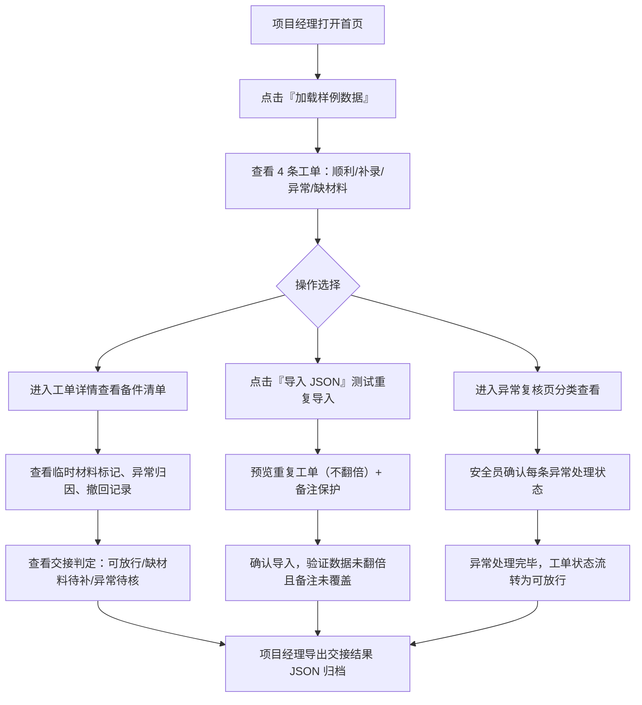
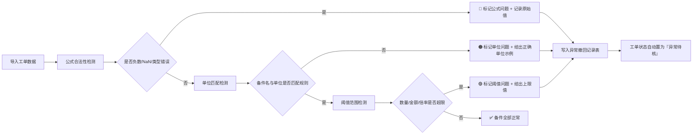

## 1. 产品概述

盾构刀盘工单回放小工具是一款面向盾构施工项目的工单复核与交接管理系统。项目经理可通过该工具完成工单导入、异常回放、交接状态判定与结果导出，解决现有手工核账导致异常被平均值掩盖、撤回记录丢失在备注中等问题。

- 解决的核心问题：异常记录无分类归因、重复导入数据翻倍、人工备注被覆盖、撤回记录无留痕、交接状态模糊
- 目标用户：项目经理、安全员老唐、班组长、仓库管理员
- 核心价值：用三四条小样例即可走通全流程，确保月底核账不被平均值拖住

---

## 2. 核心功能

### 2.1 用户角色

| 角色 | 入口方式 | 核心权限 |
|------|----------|----------|
| 项目经理 | 首页直接打开，无需登录 | 导入工单、回放异常、判定交接、导出结果 |
| 安全员（老唐） | 异常列表视图 | 查看异常归因（公式/单位/阈值）、确认修正 |

### 2.2 功能模块

1. **工单总览页**：状态看板（可放行/缺材料/异常待核/待交接）、导入入口、样例加载按钮、导出入口
2. **工单详情页**：工单基础信息、备件清单列表（含临时材料标记）、异常撤回记录、交接判定结果
3. **导入回放页**：JSON/CSV 格式导入、重复检测预览、人工备注保护策略说明、异常归因实时预览
4. **异常复核页**：按公式问题/单位问题/阈值问题分类展示、每条异常附处理动作建议

### 2.3 页面详情

| 页面名称 | 模块名称 | 功能描述 |
|----------|----------|----------|
| 工单总览页 | 状态统计卡片 | 4 类交接状态数量一目了然，点击卡片筛选列表 |
| 工单总览页 | 工单列表表格 | 列含：工单编号、设备编号、工单类型、备件数、异常数、交接状态、操作按钮 |
| 工单总览页 | 操作工具栏 | 加载样例数据、导入 JSON、导出全量、清空数据 |
| 工单详情页 | 基础信息区 | 工单编号、设备编号、刀盘型号、施工部位、班组、人工备注（只读保护标识） |
| 工单详情页 | 备件清单表格 | 列含：备件名、单位、申报数、出库数、单价、金额、是否临时材料、异常提示、处理动作 |
| 工单详情页 | 异常撤回记录区 | 时间线形式展示每条撤回：分类（公式/单位/阈值）、原始值、正确示例、处理状态 |
| 工单详情页 | 交接判定区 | 自动建议 + 人工确认：可放行/缺材料待补/异常待核 |
| 导入回放页 | 上传区 | 拖拽或粘贴 JSON，实时校验格式 |
| 导入回放页 | 重复检测预览 | 红色标记已存在工单编号/设备编号，说明"不翻倍只更新可写字段" |
| 导入回放页 | 备注保护说明 | 灰色高亮显示"人工备注字段不被覆盖"提示 |
| 导入回放页 | 异常归因预览 | 三色标识：🔴公式/🟠单位/🟣阈值，点击展开原因 |
| 异常复核页 | 分类标签栏 | 全部/公式问题/单位问题/阈值问题，右上角显示安全员确认进度 |
| 异常复核页 | 异常卡片列表 | 每条异常包含：关联工单、问题详情、原始值 vs 正确值、处理动作按钮 |

---

## 3. 核心流程

### 3.1 工单回放全流程

### 3.2 异常检测与归因流程

---

## 4. 用户界面设计

### 4.1 设计风格

- **主色调**：工业深青 `#0E4F55`（对应盾构机金属感）
- **辅助色**：
  - 可放行绿 `#10B981`
  - 缺材料橙 `#F59E0B`
  - 异常红 `#EF4444`
  - 阈值紫 `#8B5CF6`
  - 单位橙 `#F97316`
  - 公式红 `#DC2626`
- **背景基调**：石墨灰渐变 + 细线网格纹理（工业仪表板风格）
- **按钮风格**：方角 + 2px 描边，hover 时背景填充，按压时有轻微下沉感
- **字体**：标题用「JetBrains Mono」等宽字体（工业数据感），正文用「Noto Sans SC」
- **布局风格**：左右分栏仪表盘，左侧导航+主内容卡片网格，状态栏始终置顶
- **图标风格**：lucide-react 线性图标，异常标记用粗体 emoji（🔴🟠🟣✅）做视觉锚点

### 4.2 页面设计概览

| 页面名称 | 模块名称 | UI 元素细节 |
|----------|----------|-------------|
| 工单总览页 | 顶部状态条 | 4 个带边框色块统计卡，色块左边缘用对应状态色做 4px 竖条强调 |
| 工单总览页 | 列表表格 | 斑马纹行、异常行整行淡红底、交接状态列用彩色胶囊标签 |
| 工单总览页 | 工具栏 | 深青底+白字主按钮，次要按钮用描边幽灵按钮 |
| 工单详情页 | 备件清单 | 正常行灰底、临时材料行加浅紫背景条、异常行加浅红背景条+右侧异常徽章 |
| 工单详情页 | 撤回时间线 | 左侧竖线连接节点，节点用异常色实心圆，卡片右下方附处理动作按钮 |
| 工单详情页 | 交接判定 | 大号状态展示卡，自动建议居左，人工确认按钮居右 |
| 导入回放页 | 预览表格 | 重复行加黄色对角条纹背景，重复单元格右上角加"已存在"小角标 |
| 导入回放页 | 异常预览 | 三色图标 + 可展开的原因说明面板 |
| 异常复核页 | 分类标签 | 下划线切换样式，激活标签底部用对应异常色做 3px 横条 |
| 异常复核页 | 异常卡片 | 两列布局：左侧原始值（红底删除线）/右侧正确值（绿底下划线），下方处理动作 |

### 4.3 响应式

桌面优先（min-width 1280px），平板端（768–1280px）压缩为单列表格+抽屉详情，移动端（<768px）卡片堆叠。核心表格列可横向滚动。

### 4.4 动画与交互

- 页面加载：卡片依次从左上浮入（stagger 80ms）
- 异常标记出现：红色抖动动画（500ms），结束后稳定显示
- 交接状态变更：状态卡数字滚动效果 + 状态色条渐变过渡
- 导入重复检测：重复行高亮闪烁一次（黄色脉冲）

---

## 5. 样例数据规格（固定 4 条工单 + 8 条备件 + 2 条异常撤回）

| 工单编号 | 设备编号 | 类型 | 场景 | 交接状态 |
|----------|----------|------|------|----------|
| WO-2026-0601 | SDJ-001 | 例行检修 | 顺利记录：2 项备件全部正常 | 可放行 |
| WO-2026-0602 | SDJ-002 | 补录记录 | 含 1 项临时采购密封圈，人工备注不被覆盖 | 待交接（含临时材料） |
| WO-2026-0603 | SDJ-001 | 故障维修 | 异常记录：设备编号 SDJ-001 重复 + 2 条撤回（单位问题+阈值问题） | 异常待核 |
| WO-2026-0604 | SDJ-003 | 专项改造 | 缺材料记录：主轴承大齿圈未到货 | 缺材料待补 |
