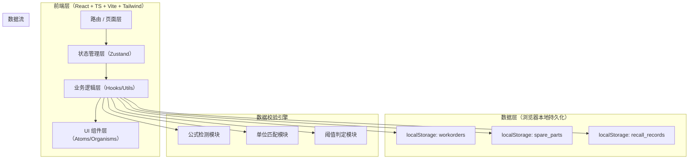
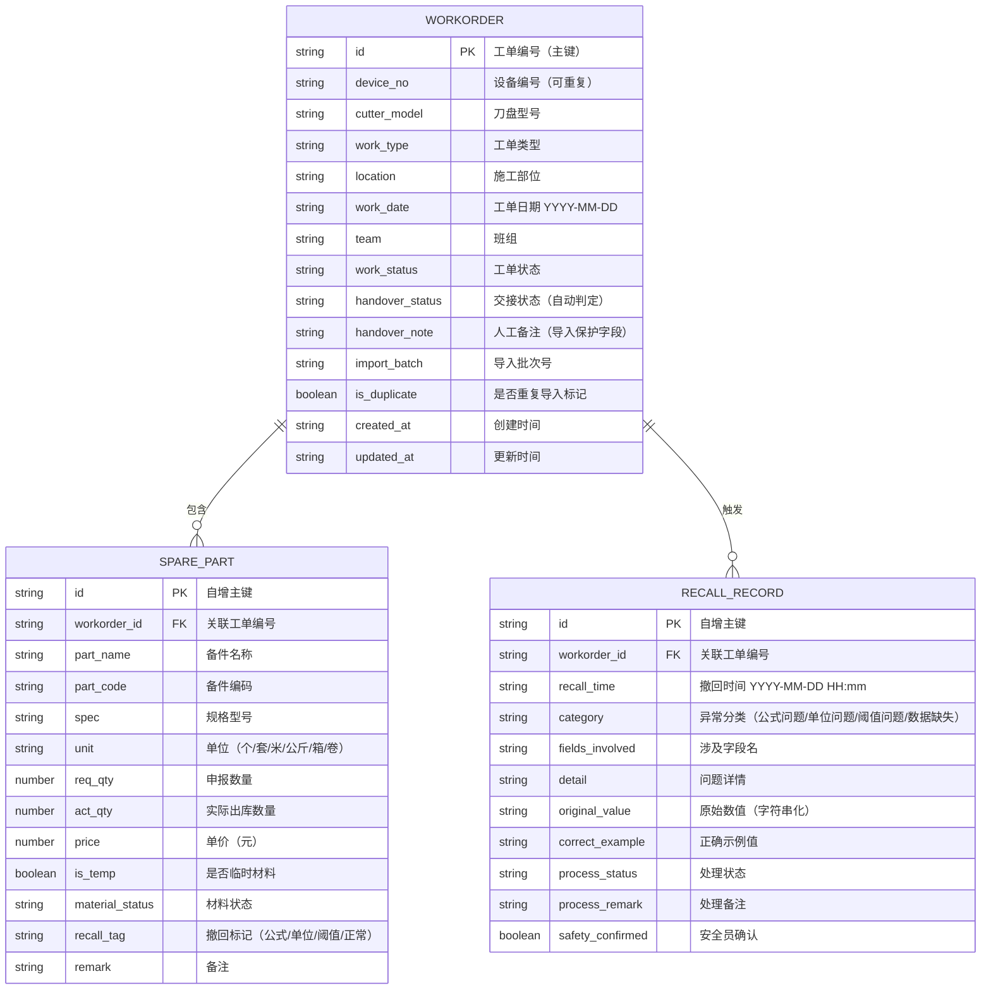

## 1. 架构设计



纯前端 SPA，数据持久化在浏览器 localStorage，支持 JSON 导入导出（可跨设备复建），无需后端。

---

## 2. 技术选型

- **前端框架**：React@18 + TypeScript@5 + Vite@5
- **初始化工具**：vite-init
- **样式方案**：TailwindCSS@3（原子化 CSS）
- **状态管理**：Zustand@4（轻量、无 Provider 嵌套）
- **路由**：react-router-dom@6
- **图标**：lucide-react
- **数据持久化**：localStorage + Zustand persist 中间件
- **数据导入/导出**：原生 FileReader + Blob

---

## 3. 路由定义

| 路由路径 | 页面组件 | 说明 |
|----------|----------|------|
| `/` | WorkorderList 工单总览页 | 状态统计、工单列表、工具栏（加载样例/导入/导出/清空） |
| `/workorder/:id` | WorkorderDetail 工单详情页 | 基础信息、备件清单、撤回时间线、交接判定 |
| `/import` | ImportPlayback 导入回放页 | JSON 上传、重复检测预览、备注保护提示、异常归因预览 |
| `/review` | ExceptionReview 异常复核页 | 分类标签（公式/单位/阈值）、异常卡片、处理动作 |

---

## 4. 数据模型

### 4.1 ER 图



### 4.2 枚举值常量

```ts
// 工单类型
export const WORK_TYPES = ['例行检修', '故障维修', '专项改造', '补录记录'] as const;
// 工单状态
export const WORK_STATUS = ['待处理', '处理中', '异常撤回', '缺材料', '可放行', '已完成'] as const;
// 交接状态
export const HANDOVER_STATUS = ['待交接', '可放行', '缺材料待补', '异常待核'] as const;
// 单位
export const UNITS = ['个', '套', '米', '公斤', '箱', '卷'] as const;
// 材料状态
export const MATERIAL_STATUS = ['正常', '缺料', '待核', '单位异常', '阈值异常', '公式异常'] as const;
// 撤回标记
export const RECALL_TAGS = ['正常', '公式问题', '单位问题', '阈值问题'] as const;
// 异常分类
export const EXCEPTION_CATEGORIES = ['公式问题', '单位问题', '阈值问题', '数据缺失'] as const;
// 处理状态
export const PROCESS_STATUS = ['待处理', '处理中', '已修正', '需人工确认'] as const;
```

---

## 5. 核心检测规则（异常归因引擎）

### 5.1 公式问题检测（🔴 formula）

```typescript
function checkFormula(sp: SparePart): string | null {
  if (isNaN(sp.req_qty) || isNaN(sp.act_qty) || isNaN(sp.price))
    return '公式异常：数值类型错误，无法计算金额';
  if (sp.req_qty < 0) return '公式异常：申报数量不能为负数';
  if (sp.act_qty < 0) return '公式异常：出库数量不能为负数';
  if (sp.price < 0)     return '公式异常：单价不能为负数';
  return null;
}
```

### 5.2 单位问题检测（🟠 unit）

```typescript
function checkUnit(sp: SparePart): string | null {
  if (!sp.unit) return '异常：未填写单位';
  const rules: [RegExp, string[]][] = [
    [/螺栓/,     ['个']],
    [/密封|圈/,  ['个', '套']],
    [/油管|管/,  ['米']],
    [/油脂|油/,  ['公斤']],
    [/焊丝|焊条/, ['卷']],
  ];
  for (const [pattern, validUnits] of rules) {
    if (pattern.test(sp.part_name) && !validUnits.includes(sp.unit))
      return `单位异常：${sp.part_name} 应使用 ${validUnits.join('/')}，当前为「${sp.unit}」`;
  }
  return null;
}
```

### 5.3 阈值问题检测（🟣 threshold）

```typescript
function checkThreshold(sp: SparePart): string | null {
  if (sp.req_qty == null || isNaN(sp.req_qty)) return '异常：申报数量为空';
  if (sp.req_qty > 1000) return '阈值异常：申报数量超过上限 1000';
  if (sp.price > 100000 && sp.req_qty > 10)
    return '阈值异常：高值备件（单价 > 10 万）单次申报不得超过 10 件';
  if (/主轴承/.test(sp.part_name) && sp.req_qty > 2)
    return '阈值异常：主轴承单次申报不得超过 2 个';
  if (sp.act_qty > sp.req_qty * 1.5 && sp.req_qty > 0)
    return `阈值异常：出库量(${sp.act_qty}) 超过申报量(${sp.req_qty}) 的 150%`;
  return null;
}
```

---

## 6. 重复导入与备注保护策略

```typescript
/**
 * 导入合并规则
 * - 相同 工单编号(id) 的记录：不新增（不翻倍），只 UPDATE
 * - UPDATE 时：跳过 handover_note（人工备注）字段，保留旧值
 * - 设备编号 device_no 允许重复（如 SDJ-001 出现两条工单属于正常业务）
 * - 对重复工单设置 is_duplicate = true 做可视化标记
 */
function mergeImport(existing: Workorder[], incoming: Workorder[]): Workorder[] {
  const map = new Map(existing.map(w => [w.id, w]));
  for (const w of incoming) {
    const old = map.get(w.id);
    if (old) {
      // 不翻倍，只更新可写字段，跳过人工备注
      const { handover_note: _keep, ...updatable } = w;
      map.set(w.id, { ...old, ...updatable, handover_note: old.handover_note, is_duplicate: true });
    } else {
      map.set(w.id, { ...w, is_duplicate: false });
    }
  }
  return Array.from(map.values());
}
```

---

## 7. 交接状态自动判定

```typescript
function computeHandoverStatus(wo: Workorder, parts: SparePart[]): HandoverStatus {
  const exceptions = parts.filter(p => p.recall_tag !== '正常');
  const missing    = parts.filter(p => p.material_status === '缺料');
  const tempParts  = parts.filter(p => p.is_temp === true);

  if (exceptions.length > 0) return '异常待核';
  if (missing.length > 0)    return '缺材料待补';
  if (parts.length === 0)    return '待交接';
  if (tempParts.length > 0)  return '待交接'; // 含临时材料需复核
  return '可放行';
}
```

---

## 8. 项目目录结构

```
.
├── README.md                       // 启动、导入样例、异常验证、导出复建
├── index.html
├── package.json
├── tailwind.config.js
├── tsconfig.json
├── vite.config.ts
├── public/
│   └── sample-data.json            // 固定样例（4 工单 + 8 备件 + 2 撤回）
└── src/
    ├── main.tsx
    ├── App.tsx
    ├── router.tsx
    ├── types/
    │   └── index.ts                // Workorder / SparePart / RecallRecord
    ├── constants/
    │   └── enums.ts                // 枚举值常量
    ├── utils/
    │   ├── detector.ts             // 公式/单位/阈值检测引擎
    │   ├── importer.ts             // 重复导入合并 + 备注保护
    │   ├── handover.ts             // 交接状态自动判定
    │   └── exporter.ts             // JSON 导出
    ├── store/
    │   └── workorderStore.ts       // Zustand + persist
    ├── components/
    │   ├── layout/
    │   │   ├── AppLayout.tsx
    │   │   └── Sidebar.tsx
    │   ├── status/
    │   │   ├── StatusCard.tsx
    │   │   └── StatusBadge.tsx
    │   ├── exception/
    │   │   ├── ExceptionBadge.tsx
    │   │   ├── RecallTimeline.tsx
    │   │   └── ExceptionCard.tsx
    │   ├── table/
    │   │   ├── WorkorderTable.tsx
    │   │   ├── SparePartTable.tsx
    │   │   └── DuplicateRow.tsx
    │   └── import/
    │       ├── ImportDropzone.tsx
    │       └── ImportPreview.tsx
    └── pages/
        ├── WorkorderList.tsx
        ├── WorkorderDetail.tsx
        ├── ImportPlayback.tsx
        └── ExceptionReview.tsx
```
