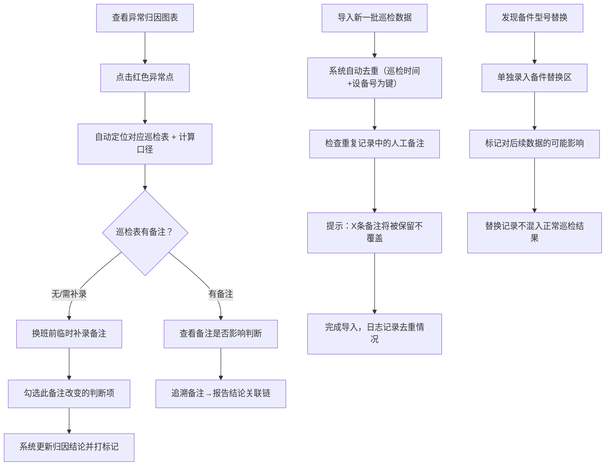

## 1. 产品概述

盾构刀盘异常归因系统，专为盾构施工维保团队设计，解决刀盘报警数据与人工巡检备注脱节、归因混乱的核心问题。帮助维保主管阿敏、排班同事快速定位异常原因、追溯巡检依据、管理备件替换记录。

- 目标用户：维保主管、巡检人员、排班同事
- 核心价值：打通报警数据-巡检表-人工备注的归因链路，消除数据冲突，沉淀异常归因知识

## 2. 核心功能

### 2.1 用户角色

| 角色 | 核心职责 | 使用场景 |
|------|----------|----------|
| 维保主管（阿敏） | 异常归因判断、审核备注、查看报告 | 报警与备注对不上时定位问题 |
| 巡检人员 | 填写巡检表、补录备注、记录异常 | 换班前补录临时巡检备注 |
| 排班同事 | 查看记录、管理备件、追溯历史 | 处理备件替换、交接班追溯 |

### 2.2 功能模块

1. **异常归因主面板**：时间序列图表（温度/振动/转速）、异常点位标记、点击回溯巡检表
2. **巡检表与计算口径区**：巡检记录详情、异常判定计算口径公式说明、口径版本历史
3. **人工备注管理区**：备注列表、补录入口、标注"此备注改变了哪些判断"、备注历史追溯链
4. **备件替换记录区**：单独拎出的备件型号替换记录、不混入正常结果、影响标记
5. **数据导入区**：重复导入去重提示、人工备注保护确认、导入记录日志
6. **历史追溯与报告区**：Markdown报告链接、备注→报告结论关联链、服务重启后历史恢复

### 2.3 页面详情

| 页面名称 | 模块名称 | 功能描述 |
|-----------|-------------|---------------------|
| 异常归因主面板 | 时序图表区 | 温度/振动/转速三指标折线图，异常点红色高亮，点击异常点跳转巡检表 |
| 异常归因主面板 | 异常归因列表 | 按时间倒序的异常记录，显示报警值、巡检表链接、归因结论 |
| 异常归因主面板 | 计算口径抽屉 | 点击"计算口径"弹出，展示判定公式、阈值、版本号、更新人 |
| 巡检表详情区 | 巡检记录表 | 巡检时间、人员、各项读数、人工备注、关联报告 |
| 巡检表详情区 | 备注影响标记 | 标注某条备注改变了哪几项异常判断（从"异常"→"正常"等） |
| 人工备注管理区 | 补录表单 | 选择巡检记录、输入备注、勾选影响的判断项、保存时间戳 |
| 备件替换区 | 替换记录卡片 | 独立区域，显示旧型号→新型号、替换时间、替换原因、对数据的影响说明 |
| 数据导入区 | 导入面板 | 拖拽/选择文件、显示去重统计、提示将保护的备注条数 |
| 历史追溯区 | 备注报告关联链 | 树形展示：备注→关联异常→报告章节→结论，可跳转到Markdown锚点 |

## 3. 核心流程

## 4. 用户界面设计

### 4.1 设计风格
- **工业运维风**：深灰底色 + 警示橙高亮 + 数据蓝主调，契合盾构施工严肃场景
- **主色**：#1E293B（工业深灰）/ #3B82F6（数据蓝）/ #F97316（警示橙）/ #10B981（正常绿）/ #EF4444（异常红）
- **按钮风格**：直角微圆角（3px），按压下沉效果，工业控制面板感
- **字体**：标题用 JetBrains Mono（等宽工业感），正文用 Noto Sans SC
- **布局**：左侧导航 + 顶部状态栏 + 主工作区三栏（图表左50%/详情右50%）
- **图标风格**：线条图标，统一 1.5px 描边，带轻微工业纹理

### 4.2 页面设计概要

| 页面名称 | 模块名称 | UI 关键要素 |
|-----------|-------------|-------------|
| 异常归因主面板 | 时序图表 | 深色Chart.js图表，异常点橙色光晕脉冲动画，hover十字准线 |
| 异常归因主面板 | 异常列表卡片 | 左侧色条（红异常/橙待确认/绿已澄清），卡片hover上浮+阴影加深 |
| 巡检表详情区 | 备注影响标记 | 绿色箭头 "▲ 正常 → ● 异常" 或反之，配文字说明 |
| 备件替换区 | 替换卡片 | 橙色边框+橙色角标"备件替换"，左右箭头连接旧新型号 |
| 数据导入区 | 去重提示 | 黄色警告框，列出将被保护的备注条数和去重记录数 |
| 历史追溯区 | 关联链树 | 缩进树形，节点用连接线，点击节点高亮对应内容 |

### 4.3 响应式策略
- Desktop-first（1440px 基准），1200px 以上三栏，800-1200px 两栏，800px 以下单栏堆叠
- 移动端保留图表缩放手势，详情区可左右滑动切换tab

### 4.4 动画与微交互
- 异常点呼吸脉冲（2s 循环）提示可点击
- 切换巡检表时右侧详情区淡入（0.3s opacity）
- 补录备注成功后绿色成功条从顶部滑入再滑出
- 备件替换卡片入场时从右侧滑入 + 轻微缩放
