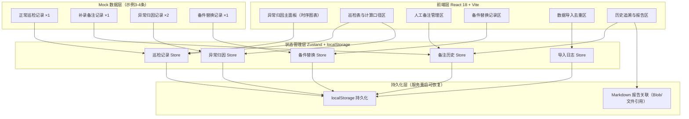

## 1. 架构设计



## 2. 技术选型

- **前端框架**：React@18 + TypeScript@5
- **构建工具**：Vite@5
- **样式方案**：TailwindCSS@3
- **图表库**：Chart.js@4 + react-chartjs-2（工业风时序图）
- **状态管理**：Zustand@4（轻量，含 localStorage 持久化中间件）
- **路由**：React Router@6（单页内tab切换，可不用hash路由）
- **图标**：Lucide React（等宽线条图标，符合工业风）
- **Markdown渲染**：react-markdown@9
- **后端**：无（纯前端 + localStorage 持久化，满足服务重启后恢复需求）
- **数据库**：localStorage（键值持久化）+ JSON Blob（导出Markdown报告）

## 3. 数据模型定义（TypeScript）

```typescript
// 6.1 核心实体 ER 图
// ┌──────────────┐       ┌────────────────┐       ┌──────────────┐
// │  巡检记录     │1─────*│   人工备注      │1─────*│  判断影响项   │
// │ Inspection   │       │   Remark       │       │ JudgementImpact│
// └──────┬───────┘       └────────────────┘       └──────────────┘
//        │
//        │1
//        │
//        *
// ┌──────────────┐       ┌────────────────┐
// │  异常归因     │       │ 备件替换记录    │
// │ AnomalyAttrib│       │ PartReplacement│
// └──────────────┘       └────────────────┘
```

### 6.2 TypeScript 类型定义

```typescript
// 巡检记录（去重键：inspectionTime + deviceId）
interface InspectionRecord {
  id: string;                          // 唯一ID
  deviceId: string;                    // 设备号（刀盘编号）
  inspectionTime: number;              // 巡检时间戳（去重键1）
  inspector: string;                   // 巡检人员
  temperature: number;                 // 刀盘温度 ℃
  vibration: number;                   // 振动值 mm/s
  rotationSpeed: number;               // 转速 rpm
  cutterWear: number;                  // 刀具磨损量 mm
  isAlarm: boolean;                    // 是否触发报警
  alarmType?: 'temperature' | 'vibration' | 'wear' | null;
  sourceImportId?: string;             // 来源导入批次（用于去重追溯）
  createdAt: number;
  updatedAt: number;
}

// 人工备注（可补录，服务重启后通过ID追溯）
interface Remark {
  id: string;
  inspectionId: string;                // 关联巡检记录
  content: string;                     // 备注内容
  author: string;                      // 填写人
  createdAt: number;                   // 填写时间
  isSupplementary: boolean;            // 是否补录（换班前临时补的）
  supplementaryTime?: number;          // 补录时间
  judgementImpacts: JudgementImpact[]; // 此备注改变了哪些判断
  reportAnchorId?: string;             // 关联 Markdown 报告锚点ID
}

// 判断影响项（描述备注如何改变归因结论）
interface JudgementImpact {
  id: string;
  metric: 'temperature' | 'vibration' | 'wear' | 'overall'; // 影响的指标
  beforeStatus: 'normal' | 'warning' | 'anomaly';           // 变更前状态
  afterStatus: 'normal' | 'warning' | 'anomaly';            // 变更后状态
  reason: string;                                            // 变更理由
}

// 异常归因结论
interface AnomalyAttribution {
  id: string;
  inspectionId: string;                // 关联巡检记录
  anomalyType: string;                 // 异常类型：高温/振动超标/磨损超限
  rootCause: string;                   // 根因分析
  confidence: number;                  // 置信度 0-100
  relatedMetric: 'temperature' | 'vibration' | 'wear';
  calculationVersion: string;          // 使用的计算口径版本号
  confirmedBy?: string;                // 确认人
  confirmedAt?: number;
  status: 'pending' | 'confirmed' | 'clarified'; // 待确认/已确认/已澄清
  clarifiedRemarkId?: string;          // 澄清此异常的备注ID
}

// 备件型号替换（单独拎出，不混入正常巡检）
interface PartReplacement {
  id: string;
  time: number;                        // 替换时间
  deviceId: string;
  partName: string;                    // 备件名称（如：主驱动密封）
  oldModel: string;                    // 旧型号
  newModel: string;                    // 新型号
  quantity: number;
  operator: string;
  reason: string;                      // 替换原因
  dataImpactNote: string;              // 对后续数据的可能影响说明
  relatedInspectionIds: string[];      // 关联的巡检记录ID（可能受影响的）
}

// 导入日志（记录去重与备注保护情况）
interface ImportLog {
  id: string;
  importTime: number;
  fileName: string;
  totalRecords: number;                // 总条数
  duplicateRecords: number;            // 去重条数
  preservedRemarks: number;            // 被保护不覆盖的备注数
  status: 'success' | 'partial' | 'failed';
}

// 计算口径（判定公式版本）
interface CalculationCriterion {
  version: string;                     // 版本号如 v1.2.0
  updatedAt: number;
  updatedBy: string;
  temperatureThreshold: number;        // 温度阈值 ℃
  vibrationThreshold: number;          // 振动阈值
  wearThreshold: number;               // 磨损阈值 mm
  formulaDescription: string;          // 判定公式文字说明
  isActive: boolean;
}

// Markdown 报告章节（供历史追溯）
interface ReportSection {
  id: string;                          // 锚点ID，与 Remark.reportAnchorId 对应
  title: string;
  content: string;                     // Markdown 内容
  createdAt: number;
}
```

### 6.3 localStorage 存储键设计

| Key | 存储内容 | 恢复策略 |
|-----|----------|----------|
| `cutter_inspections_v1` | InspectionRecord[] | 首次加载无数据时注入示例3-4条 |
| `cutter_remarks_v1` | Remark[] | 与 inspections 通过 inspectionId 关联恢复 |
| `cutter_attributions_v1` | AnomalyAttribution[] | 恢复异常归因结论 |
| `cutter_replacements_v1` | PartReplacement[] | 恢复备件替换记录 |
| `cutter_import_logs_v1` | ImportLog[] | 恢复导入历史 |
| `cutter_criterion_v1` | CalculationCriterion | 恢复当前计算口径 |
| `cutter_report_sections_v1` | ReportSection[] | 恢复 Markdown 报告章节 |

### 6.4 去重与备注保护算法（核心逻辑）

```
去重键生成函数：
  dedupKey = SHA256(deviceId + "|" + floor(inspectionTime / 60000))
  （取设备号 + 巡检时间精确到分钟的哈希）

重复导入处理流程：
1. 遍历新导入记录，逐一生成 dedupKey
2. 在现有记录中查找同 dedupKey 的记录
3. 若找到：
   a. 若旧记录含有关联 Remark（人工备注）→ 保留旧备注不覆盖
   b. 仅更新数值字段（温度/振动等），标记 duplicateRecords++
   c. 若备注字段不为空 → preservedRemarks++
4. 若未找到 → 直接插入新记录
```
