## 1. 产品概述
幕墙节点图纸复核 Web3D 协作系统，服务于 BIM 协调员完成幕墙施工图纸与材料送审的一致性核对工作。系统通过可回溯的时间轴、点选联动的 Web3D 视图、多来源备注标记与异常检测，解决"人工记忆不可靠、影响链条说不清、异常混进常规数据"三大痛点。

目标用户：BIM 协调员、幕墙工程师、施工监理
市场价值：将图纸复核的隐性知识结构化留存，每一次判断都有来源、有证据、可追溯。

## 2. 核心功能

### 2.1 用户角色
| 角色 | 注册方式 | 核心权限 |
|------|----------|----------|
| BIM 协调员 | 登录系统 | 导入送审表、点选 3D 对象、添加/编辑备注、切换时间轴、导出复核报告、标记异常 |
| 监理（只读） | 登录系统 | 查看 3D 模型、浏览时间线历史、查看备注与结论影响链 |

### 2.2 功能模块
1. **主工作台**：Web3D 场景（居中）+ 左侧材料送审表 + 右侧影响分析面板 + 底部时间轴
2. **材料送审表模块**：旧版/新版对比、施工口径映射、口径不一致高亮
3. **Web3D 交互模块**：幕墙节点模型加载、点选对象高亮、坐标显示、异常对象独立标红
4. **时间轴模块**：历史事件时间线、版本切换、事件筛选（送审/备注/异常）、与 3D + 送审表联动
5. **备注系统**：后补备注、口头备注、备注绑定对象/事件、可追溯的影响标记
6. **结论影响分析**：自动梳理"本次复核结论"受哪些送审表、备注、异常影响，以树状结构展示
7. **异常检测模块**：模型坐标偏移等异常自动拎出，独立展示区，不混入正常数据
8. **补录变更说明**：补录备注后，系统说明此次补录让导出报告变化了哪些章节/字段
9. **历史状态对齐**：重跑复核时自动保留历史备注，当前时间线与历史状态自动对齐
10. **模拟演示流程**：一键演示"导入旧材料 → 补后补备注 → 查看历史时间线变化"完整节奏

### 2.3 页面详情
| 页面名称 | 模块名称 | 功能描述 |
|----------|----------|----------|
| 主工作台 | Web3D 场景 | 加载幕墙节点模型，支持旋转/缩放/平移，点选构件高亮并联动送审表与时间轴 |
| 主工作台 | 材料送审表面板 | 展示送审材料清单，区分旧版/新版，施工口径与送审口径对比，不一致行标橙 |
| 主工作台 | 影响分析面板 | 展示当前复核结论的影响链：送审表差异→备注修正→异常→最终结论，每层来源可追踪 |
| 主工作台 | 底部时间轴 | 横向时间线，每个节点带类型图标（送审/备注/异常），可拖动/点击切换，切换时全视图联动 |
| 主工作台 | 异常独立区 | 右上角悬浮卡片，仅展示坐标偏移等异常项，点击高亮 3D 中异常构件 |
| 备注弹窗 | 新增备注 | 选择备注类型（正式/后补/口头），绑定对象或事件，填写内容，记录录入人与时间 |
| 变更说明弹窗 | 补录对比 | 以 diff 样式展示补录备注前后，导出报告中哪些章节/字段发生了变化 |
| 历史视图 | 时间回溯 | 点击历史时间点可查看当时的 3D 状态、送审表版本、备注内容，与当前状态做左右对比 |

## 3. 核心流程
用户以"第二天复盘前"的真实节奏操作：

1. 系统预置：旧版材料送审表已导入、已检测到一条模型坐标偏移异常、存在一条历史后补备注和两条口头备注
2. BIM 协调员打开系统 → Web3D 展示幕墙节点，时间轴停在"初始导入"节点
3. 点击时间轴"旧版送审表"节点 → 送审表切到旧版 → 3D 中对应材料构件高亮 → 影响面板显示旧版结论
4. 点击"添加后补备注"→ 选择绑定"施工口径不一致条目"→ 填写备注内容 → 系统自动生成新时间节点
5. 点击新时间节点 → 时间轴推进 → 3D 视图/送审表/影响面板 **同步联动更新**
6. 打开"影响分析面板"→ 清晰看到：结论 = 旧送审表(有差异) × 后补备注(修正口径) × 坐标偏移(异常)
7. 打开"异常独立区"→ 单独查看坐标偏移异常，点击后 3D 中对应构件闪烁标红
8. 再次运行"复核"→ 历史备注保留，时间线自动对齐 → 导出报告包含所有来源追溯
9. 补录新备注后打开"变更说明"→ 以 diff 高亮展示导出报告变化位置

```mermaid
flowchart LR
    A["打开系统"] --> B["时间轴初始状态"]
    B --> C["查看旧版材料送审表"]
    C --> D["识别送审口径不一致"]
    D --> E["补录后补备注"]
    E --> F["时间轴自动插入新节点"]
    F --> G["全视图联动刷新"]
    G --> H["结论影响分析"]
    H --> I["异常单独拎出"]
    I --> J["导出含追溯链的报告"]
    J --> K["再次补录备注"]
    K --> L["系统展示变更 diff"]
```

## 4. 用户界面设计

### 4.1 设计风格
- **设计方向**：工业/工程美学 + 深色科技感。幕墙行业属于建筑工程领域，用户需要高信息密度、专业感的界面。
- **主色**：深海军蓝 `#0B1623`（背景）、钢青色 `#1F4E5F`（面板）、铝金属银 `#8A9BA8`（边框/分割线）
- **强调色**：警示橙 `#F08A3E`（口径不一致/后补）、异常红 `#E5484D`（坐标偏移/严重问题）、通过绿 `#3E935A`（已对齐/确认）、追溯蓝 `#5B8DEF`（影响链高亮）
- **按钮风格**：矩形直角，1px 实线边框，hover 时边框发光 + 背景轻微提亮，工程软件风格
- **字体**：`JetBrains Mono` 用于数据/编号（工程字体），`Noto Sans SC` 用于中文正文
- **布局风格**：四象限工作台式布局，居中 Web3D，左/右/下三面信息面板，面板可拖拽折叠
- **图标**：lucide-react 线条图标，16px 尺寸，严谨专业风格

### 4.2 页面设计概览
| 页面名称 | 模块名称 | UI 元素 |
|----------|----------|---------|
| 主工作台 | Web3D 场景 | 深色空间背景 + 网格地面 + 冷白聚光灯，构件默认半透明铝色，点选后外框发蓝光，异常构件持续红闪，选中时右上角显示坐标 X/Y/Z 标签 |
| 主工作台 | 左侧送审表 | 深色表格，斑马纹 5% 透明交替，口径不一致行整行警示橙描边，表头固定，右侧 20px 列显示"来源标记"（旧/新/口头/后补图标） |
| 主工作台 | 右侧影响面板 | 树状缩进结构，每层带类型图标与颜色圆点，悬浮高亮对应影响链条，底部显示结论色块（红/黄/绿） |
| 主工作台 | 底部时间轴 | 横向轨道，节点为小圆点+类型图标，当前节点放大+外环发光，时间线背景为渐变色进度条，节点间连线上方显示事件标签 |
| 主工作台 | 异常悬浮卡 | 右上角半透明深色玻璃态卡，红色顶部条，条目带"定位"按钮，点击 3D 中视角飞向异常点 |
| 备注弹窗 | 表单 | 类型单选卡（正式/后补/口头，不同颜色）、对象选择下拉（自动关联选中构件）、时间记录（不可改）、内容多行输入、保存/取消 |
| 变更说明弹窗 | Diff 视图 | 左右两栏，左旧右新，变化段落黄色背景+删除线/下划线，顶部汇总"变更 3 处：结论描述×1、备注列表×1、影响链×1" |

### 4.3 响应式
- 桌面端优先，最低支持 1440×900
- 面板宽度可拖拽调整，最小宽度 280px
- Web3D 场景自动适配中央剩余空间
- 触摸板支持双指缩放、单指旋转

### 4.4 3D 场景指南
- **环境**：深色 `#0B1623` 背景 + 低强度环境光 + 两盏冷白方向光模拟工程射灯，地面为半透明网格
- **光照**：主光 DirectionalLight(0xffffff, 0.8) 从左上 45°，补光 DirectionalLight(0x88aaff, 0.4) 从右下，AmbientLight(0x223344, 0.5)
- **相机**：PerspectiveCamera(50, aspect, 0.1, 1000)，初始位置 (8, 6, 10) 看向原点，OrbitControls 限制最小距离 3，最大 30
- **构图与焦点**：幕墙节点居中，构件按楼层/分区用不同深浅的金属铝色区分，焦点构件（选中/异常）通过 emissive 发光材质突出
- **交互与动画**：点选构件有 0.2s 缩放脉冲 + 外框 OutlineEffect，时间轴切换时相机平滑 flyTo 对应构件（0.8s ease-in-out），异常构件 2s 循环呼吸闪烁（emissive 强度 0→0.5→0）
- **后处理**：轻微 Bloom（阈值 0.8，强度 0.3）让发光构件有辉光，FXAA 抗锯齿，Vignette 暗角（0.2）增加沉浸感
- **资产来源**：用 Three.js 程序化生成幕墙节点（竖梃/横梃/玻璃面板/连接件），不依赖外部模型文件，性能目标 60fps
