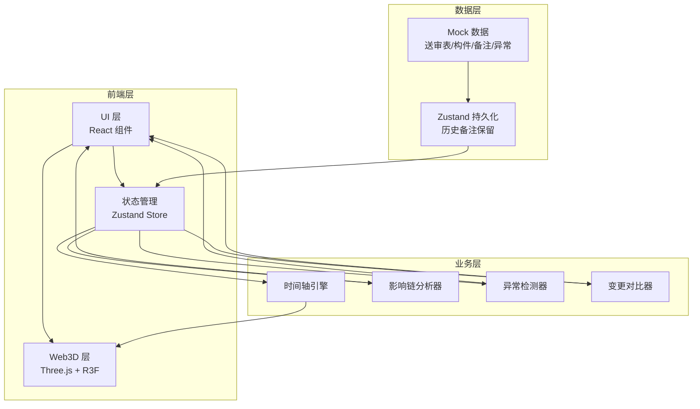
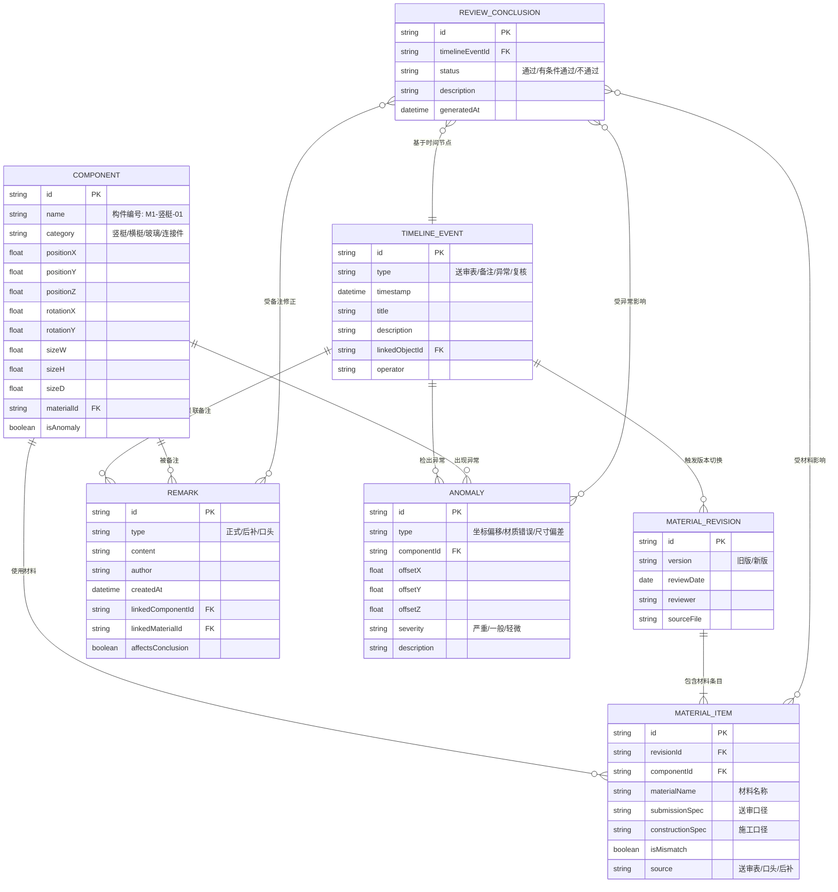

## 1. 架构设计


## 2. 技术说明
- **前端框架**: React@18 + TypeScript
- **构建工具**: Vite@6
- **样式方案**: TailwindCSS@3 + CSS 变量（设计系统主题化）
- **状态管理**: Zustand（含时间线状态快照 + 历史备注持久化）
- **Web3D**: three@0.160 + @react-three/fiber@8 + @react-three/drei@9 + @react-three/postprocessing@2
- **图标**: lucide-react
- **后端**: 无后端，纯前端 Mock 数据
- **数据持久化**: Zustand + localStorage（保留历史备注与时间线状态）

## 3. 路由定义
| 路由 | 用途 |
|------|------|
| / | 幕墙节点图纸复核主工作台（单页应用，唯一页面） |

## 4. 数据模型

### 4.1 数据模型定义



### 4.2 Zustand Store 结构
```typescript
interface ReviewStore {
  // 时间线状态
  timelineEvents: TimelineEvent[]
  currentEventId: string | null
  
  // 3D 构件
  components: Component[]
  selectedComponentId: string | null
  cameraTarget: { x: number; y: number; z: number } | null
  
  // 材料送审
  materialRevisions: MaterialRevision[]
  materialItems: MaterialItem[]
  activeRevisionId: string | null
  
  // 备注
  remarks: Remark[]
  
  // 异常
  anomalies: Anomaly[]
  
  // 结论
  conclusions: ReviewConclusion[]
  
  // 交互状态
  filters: {
    eventTypes: string[]
    mismatchOnly: boolean
    anomalyOnly: boolean
  }
  uiState: {
    openRemarkModal: boolean
    openDiffModal: boolean
    openInfluencePanel: boolean
    previousSnapshot: Snapshot | null // 用于 diff 对比
  }
  
  // Actions
  selectComponent: (id: string) => void
  gotoTimelineEvent: (id: string) => void
  addRemark: (remark: Omit<Remark, 'id' | 'createdAt'>) => void
  runReview: () => ReviewConclusion
  toggleFilter: (filter: keyof Filters, value: string) => void
  exportReport: () => ReportData
  computeInfluenceChain: (conclusionId: string) => InfluenceNode[]
  computeDiff: (beforeId: string, afterId: string) => DiffItem[]
  loadMockData: () => void
}
```

## 5. 核心组件目录结构

```
src/
├── components/
│   ├── Scene3D/               # Web3D 场景
│   │   ├── Scene3D.tsx        # R3F Canvas 入口
│   │   ├── CurtainWallNode.tsx # 幕墙节点程序化生成
│   │   ├── ComponentMesh.tsx  # 单构件（含选中/异常/高亮）
│   │   ├── CoordinateLabel.tsx # 坐标标签
│   │   └── Lights.tsx         # 光照与环境
│   ├── MaterialPanel/         # 左侧材料送审表面板
│   │   ├── MaterialTable.tsx  # 材料表
│   │   └── RevisionSelector.tsx # 版本切换
│   ├── InfluencePanel/        # 右侧影响分析面板
│   │   ├── InfluenceTree.tsx  # 影响链树
│   │   └── ConclusionBadge.tsx # 结论状态
│   ├── Timeline/              # 底部时间轴
│   │   ├── TimelineBar.tsx    # 时间轴主体
│   │   ├── TimelineNode.tsx   # 时间节点
│   │   └── FilterBar.tsx      # 事件类型筛选
│   ├── AnomalyBadge/          # 异常悬浮卡
│   │   └── AnomalyCard.tsx
│   ├── Modals/
│   │   ├── RemarkModal.tsx    # 新增备注弹窗
│   │   └── DiffModal.tsx      # 变更说明弹窗
│   └── Header/
│       └── WorkbenchHeader.tsx
├── store/
│   ├── useReviewStore.ts      # Zustand 主 Store
│   └── selectors.ts           # 派生选择器（影响链计算、diff 计算）
├── types/
│   └── index.ts               # 所有 TypeScript 类型定义
├── data/
│   └── mockData.ts            # Mock 数据（预置旧送审表/异常/历史备注）
├── utils/
│   ├── influenceChain.ts      # 影响链算法
│   ├── diffEngine.ts          # 变更对比算法
│   └── anomalyDetector.ts     # 异常检测算法
├── pages/
│   └── Workbench.tsx          # 主工作台页面
├── App.tsx
├── main.tsx
└── index.css
```

## 6. 关键技术实现要点

### 6.1 时间轴联动机制
- Zustand Store 中 `currentEventId` 变化时触发三个派生 selector：
  - `useActiveRevision` → 驱动左侧送审表版本切换
  - `useHighlightedComponents` → 驱动 3D 场景构件高亮
  - `useActiveConclusion` → 驱动右侧影响链面板重算
- 通过 Zustand 的 `subscribe` 监听 `currentEventId`，触发相机 flyTo 动画

### 6.2 影响链分析算法
- 以 `ReviewConclusion` 为根节点，广度优先遍历关联的：
  - MaterialItem（isMismatch = true）
  - Remark（affectsConclusion = true）
  - Anomaly（severity 非轻微）
- 每个节点附带 `influenceWeight`（0-1），用于颜色深浅

### 6.3 变更对比引擎
- 补录备注前自动保存状态快照 `previousSnapshot`（含 materialItems + remarks + conclusions 序列化）
- 补录后调用 `computeDiff()` 生成三种变化：
  - `changed`: 字段变化（结论描述、影响链节点）
  - `added`: 新增条目（新备注、新异常）
  - `removed`: 删除条目（本系统不允许删除，记录占位）
- DiffModal 以左右两栏 + inline 高亮展示

### 6.4 历史备注保留与状态对齐
- 所有 `remarks` 存 localStorage，key 含 `timelineEventId`
- "重新运行复核"时：
  1. 生成新的 `TimelineEvent`
  2. 遍历 remarks，按 `linkedObjectId` 重新挂载到新对应对象上
  3. 历史 remarks 的 `createdAt` 不变，新增 `reappliedAt` 字段标记对齐时间

### 6.5 异常单独拎出
- `AnomalyCard` 组件位于场景右上角（fixed 定位，z-index: 40）
- 3D 场景中异常构件的 `userData.isAnomaly = true`，材质使用 `MeshStandardMaterial` 并通过 `useFrame` 驱动 emissiveIntensity 正弦波动
- 异常构件不参与正常构件的材质切换逻辑，独立渲染

## 7. Mock 数据预置（真实节奏演示）
预置以下数据，确保用户一打开即可按"第二天复盘前"流程操作：
1. 材料送审表：旧版 8 条（其中 3 条口径不一致）、新版 8 条（其中 1 条不一致）
2. 构件 12 个：4 竖梃 + 4 横梃 + 2 玻璃 + 2 连接件
3. 历史备注：1 条后补备注（绑定口径不一致条目）、2 条口头备注
4. 异常：1 条坐标偏移异常（竖梃 M1-01，offsetY +15mm）
5. 时间节点：初始导入 → 旧版送审表加载 → 异常检出 → 口头备注×2 → 后补备注×1
