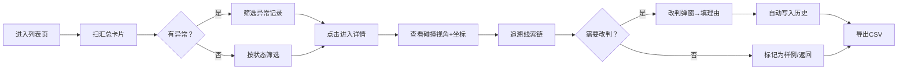

## 1. 产品概述

幕墙节点碰撞预审管理系统，解决结构工程师复核碰撞记录时依赖会议纪要、碰撞截图脱离视角无法说明的痛点。通过线索化的样本-结论关联、坐标偏移异常标记、可追溯的改判历史与分类CSV导出，让负责人从汇总到异常、从异常到证据的链路一目了然。

## 2. 核心功能

### 2.1 用户角色

| 角色 | 说明 | 核心权限 |
|------|------|----------|
| 结构工程师（老叶） | 复核碰撞预审的核心用户 | 查看列表/详情、改判、导出CSV、追溯历史 |
| 负责人 | 审核汇总结果的管理角色 | 扫汇总、追异常明细、查看数字变动原因 |

### 2.2 功能模块

1. **预审列表页**：顶部汇总卡（总数/已放行/待补证据/人工改判/异常数），筛选工具栏，碰撞记录表格（含异常标记、状态标签）
2. **预审详情页**：碰撞截图视角卡片（含坐标信息、视角锚点说明），线索链（样本→结论），坐标偏移异常警告条，基本信息面板
3. **改判功能**：状态变更弹窗（选择新状态、填写改判理由、上传补充证据），改判后自动写入历史
4. **历史记录页/面板**：时间线形式展示状态变更、操作人、改判理由，支持对比前后状态差异
5. **CSV导出**：按状态分列标记（已放行/待补证据/人工改过），含坐标偏移异常标识、改判次数、最近操作人

### 2.3 页面详情

| 页面名称 | 模块名称 | 功能描述 |
|----------|----------|----------|
| 预审列表页 | 汇总卡片区 | 5个数字卡片：总碰撞数、已放行、待补证据、人工改判、坐标偏移异常；异常卡片用强调色边框 |
| 预审列表页 | 筛选工具栏 | 状态筛选（全部/已放行/待补证据/人工改过）、异常筛选（仅看坐标偏移）、项目/楼层下拉、搜索框、导出CSV按钮 |
| 预审列表页 | 碰撞记录表格 | 列：编号、项目-楼层-节点、碰撞类型、截图缩略图、状态标签、异常角标、改判次数、负责人、操作（查看/改判）；行背景异常时微着色 |
| 预审详情页 | 碰撞视角卡片 | 大尺寸主截图+3个辅助视角缩略图，每张图下方标注视角方向与XYZ坐标；若坐标偏移→卡片顶部红色警告条 |
| 预审详情页 | 线索链面板 | 横向时间轴：样本提取→初判依据→复核意见→结论，每个节点可展开查看关联证据与说明文本 |
| 预审详情页 | 基本信息面板 | 碰撞编号、项目、楼层、节点编号、碰撞双方构件、初判结论、当前状态、创建时间、最后修改 |
| 预审详情页 | 操作栏 | 改判按钮、查看历史、返回列表、标记为样例按钮 |
| 改判弹窗 | 改判表单 | 新状态下拉（放行/待补证据/驳回）、改判理由文本框、补充证据上传区、确认/取消 |
| 历史面板 | 时间线列表 | 每条记录：操作时间、操作人、前后状态对比标签、改判理由、证据附件缩略图 |
| CSV导出 | 文件生成 | 列含：是否样例、是否坐标偏移异常、状态分类、改判次数、历史操作摘要；文件名带时间戳 |

## 3. 核心流程

结构工程师老叶打开系统→扫顶部汇总卡片发现异常数字→点异常筛选快速定位问题记录→进入详情页查看碰撞视角截图与坐标→线索链追溯样本到结论的依据→确认后改判并填写理由→导出CSV交付负责人。

## 4. 用户界面设计

### 4.1 设计风格
- **主色**：工程蓝 #1E40AF（稳重、专业），辅色：警示橙 #F59E0B（待补证据）、安全绿 #10B981（已放行）、警告红 #EF4444（坐标偏移异常）、人工紫 #8B5CF6（人工改判）
- **按钮风格**：直角微圆角（4px），实心主按钮配细边框，次要按钮空心描边
- **字体**：标题用 Noto Sans SC 700，正文用 JetBrains Mono（工程数据对齐友好）+ Noto Sans SC 400，数字等宽
- **布局风格**：顶部导航+左侧状态图标边栏+主内容区卡片式布局；异常卡片左上角斜角彩色标签
- **图标风格**：线条型 Lucide 图标，异常项用实心图标加强

### 4.2 页面设计概述

| 页面名称 | 模块名称 | UI 元素 |
|----------|----------|---------|
| 预审列表页 | 汇总卡片区 | 5张卡片横向排列，每张上方大数字+下方趋势小箭头，异常卡片左侧彩色竖条+脉冲动画 |
| 预审列表页 | 筛选工具栏 | 灰色圆角容器内，筛选标签组+搜索框+导出按钮（主色实心） |
| 预审列表页 | 碰撞记录表格 | 表头深灰背景冻结，斑马纹行间差，异常行左侧红竖条，状态标签圆角色块+白字 |
| 预审详情页 | 碰撞视角卡片 | 深灰背景容器，主图占60%宽+辅图3张网格，每张图半透明坐标叠加层，警告条红底白字居顶 |
| 预审详情页 | 线索链面板 | 浅色背景，节点圆圈用颜色区分阶段，连接线虚线，hover时节点放大并显示详情气泡 |
| 预审详情页 | 操作栏 | 固定底部悬浮条，改判按钮主色实心，其余次按钮空心 |
| 历史面板 | 时间线列表 | 左侧彩色竖线+圆点，右侧操作卡片，前后状态对比用删除线+新增色标注 |
| CSV导出 | 下载提示 | 右上角Toast通知，含进度条与文件名预览 |

### 4.3 响应式
- Desktop 优先：1440px 基准布局，列表表格横向可滚动
- 平板：汇总卡片换行 2+3 排列
- 移动端：汇总卡片纵向堆叠，表格转为卡片列表模式，详情页视角图纵向排列

### 4.4 异常视觉强化
- 坐标偏移异常：行/卡片左侧 4px 红色竖条 + 角标 ⚠️ + 背景极淡红渐变
- 人工改判记录：状态标签紫色 + 数字旁显示改判次数徽标
- 样例标记：编号前缀 ★ 星标 + 浅金底色
