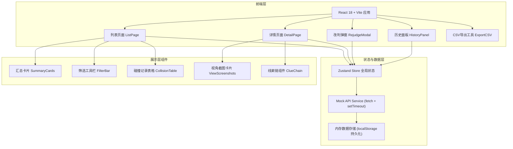
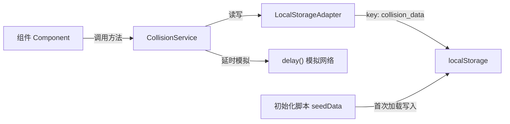
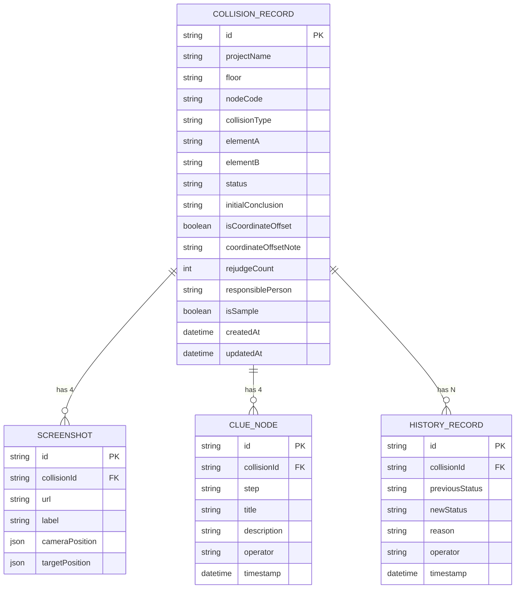

## 1. 架构设计



## 2. 技术描述

- **前端框架**：React@18 + TypeScript@5 + Vite@5
- **样式方案**：TailwindCSS@3（原子化CSS）+ Lucide React（图标库）
- **状态管理**：Zustand@4（轻量状态管理，替代Redux）
- **路由**：React Router@6
- **后端**：无独立后端，使用 Mock API Service 层模拟后端，写回 localStorage 实现真实持久化
- **数据持久化**：localStorage + 自动初始化样例数据
- **CSV导出**：纯前端生成 CSV Blob + 触发文件下载

## 3. 路由定义

| 路由 | 页面/组件 | 用途 |
|------|-----------|------|
| `/` | 重定向到 `/collisions` | 默认入口 |
| `/collisions` | CollisionListPage | 预审列表页（汇总+筛选+表格） |
| `/collisions/:id` | CollisionDetailPage | 预审详情页（视角+线索+操作） |

## 4. API 定义（Mock Service 层）

```typescript
// ============ 类型定义 ============
type CollisionStatus = 'PASSED' | 'PENDING_EVIDENCE' | 'REJECTED' | 'MANUAL_REJUDGED';

interface ViewScreenshot {
  id: string;
  url: string;           // 使用 text_to_image 服务生成的URL
  label: string;         // 视角名称: 主视图/左视图/俯视图/右视图
  cameraPosition: { x: number; y: number; z: number };
  targetPosition: { x: number; y: number; z: number };
}

interface ClueNode {
  id: string;
  step: 'SAMPLE' | 'INITIAL_JUDGEMENT' | 'REVIEW' | 'CONCLUSION';
  title: string;
  description: string;
  evidenceUrls?: string[];
  operator: string;
  timestamp: string;
}

interface HistoryRecord {
  id: string;
  collisionId: string;
  previousStatus: CollisionStatus;
  newStatus: CollisionStatus;
  reason: string;
  operator: string;
  timestamp: string;
  evidenceUrls?: string[];
}

interface CollisionRecord {
  id: string;                    // 如: CL2024-001
  projectName: string;           // 项目名称
  floor: string;                 // 楼层: 如 F12
  nodeCode: string;              // 节点编号: 如 N-12A-07
  collisionType: string;         // 碰撞类型: 构件干涉/预埋件偏差/焊缝冲突
  elementA: string;              // 碰撞构件A
  elementB: string;              // 碰撞构件B
  status: CollisionStatus;
  initialConclusion: string;     // 初判结论
  screenshots: ViewScreenshot[];
  clueChain: ClueNode[];
  history: HistoryRecord[];
  isCoordinateOffset: boolean;   // 是否坐标偏移异常
  coordinateOffsetNote?: string; // 坐标偏移说明
  rejudgeCount: number;          // 改判次数
  responsiblePerson: string;     // 负责人
  isSample: boolean;             // 是否标记为样例
  createdAt: string;
  updatedAt: string;
}

// ============ Mock API 接口 ============
interface CollisionAPI {
  // 获取列表（支持筛选）
  list(params?: {
    status?: CollisionStatus;
    coordinateOffsetOnly?: boolean;
    keyword?: string;
    project?: string;
    floor?: string;
  }): Promise<{ data: CollisionRecord[]; summary: SummaryData }>;

  // 获取详情
  get(id: string): Promise<CollisionRecord | null>;

  // 改判（写回）
  rejudge(id: string, payload: {
    newStatus: CollisionStatus;
    reason: string;
    operator: string;
    evidenceUrls?: string[];
  }): Promise<CollisionRecord>;

  // 切换样例标记
  toggleSample(id: string, isSample: boolean): Promise<CollisionRecord>;

  // 获取单条记录历史
  getHistory(id: string): Promise<HistoryRecord[]>;

  // 导出CSV
  exportCSV(params?: any): Promise<Blob>;
}

interface SummaryData {
  total: number;
  passed: number;
  pendingEvidence: number;
  manualRejudged: number;
  coordinateOffset: number;
}
```

## 5. Service 层架构（Mock）



- **CollisionService**：单例类，封装所有业务操作与模拟网络延迟（200-500ms）
- **LocalStorageAdapter**：统一管理 localStorage 读写、序列化/反序列化、版本迁移
- **seedData**：首次访问时检测无数据，自动写入 12 条样例碰撞记录（含 3 条坐标偏移、4 条不同状态）

## 6. 数据模型（localStorage 结构）

### 6.1 实体关系



### 6.2 localStorage 存储结构

```json
{
  "__version": "1.0",
  "__seededAt": "2026-06-10T09:00:00Z",
  "collisions": [
    { /* CollisionRecord 完整对象 */ }
  ]
}
```

### 6.3 初始样例数据说明

初始化写入 12 条记录，分布如下：
- **状态分布**：已放行 5，待补证据 3，人工改判 2，驳回 2
- **坐标偏移**：3 条（编号 CL2024-003 / 007 / 011），含偏移说明文字
- **样例标记**：2 条（★ CL2024-001 标准放行案例 / ★ CL2024-007 坐标偏移异常案例）
- **改判次数**：1~3 次不等，含完整历史记录
- **项目/楼层**：3 个项目 × 4 个楼层，便于筛选演示
