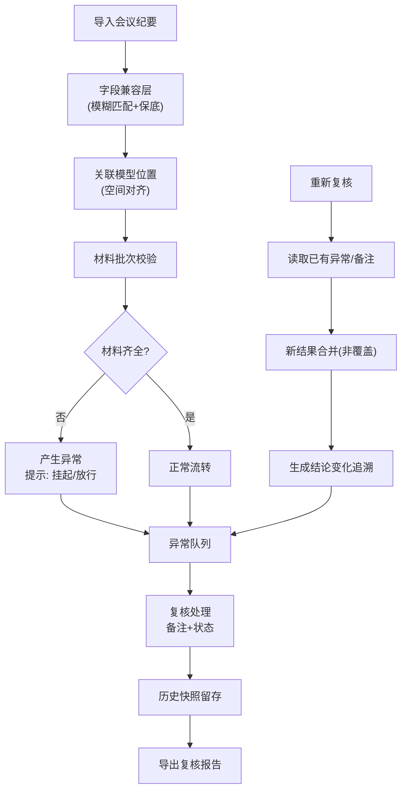

## 1. 产品概述

结构加固图纸复核系统，为施工经理、算法值班人打造的工程图纸变更协作平台。解决现场变更无法同步到模型、会议纪要字段不统一、材料批次缺失判断模糊、重跑丢失历史备注等核心卡点。目标是让变更闭环、结论可追溯、新人零交接上手。

## 2. 核心功能

### 2.1 用户角色
| 角色 | 注册方式 | 核心权限 |
|------|---------|---------|
| 施工经理（阿乔） | 无需注册，本地使用 | 录入现场变更、关联会议纪要、标注模型位置 |
| 算法值班人 | 无需注册，本地使用 | 导入会议纪要、复核异常、判断挂起/放行、导出复核报告 |

### 2.2 功能模块
1. **总览仪表盘**：复核进度、异常统计、材料状态概览
2. **模型标注视图**：空间平面图标注、异常高亮、会议纪要来源跳转
3. **会议纪要管理**：导入（兼容字段名不一致）、来源追踪、处理状态流转
4. **材料批次校验**：批次登记、缺失检测、挂起/放行判定
5. **异常队列追溯**：异常记录、变更前后对比、备注留存（重跑不丢失）
6. **复核报告导出**：导出完整复核包（含异常说明、变更历史、材料状态）

### 2.3 页面详情
| 页面名称 | 模块名称 | 功能描述 |
|---------|---------|----------|
| 总览仪表盘 | 进度卡片 | 待复核/已复核/异常/挂起四项核心指标卡 |
| 总览仪表盘 | 异常趋势 | 近7天异常产生与解决趋势图 |
| 总览仪表盘 | 快捷入口 | 材料录入、异常查看、报告导出三大入口卡片（零交接：位置固定） |
| 模型标注视图 | 楼层平面图 | 可切换楼层、网格定位、点击区域标注 |
| 模型标注视图 | 异常高亮层 | 按状态着色（红=异常/黄=挂起/绿=正常），悬停显示详情 |
| 模型标注视图 | 来源关联面板 | 点击标注跳转对应会议纪要，显示来源段落 |
| 会议纪要管理 | 导入解析 | JSON/CSV导入，字段模糊匹配，来源+状态保底 |
| 会议纪要管理 | 兼容日志 | 显示哪些字段被重命名映射，便于算法值班人核对 |
| 会议纪要管理 | 状态流转 | 待处理→复核中→已解决/已挂起 |
| 材料批次管理 | 批次录入 | 材料类型、批次号、检测报告、关联变更位置 |
| 材料批次管理 | 缺失判定 | 自动检测变更关联材料是否齐全，给出挂起/放行建议 |
| 材料批次管理 | 决策提示 | 缺失时明确说明：此条建议挂起/可放行+理由 |
| 异常队列 | 异常列表 | 按严重程度排序，显示关联位置、会议来源、材料状态 |
| 异常队列 | 追溯面板 | 展开显示历次变更快照：旧值→新值、操作人、时间、备注 |
| 异常队列 | 备注留存 | 备注与异常永久绑定，重跑不覆盖 |
| 导出中心 | 导出配置 | 选择导出范围、格式（PDF/JSON）、是否包含历史快照 |
| 导出中心 | 一键导出 | 生成复核报告，包含异常说明、结论变化轨迹、材料清单 |

## 3. 核心流程

### 3.1 现场变更复核流程
算法值班人导入会议纪要 → 系统自动匹配字段（保住来源+状态）→ 关联模型空间位置 → 检测材料批次 → 产生异常队列 → 复核人逐条处理（挂起/放行/解决）→ 历史快照留存 → 导出报告

### 3.2 重跑不丢数据流程
发起重新复核 → 读取已有异常队列和备注 → 新结果合并而非覆盖 → 结论变化自动生成追溯记录 → 旧备注原封保留 → 可对比新旧结论差异

## 4. 用户界面设计

### 4.1 设计风格
- **主色调**：工程蓝（#1E40AF）+ 警示橙（#EA580C）+ 安全绿（#16A34A）
- **辅色**：深灰中性色（Zinc色系），工业感
- **按钮风格**：直角微圆角（4px），强调工程专业感；按下有轻微下沉阴影
- **字体**：标题用思源黑体 Heavy（工程感），正文用思源宋体/等宽字体混合（数据可读性）
- **布局风格**：左侧固定导航（零交接：分区永远在熟悉位置）+ 顶部面包屑 + 主内容卡片化
- **图标风格**：Lucide 线性图标，状态用色块+文字双编码（颜色+中文标签，避免色盲歧义）

### 4.2 页面设计概览
| 页面名称 | 模块名称 | UI元素 |
|---------|---------|--------|
| 总览仪表盘 | 进度卡片区 | 四色卡片，数字+趋势箭头，悬停微动效 |
| 总览仪表盘 | 三大固定入口 | 位置固定不变（顶部右侧）：材料录入（蓝）/异常查看（橙）/报告导出（绿），图标+中文+英文辅助 |
| 模型标注视图 | 平面图区 | 浅灰网格背景，SVG绘制区域，异常色块叠加+脉冲动画 |
| 模型标注视图 | 右侧详情面板 | 三段式固定结构：①位置信息 ②关联纪要 ③材料状态 |
| 会议纪要管理 | 字段兼容日志 | 表格展示：原字段名→映射后字段，置信度百分比 |
| 异常队列 | 追溯展开行 | 时间线式快照：圆形节点+竖线+旧值/新值对比卡片 |
| 异常队列 | 备注区 | 浅黄底色，永久固定在异常卡片底部，无法被重跑覆盖 |

### 4.3 响应式
- 桌面端优先（工程场景大屏为主），1440px 最优
- 平板端：右侧面板折叠为抽屉
- 移动端：仅保留异常队列和三大入口，模型视图简化为列表

### 4.4 设计记忆点
- **零交接导航**：左侧导航图标+中文位置永久不变，三大功能入口（材料/异常/导出）永远在总览页右上角固定位置
- **追溯时间线**：每次结论变化生成一条「时间胶囊」，用颜色编码旧→新过渡
- **挂起/放行决策条**：材料缺失时不是简单报错，而是一条带决策建议的banner，左红（建议挂起：影响结构安全）或左黄（可放行：非关键部位）+ 右侧操作按钮
