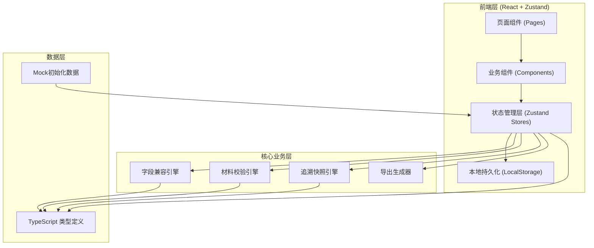
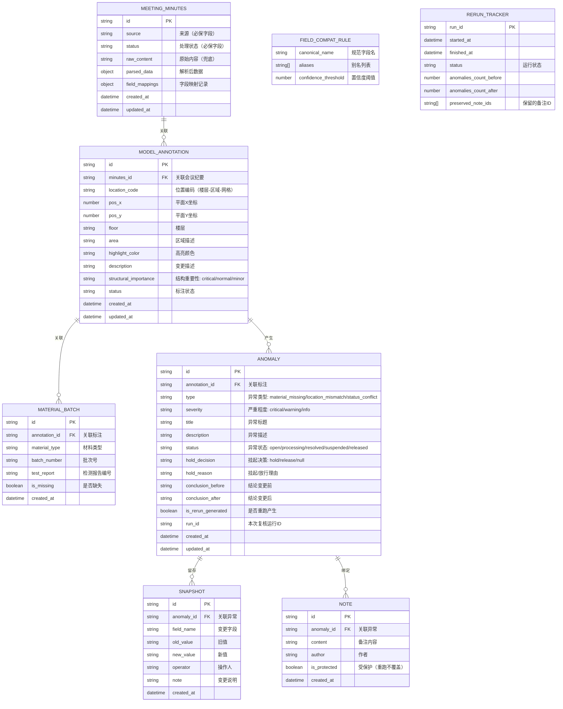

## 1. 架构设计



## 2. 技术描述
- 前端框架：React@18 + TypeScript + Vite
- 样式方案：TailwindCSS@3 + 自定义CSS变量（工程蓝/警示橙/安全绿色系）
- 状态管理：Zustand（分模块：会议纪要、模型标注、材料批次、异常队列、全局UI）
- 持久化方案：LocalStorage + Zustand persist 中间件（重跑不丢数据核心保障）
- 图标库：Lucide React
- 初始化工具：vite-init（react-ts 模板）
- 后端：无（纯前端本地应用，LocalStorage作为数据库）

## 3. 路由定义
| 路由 | 页面名称 | 用途 |
|------|---------|------|
| / | 总览仪表盘 | 进度概览、三大入口、异常趋势 |
| /model | 模型标注视图 | 空间平面图、异常高亮、来源关联 |
| /minutes | 会议纪要管理 | 导入、字段兼容日志、状态流转 |
| /materials | 材料批次管理 | 批次录入、缺失判定、挂起/放行 |
| /anomalies | 异常队列追溯 | 异常列表、追溯时间线、备注留存 |
| /export | 导出中心 | 报告配置、一键导出 |

## 4. 数据模型

### 4.1 ER图


### 4.2 核心状态模块划分
```typescript
// useMinutesStore - 会议纪要
// useModelStore - 模型标注
// useMaterialsStore - 材料批次
// useAnomaliesStore - 异常队列 + 快照 + 备注
// useRerunStore - 重跑追踪器
// useUIGlobalStore - 全局UI（选中项、展开项）
```

## 5. 关键引擎设计

### 5.1 字段兼容引擎
- 输入：任意结构 JSON/CSV 对象
- 处理：
  1. 第一轮精确匹配（大小写不敏感）
  2. 第二轮别名匹配（基于 FIELD_COMPAT_RULE 预设的别名表：如「来源」/「纪要来源」/「会议来源」→ source）
  3. 第三轮编辑距离模糊匹配（Levenshtein < 阈值）
  4. 保底兜底：source → 取第一个字符串类型的非空长字段；status → 取第一个包含状态枚举值的字段
- 输出：标准化对象 + field_mappings 映射日志
- 不可突破规则：source 和 status 两个字段绝不丢失，解析失败时使用「未标注来源」「待处理」默认值

### 5.2 材料校验与决策引擎
- 输入：标注的 structural_importance + 关联材料的 is_missing
- 决策矩阵：
  | 结构重要性 | 材料缺失 | 建议决策 | 理由模板 |
  |-----------|---------|---------|---------|
  | critical | 是 | HANG（挂起） | 关键结构部位{位置}材料{类型}批次缺失，建议挂起待补全 |
  | normal | 是 | EVALUATE（评估放行） | 普通部位材料缺失，如不影响主结构可评估后放行 |
  | minor | 是 | RELEASE（可放行） | 次要装饰部位材料缺失，不影响结构安全，可先放行 |
  | * | 否 | PASS | 材料齐全 |

### 5.3 追溯快照引擎
- 触发时机：异常状态变更、结论变更、重跑合并时
- 策略：old_value / new_value 深拷贝，字段级快照
- 重跑合并逻辑：
  1. 新产生的异常 → 正常插入，标记 is_rerun_generated=true
  2. 已存在的异常（按 annotation_id + type 匹配）→ 只更新结论变化字段，旧 SNAPSHOT 和 NOTE 永不删除
  3. preserved_note_ids 登记所有受保护备注ID

## 6. 初始化 Mock 数据
内置一套完整演示数据：
- 3 份会议纪要（含2种不同字段命名风格，用于演示兼容引擎）
- 8 个模型标注点（覆盖不同楼层/区域/结构重要性）
- 12 条材料批次（含 3 条缺失，覆盖 critical/normal/minor 各一）
- 10 条异常（含 2 条已解决、3 条挂起、5 条待处理）
- 15 条历史快照 + 8 条备注
