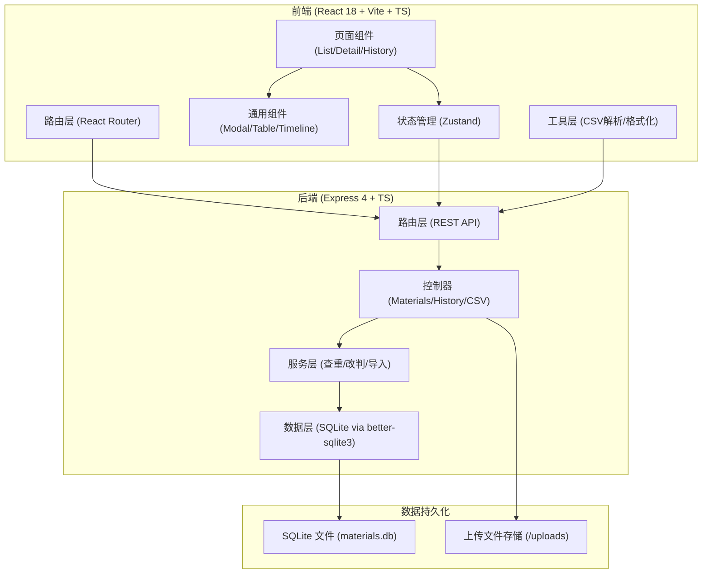
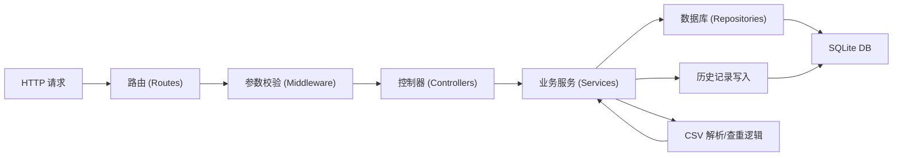
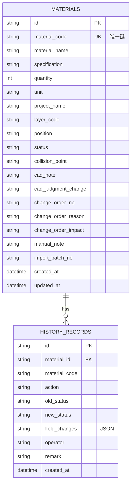

## 1. 架构设计



## 2. 技术说明

- **前端**：React@18 + React Router DOM + Tailwind CSS@3 + Zustand + lucide-react
- **初始化工具**：vite-init (react-express-ts 模板)
- **后端**：Express@4 + TypeScript + better-sqlite3
- **数据库**：SQLite 本地文件存储，重启不丢数据
- **文件存储**：uploads 目录存放上传的CSV原始文件

## 3. 路由定义

### 3.1 前端路由

| 路由 | 页面 | 说明 |
|------|------|------|
| `/` | 材料列表页 | 主页，搜索筛选、导入导出 |
| `/materials/:id` | 材料详情页 | 基本信息、CAD备注、改判、历史、变更处理 |
| `/history` | 历史记录页 | 全量操作时间线 |

### 3.2 后端 API 路由

| Method | 路由 | 说明 |
|--------|------|------|
| GET | `/api/materials` | 分页查询材料列表，支持筛选 |
| GET | `/api/materials/:id` | 获取单条材料详情（含历史） |
| POST | `/api/materials` | 新增材料 |
| PUT | `/api/materials/:id` | 更新材料基本信息 |
| PUT | `/api/materials/:id/rejudge` | 材料改判（写入历史） |
| PUT | `/api/materials/:id/cad-note` | 更新CAD图层备注 |
| PUT | `/api/materials/:id/change-order` | 补录变更单（晚到）确认 |
| GET | `/api/history` | 查询全量操作历史 |
| POST | `/api/csv/import` | CSV导入（含重复检测、备注保护） |
| GET | `/api/csv/export` | CSV导出（当前状态+明细） |
| GET | `/api/materials/stats` | 各状态数量统计 |

## 4. API 定义（TypeScript 类型）

```typescript
// 材料状态枚举
type MaterialStatus = 'pending' | 'normal' | 'rejudged' | 'changing' | 'archived';

// 材料主表
interface Material {
  id: string;                    // UUID
  materialCode: string;          // 材料编号（唯一键，查重用）
  materialName: string;          // 材料名称
  specification: string;         // 规格型号
  quantity: number;              // 数量
  unit: string;                  // 单位
  projectName: string;           // 项目名称
  layerCode: string;             // CAD图层号
  position: string;              // 图纸位置
  status: MaterialStatus;        // 当前状态
  collisionPoint: string;        // 碰撞点说明
  cadNote: string;               // CAD图层备注（灰度临时补充）
  cadJudgmentChange: string;     // CAD改变了哪些判断
  changeOrderNo: string;         // 变更单号
  changeOrderReason: string;     // 人工确认理由（变更单晚到）
  changeOrderImpact: string;     // 影响范围
  manualNote: string;            // 人工备注（导入时不覆盖）
  importBatchNo: string;         // 最后一次导入批次号
  createdAt: string;
  updatedAt: string;
}

// 操作历史
interface HistoryRecord {
  id: string;
  materialId: string;
  materialCode: string;
  action: 'create' | 'update' | 'rejudge' | 'cad_note' | 'change_order' | 'csv_import' | 'csv_update';
  oldStatus?: MaterialStatus;
  newStatus?: MaterialStatus;
  fieldChanges: Record<string, { old: any; new: any }>;
  operator: string;
  remark: string;
  createdAt: string;
}

// 改判请求
interface RejudgeRequest {
  newStatus: MaterialStatus;
  reason: string;
  relatedLayer: string;
  collisionDesc: string;
  operator: string;
}

// CAD备注请求
interface CadNoteRequest {
  cadNote: string;
  cadJudgmentChange: string;
  operator: string;
}

// 变更单请求
interface ChangeOrderRequest {
  changeOrderNo: string;
  changeOrderReason: string;
  changeOrderImpact: string;
  operator: string;
}

// CSV导入结果
interface CsvImportResult {
  totalRows: number;
  newCount: number;
  updatedCount: number;
  skippedCount: number;
  duplicates: Array<{ row: number; materialCode: string; reason: string }>;
  batchNo: string;
}
```

## 5. 服务端架构图



## 6. 数据模型

### 6.1 ER 图



### 6.2 DDL

```sql
-- 材料主表
CREATE TABLE IF NOT EXISTS materials (
  id TEXT PRIMARY KEY,
  material_code TEXT NOT NULL UNIQUE,
  material_name TEXT NOT NULL,
  specification TEXT NOT NULL DEFAULT '',
  quantity REAL NOT NULL DEFAULT 0,
  unit TEXT NOT NULL DEFAULT '',
  project_name TEXT NOT NULL DEFAULT '',
  layer_code TEXT NOT NULL DEFAULT '',
  position TEXT NOT NULL DEFAULT '',
  status TEXT NOT NULL DEFAULT 'pending',
  collision_point TEXT NOT NULL DEFAULT '',
  cad_note TEXT NOT NULL DEFAULT '',
  cad_judgment_change TEXT NOT NULL DEFAULT '',
  change_order_no TEXT NOT NULL DEFAULT '',
  change_order_reason TEXT NOT NULL DEFAULT '',
  change_order_impact TEXT NOT NULL DEFAULT '',
  manual_note TEXT NOT NULL DEFAULT '',
  import_batch_no TEXT NOT NULL DEFAULT '',
  created_at TEXT NOT NULL,
  updated_at TEXT NOT NULL
);
CREATE INDEX IF NOT EXISTS idx_materials_status ON materials(status);
CREATE INDEX IF NOT EXISTS idx_materials_project ON materials(project_name);
CREATE INDEX IF NOT EXISTS idx_materials_layer ON materials(layer_code);

-- 历史记录表
CREATE TABLE IF NOT EXISTS history_records (
  id TEXT PRIMARY KEY,
  material_id TEXT NOT NULL,
  material_code TEXT NOT NULL,
  action TEXT NOT NULL,
  old_status TEXT,
  new_status TEXT,
  field_changes TEXT NOT NULL DEFAULT '{}',
  operator TEXT NOT NULL DEFAULT '阿宁',
  remark TEXT NOT NULL DEFAULT '',
  created_at TEXT NOT NULL
);
CREATE INDEX IF NOT EXISTS idx_history_material_id ON history_records(material_id);
CREATE INDEX IF NOT EXISTS idx_history_action ON history_records(action);
CREATE INDEX IF NOT EXISTS idx_history_created_at ON history_records(created_at);

-- 初始种子数据
INSERT OR IGNORE INTO materials (id, material_code, material_name, specification, quantity, unit, project_name, layer_code, position, status, manual_note, created_at, updated_at)
VALUES
  ('seed-001', 'JG-2024-001', '碳纤维布I级300g', '300g/m², 宽100mm', 120, 'm²', '滨江大厦结构加固', 'LAYER-CFRP-01', '3层梁底B3-05', 'normal', '旧材料导入，与原清单一致', datetime('now'), datetime('now')),
  ('seed-002', 'JG-2024-002', '粘钢胶JGN型', 'A+B组分, 20kg/组', 15, '组', '滨江大厦结构加固', 'LAYER-STEEL-02', '4层柱包钢C4-12', 'pending', '', datetime('now'), datetime('now')),
  ('seed-003', 'JG-2024-003', '植筋胶HRK-500', '注射式, 360ml/支', 80, '支', '滨江大厦结构加固', 'LAYER-BAR-01', '5层板植筋B5-23区', 'rejudged', '', datetime('now'), datetime('now'));
```
