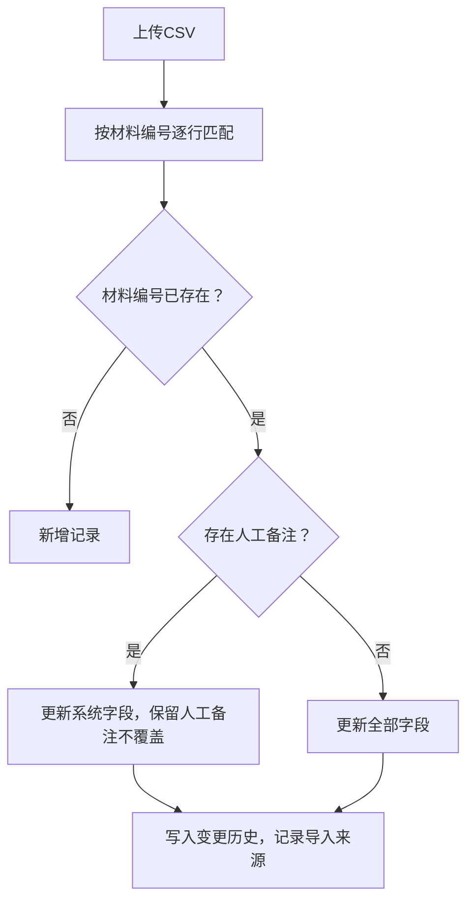

## 1. 产品概述

结构加固材料追踪系统用于建筑设计院助理阿宁追踪结构加固工程中各类加固材料（碳纤维布、粘钢胶、植筋胶等）的使用情况，解决CAD图层中材料记录断断续续、碰撞点说不清、变更单晚到导致的追踪混乱问题。

- 核心目标：将CAD图层中零散的材料信息整合为主线，提供可追溯的改判记录和变更处理机制
- 目标用户：设计院助理、结构工程师、项目管理人员
- 核心价值：材料追踪不遗漏、改判有依据、变更可追溯、CSV明细可对账

## 2. 核心功能

### 2.1 用户角色

| 角色 | 注册方式 | 核心权限 |
|------|----------|----------|
| 设计院助理 | 系统内置账号 | 材料导入、详情查看、改判操作、变更单处理、CSV导入导出 |
| 结构工程师 | 系统内置账号 | 查看追踪记录、审核改判、确认变更影响范围 |

### 2.2 功能模块

1. **材料列表页**：搜索筛选、状态标签、导入入口、导出CSV
2. **材料详情页**：基本信息、当前状态、CAD图层备注、改判历史、变更记录
3. **改判模态框**：选择新状态、填写改判理由、关联CAD图层碰撞点
4. **历史记录页**：全量变更时间线、操作人、前后状态对比
5. **CSV明细**：导入/导出、字段映射、重复检测、变化说明

### 2.3 页面详情

| 页面名称 | 模块名称 | 功能描述 |
|----------|----------|----------|
| 材料列表页 | 搜索筛选区 | 按材料编号、类型、状态、项目名称搜索 |
| 材料列表页 | 数据表格 | 展示材料编号、名称、规格、数量、当前状态、项目、操作列 |
| 材料列表页 | 导入导出栏 | CSV导入按钮（含重复检测）、CSV导出按钮、新增材料 |
| 材料列表页 | 状态汇总卡片 | 各状态材料数量统计（待确认/正常/改判/变更中/已归档） |
| 材料详情页 | 基本信息卡 | 材料全部字段展示 |
| 材料详情页 | CAD图层备注区 | 灰度发布临时补充：记录CAD图层位置、碰撞点截图说明、改变了哪些判断 |
| 材料详情页 | 改判操作区 | 触发改判模态框 |
| 材料详情页 | 变更单处理区 | 变更单晚到后，填写人工确认理由和影响范围 |
| 材料详情页 | 操作时间线 | 改判历史、变更记录、导入记录 |
| 改判模态框 | 状态选择 | 下拉选择目标状态 |
| 改判模态框 | 理由输入 | 必填改判原因 |
| 改判模态框 | CAD关联 | 关联CAD图层号、碰撞点描述 |
| 历史记录页 | 时间线视图 | 全量操作记录，可按材料、操作人、时间范围筛选 |
| CSV导入弹窗 | 字段映射 | CSV列与系统字段对应关系 |
| CSV导入弹窗 | 重复预览 | 高亮重复记录（基于材料编号唯一键）、展示是否有人工备注（不覆盖） |

## 3. 核心流程

### 3.1 日常追踪流程
```mermaid
flowchart LR
    A["设计院助理阿宁"["导入旧材料CSV"] --> B["系统查重并预览"]
    B --> C["确认导入（重复不翻倍，人工备注保留）"]
    C --> D["材料列表生成主线"]
    D --> E["查看CAD图层，补备注/碰撞点说明"]
    E --> F["发现异常，发起改判"]
    F --> G["填写改判理由，关联CAD信息"]
    G --> H["状态更新，写入历史"]
    H --> I["变更单晚到，补录确认理由与影响范围"]
    I --> J["导出CSV明细，与当前状态互相印证"]
```

### 3.2 重复导入处理逻辑


## 4. 用户界面设计

### 4.1 设计风格
- **主色调**：深蓝 `#1e3a5f`（工程专业感）+ 琥珀橙 `#f59e0b`（状态警示）
- **辅色**：青绿 `#0d9488`（正常状态）、砖红 `#dc2626`（碰撞/异常）
- **字体**：标题用「思源宋体 CN」体现工程严谨，正文用「思源黑体 CN」保证可读性
- **布局风格**：顶部导航 + 左侧状态汇总卡片 + 右侧主表格的工程仪表盘布局
- **图标风格**：使用 lucide-react 线性图标，搭配细边框卡片，整体工业图纸质感

### 4.2 页面设计概览

| 页面名称 | 模块名称 | UI元素 |
|----------|----------|--------|
| 材料列表页 | 顶部导航 | 深蓝底白字品牌Logo、历史记录入口、导出按钮 |
| 材料列表页 | 状态卡片行 | 5张彩色统计卡片，带数字和图标，hover有微动效 |
| 材料列表页 | 搜索栏 | 灰色边框圆角输入框，内嵌搜索图标 |
| 材料列表页 | 数据表格 | 斑马纹、状态标签用不同背景色、操作列两个图标按钮 |
| 材料详情页 | 信息网格 | 2列信息网格，label加粗灰，value深色粗体 |
| 材料详情页 | CAD备注区 | 琥珀色左边框提示框，标注「灰度CAD图层备注」 |
| 材料详情页 | 时间线 | 左侧垂直时间轴，右侧事件卡片，不同操作不同颜色圆点 |
| 改判模态框 | 表单 | 标签左对齐，输入框灰色边框，底部主操作按钮深蓝色 |
| 历史记录页 | 筛选器 | 水平排列筛选条件，时间线在主内容区 |

### 4.3 响应式
- 桌面端优先（设计宽度1440px）
- 平板端：统计卡片换行，表格横向滚动
- 移动端：卡片堆叠，表格转卡片列表

### 4.4 动画与微交互
- 页面加载：统计卡片数字从0计数动画
- 改判保存：成功后详情页时间线新增项滑入
- 状态标签：hover时轻微上浮+阴影
- 导入进度：顶部进度条平滑过渡
