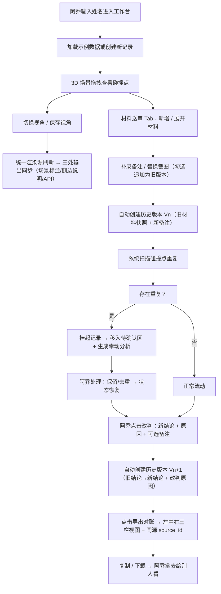

## 1. 产品概述

面向施工经理（如阿乔）的**结构加固方案比选 WebGL 交互工具**。解决换视角后场景标注/侧边说明/接口返回"三套话"、补录备注与旧截图被覆盖、碰撞点重复无挂起机制、改判原因无法跨班次追溯等核心痛点。目标：让阿乔在一个界面里完成 3D 查勘 → 材料送审 → 挂起/改判 → 导出对账，全过程可审计可追溯。

---

## 2. 核心功能

### 2.1 用户角色

| 角色 | 登录方式 | 核心权限 |
|------|----------|----------|
| 施工经理（阿乔） | 输入姓名进入 | 创建记录、添加材料、补录备注、替换截图、改判结论、处理待确认、导出对账 |
| 协同查看方 | 只读链接 | 浏览材料、处理记录、历史版本、对账视图，不能修改 |

### 2.2 功能模块

1. **方案比选工作台（首页/主页面）**：3D 场景查看器 + 视角切换 + 碰撞点标注 + 统一渲染源派生的三处输出
2. **材料送审面板**：材料列表 + 补录备注 + 替换截图 / 追加旧版本截图
3. **待确认区**：重复碰撞点挂起卡片 + 牵动影响分析 + 解决动作
4. **历史时间线**：版本链浏览 + 改判三元组（旧材料 / 新备注 / 改判原因）+ 操作人追溯
5. **三栏对账视图弹层**：左=材料送审表 + 中=处理记录 + 右=接口返回，同源一套话

### 2.3 页面详情

| 页面名称 | 模块名称 | 功能描述 |
|----------|----------|----------|
| 工作台（单页） | 3D WebGL 场景 | Three.js 渲染结构柱/梁示意模型；视角可拖拽旋转缩放；碰撞点用红色球体高亮标记；悬浮显示碰撞点 ID/描述/视角指纹 |
| 工作台（单页） | 视角管理 | 三个预设视角（正/侧/俯）+ 保存当前视角按钮；切换视角后同步更新场景标注、侧边说明、API 预览 |
| 工作台（单页） | 统一输出三栏 | 左侧场景标注（渲染源派生）、右侧侧边说明（渲染源派生）、底部可折叠 API 响应 JSON（渲染源派生）；三处显示同一 source_id |
| 工作台（单页） | 材料送审表 Tab | 表格：名称/规格/批号/数量/碰撞点数/备注数；行展开显示碰撞点列表 + 截图轮播（当前 + 历史）+ 备注时间轴 |
| 工作台（单页） | 材料操作 | "追加材料"按钮；每条材料内的"补录备注"输入框；"替换截图"上传 + "追加为旧版本"开关；保存时自动写入历史版本链 |
| 工作台（单页） | 待确认区面板 | 醒目的黄色卡片区；每组重复碰撞点显示：涉及材料、碰撞描述、严重程度、牵动影响分析文字、受影响结论清单；"确认保留此条 + 去重"动作 |
| 工作台（单页） | 历史时间线 | 左侧竖向时间线：V1/V2/V3… 节点；点击节点展开：操作人/时间/旧结论→新结论/改判原因/新增备注数；支持按操作人筛选（下拉含"施工经理阿乔"） |
| 工作台（单页） | 结论与改判 | 顶部结论卡片：当前结论（方案A/B/C/需检测）+ 置信度 + "改判"按钮；改判弹窗：新结论下拉 + 改判原因必填 + 备注补充 |
| 工作台（单页） | 导出对账 | "导出对账单"按钮；弹窗显示左中右三栏对账视图纯文本 + JSON 下载 + 复制纯文本按钮；待确认未解决时显示警告横幅 |

---

## 3. 核心流程

---

## 4. 界面设计

### 4.1 设计风格

- **主色**：建筑工业风 —— 深青灰 `#0f172a` 背景 + 警示橙 `#f97316` 强调（碰撞/挂起）+ 结构绿 `#10b981`（确认/通过）
- **副色**：钢蓝 `#3b82f6`（3D 模型 / 选中）、琥珀黄 `#f59e0b`（待确认）
- **按钮**：方角微圆（4px）、深色描边、按下凹陷阴影；主要操作 2px 钢蓝左边框
- **字体**：标题用 "JetBrains Mono" 等宽（工程感），正文用 "PingFang SC"；所有数值/ID 用等宽字体
- **布局**：顶栏（记录信息/结论/导出）+ 左侧 3D 场景（60%宽）+ 右侧 Tab 面板（材料/待确认/历史/对账）+ 底部统一输出三栏可折叠
- **图标**：Lucide 线性图标，强调工程严谨感

### 4.2 页面设计总览

| 区域 | 模块 | UI 元素 |
|------|------|----------|
| 顶部栏 | 记录元信息 | 工程编号、结构构件、状态徽章、当前结论卡片（带改判按钮）、导出按钮 |
| 左侧主区 | 3D WebGL 场景 | 深色背景、OrbitControls 操作、碰撞点红球、点击弹出视角信息面板、预设视角快捷按钮 |
| 右侧 Tab | 材料送审表 | 斑马纹表格、展开行内嵌截图轮播+备注时间轴、行内操作按钮（补录/替换截图） |
| 右侧 Tab | 待确认区 | 黄色阴影卡片、影响分析高亮、受影响结论项目符号、操作下拉（保留哪条） |
| 右侧 Tab | 历史时间线 | 竖向连接线+圆点节点、改判节点加粗橙色、按操作人筛选下拉、版本对比视图 |
| 右侧 Tab | 对账预览 | 三栏等宽布局、同高滚动、顶部 source_id 标签、复制纯文本按钮 |
| 底部折叠 | 统一输出三栏 | 左场景标注（等宽白底）/中侧边说明（工程灰底）/右 API JSON（代码高亮） |

### 4.3 响应式

桌面优先（≥ 1440px），右侧面板可折叠为抽屉（≤ 1024px），3D 场景自动填充。手机端不做适配。

### 4.4 3D 场景指引

- **环境**：纯深色 `#0b1220` + 雾效 `FogExp2(0x0b1220, 0.02)`，模拟施工 BIM 查看器氛围
- **光照**：AmbientLight(0x64748b, 0.6) + DirectionalLight(0xf8fafc, 1.0) 打在正上偏右 + 点光源在碰撞点附近高亮
- **相机**：PerspectiveCamera 50° fov，初始位置 (12, 10, 12) 看向原点；OrbitControls 阻尼开启
- **构图**：居中一个示意结构柱（CylinderGeometry）+ 两根梁（BoxGeometry 横纵十字），形成梁柱节点；碰撞点用 0.35 半径红色 MeshStandardMaterial 球体 + 轻微 pulse 动画（scale 1.0 ↔ 1.15）
- **交互**：
  - 鼠标悬停碰撞点 → tooltip（碰撞点描述 + 视角指纹 + 材料归属）
  - 点击碰撞点 → 相机平滑飞向该点，右侧面板自动切到对应材料并高亮对应行
  - 视角预设按钮（正视/侧视/俯视/自由）→ 相机 tween 到指定位置，同时更新统一渲染源 viewpoint
- **后期**：Bloom（低强度）让红色碰撞点有辉光感；FXAA 抗锯齿

---
