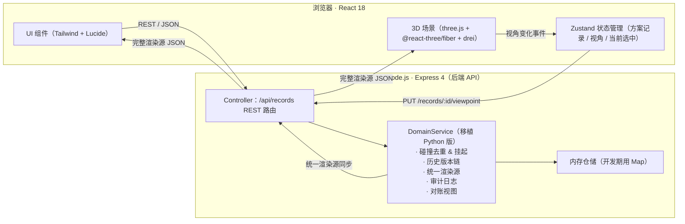
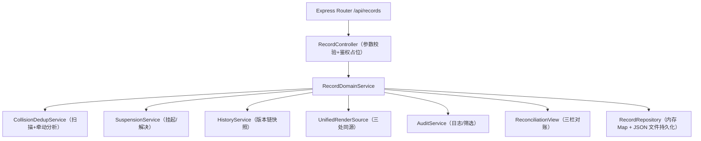
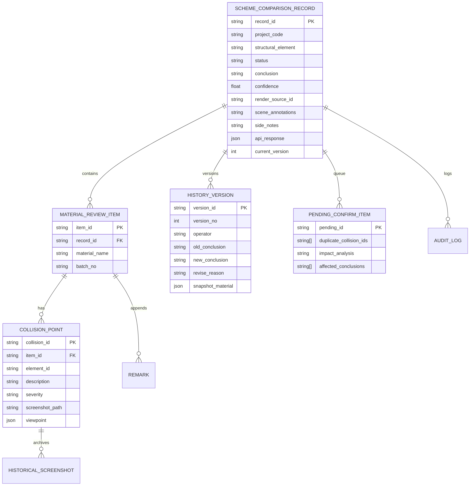

## 1. 架构设计



---

## 2. 技术选型说明

| 层 | 技术 | 说明 |
|---|------|------|
| 前端框架 | React 18 + TypeScript + Vite | 脚手架 |
| 前端样式 | TailwindCSS 3 | 工程风 UI |
| 前端状态 | Zustand 4 | 方案记录、视角、选中态全局共享 |
| 前端路由 | React Router 6 | 单路由 `/`（工作台），可选 `/records/:id` |
| 3D 引擎 | three.js 0.160，@react-three/fiber 8，@react-three/drei 9 | WebGL 渲染梁柱示意 + 碰撞点高亮 + OrbitControls |
| 3D 后期 | @react-three/postprocessing 2 | Bloom + FXAA |
| 图标 | lucide-react | 统一工程线性图标 |
| 后端 | Express 4 + TypeScript | 提供 REST API，移植 Python 版 models/service 领域逻辑 |
| 数据存储 | 内存 Map（开发期） + JSON 文件持久化（启动/关闭时读写） | 无需部署数据库，双击即可运行 |
| 测试 | Node test runner（后端单元）+ Playwright 代码（前端 E2E 示例脚本） | 覆盖 API + 浏览器操作 |

---

## 3. 路由定义

| 路由 | 页面/目的 |
|------|----------|
| `/` | 工作台（单页），默认加载示例 PRJ-DEMO 记录 |
| `/records/:id` | 工作台，加载指定记录 |

---

## 4. API 定义

```typescript
// ========== 基础类型 ==========
export type RecordStatus = 'active' | 'suspended' | 'pending_confirm' | 'confirmed' | 'archived';
export type Conclusion = 'scheme_a' | 'scheme_b' | 'scheme_c' | 'needs_inspection' | 'rejected';
export type OperationType = 'create' | 'update' | 'supplement' | 'suspend' | 'confirm' | 'revise_conclusion' | 'export';

export interface ViewPoint {
    camera_position: { x: number; y: number; z: number };
    camera_target: { x: number; y: number; z: number };
    camera_up?: { x: number; y: number; z: number };
    zoom: number;
    fov: number;
}

export interface CollisionPoint {
    collision_id: string;
    element_id: string;
    description: string;
    screenshot_path: string;
    viewpoint: ViewPoint;
    severity: 'low' | 'medium' | 'high';
    detected_at: string;
    supplement_note?: string;
    historical_screenshots: Array<{ path: string; captured_at?: string; viewpoint_fingerprint?: string }>;
}

export interface MaterialReviewItem {
    item_id: string;
    material_name: string;
    specification: string;
    supplier: string;
    batch_no: string;
    quantity: number;
    unit: string;
    collision_points: CollisionPoint[];
    remarks: Array<{ content: string; operator: string; timestamp: string }>;
    created_at: string;
    created_by: string;
}

export interface HistoryVersion {
    version_id: string;
    version_no: number;
    parent_id?: string;
    snapshot_material?: any;
    new_remarks: any[];
    old_conclusion?: Conclusion;
    new_conclusion?: Conclusion;
    revise_reason: string;
    operator: string;
    operated_at: string;
    affected_conclusion_ids: string[];
}

export interface PendingConfirmItem {
    pending_id: string;
    record_id: string;
    material_item_id: string;
    duplicate_collision_ids: string[];
    impact_analysis: string;
    affected_conclusions: string[];
    suspended_at: string;
    suspended_by: string;
    resolved_at?: string;
    resolved_by?: string;
    resolution?: string;
}

export interface SchemeComparisonRecord {
    record_id: string;
    project_name: string;
    project_code: string;
    structural_element: string;
    status: RecordStatus;
    conclusion?: Conclusion;
    confidence: number;
    materials: MaterialReviewItem[];
    history_chain: HistoryVersion[];
    pending_queue: PendingConfirmItem[];
    scene_annotations: string;
    side_notes: string;
    api_response: any;
    render_source_id: string;
    created_at: string;
    created_by: string;
    updated_at: string;
    current_version: number;
}

// ========== REST 接口 ==========

// GET  /api/records                         → 列表（摘要）
// GET  /api/records/:id                     → 单条完整记录
// POST /api/records                         → 创建 { project_name, project_code, structural_element, operator }
// PUT  /api/records/:id/viewpoint           → 更新视角，同步渲染源 { viewpoint, operator }
// POST /api/records/:id/materials           → 追加材料，自动查重挂起，自动写历史，返回完整记录
// POST /api/records/:id/materials/:itemId/remarks  → 补录备注，自动写历史
// POST /api/records/:id/materials/:itemId/collisions/:colId/screenshot
//                                            → 替换/追加截图 body: { image_base64_or_url, append_to_history: bool, operator }
// POST /api/records/:id/pending/:pendingId/resolve
//                                            → 解决待确认：{ keep_collision_id, resolution, operator }
// POST /api/records/:id/revise              → 改判：{ new_conclusion, revise_reason, confidence?, extra_remarks?, operator }
// GET  /api/records/:id/export              → 导出对账：{ warnings, render_source_id, scene_annotations, side_notes, api_response, reconciliation_text }
// GET  /api/records/:id/audit               → 审计日志筛选 query: operator?, op_type?, keyword?
```

---

## 5. 后端分层



---

## 6. 数据模型

### 6.1 ER 图（逻辑）



### 6.2 初始示例数据（开发期自动注入）

项目启动时自动向仓库注入 1 条示例记录（对应 PRJ-DEMO，四层框架柱 FZ-4），包含：
- 2 条材料送审项（碳纤维布 + 粘钢胶）
- 3 处碰撞点，其中 2 处构造为同元素同视角的重复对，用于演示挂起 → 解决流程
- 1 个历史改判版本（操作人=施工经理阿乔）用于演示跨班次追溯
- 1 张旧截图已经归档在 historical_screenshots 里
