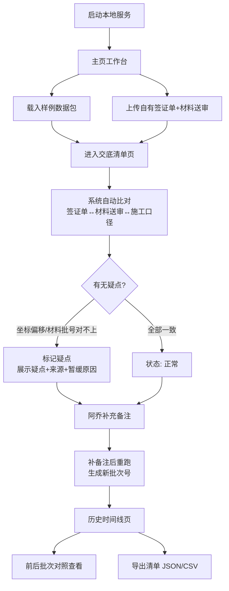

## 1. 产品概述

结构加固交底清单系统，解决施工经理阿乔在结构加固交底中人工记录的痛点。通过 Web3D 模型联动，将现场签证单、材料送审、施工口径差异三者关系结构化留存，保留原始数据来源，支持重跑、历史追溯与疑点管理。

- **核心目标**：把现场签证单→材料送审→施工口径对不上的关系永久留存，而非靠人记忆
- **目标用户**：施工经理（阿乔）、现场工程师、监理
- **产品价值**：交底有据可查、历史可回溯、疑点不丢失、前后批次可对照

---

## 2. 核心功能

### 2.1 用户角色

| 角色 | 登录方式 | 核心权限 |
|------|----------|----------|
| 施工经理 | 本地启动 | 全功能：导入样例、跑清单、加备注、重跑、导出、查看历史 |
| 现场工程师 | 本地启动 | 查看清单、标注疑点、上传签证单 |

### 2.2 功能模块

1. **主页（工作台）**：批次概览、快速入口（跑清单 / 看样例 / 历史时间线）、最新批次状态
2. **交底清单页**：Web3D 模型区 + 清单列表 + 签证单/材料送审/疑点面板 + 时间轴 + 筛选器
3. **样例演示页**：预置一包"像现场会收到的材料"，一键导入演示完整流程
4. **历史时间线页**：批次记录、重跑痕迹、导出快照、前后对照

### 2.3 页面详情

| 页面名称 | 模块名称 | 功能描述 |
|----------|----------|----------|
| 主页 | 批次概览卡片 | 显示批次编号、状态（正常/疑点/暂缓）、构件数量、最近更新时间 |
| 主页 | 快捷入口区 | 三个大卡片：跑新批次 / 载入样例 / 查看历史时间线 |
| 交底清单页 | Web3D 模型区 | 三维结构模型，支持点选构件、高亮选中、时间轴切片联动筛选 |
| 交底清单页 | 筛选器 | 按构件编号、签证单编号、材料批号、状态（正常/疑点/暂缓）筛选；与3D模型双向联动 |
| 交底清单页 | 时间轴 | 滑动时间轴，按签证单签发日期/材料进场日期切片；3D模型与清单同步过滤 |
| 交底清单页 | 清单列表 | 每条含构件、签证单链接、材料送审链接、施工口径对比、状态标签 |
| 交底清单页 | 原始来源面板 | 签证单原件内容（不清洗，保留脏数据痕迹）+ 材料送审原件 + 坐标偏移日志 |
| 交底清单页 | 疑点/暂缓面板 | 展示疑点说明、数据来源、暂缓原因，阻止进入最终报告 |
| 交底清单页 | 备注与重跑 | 追加备注文本；一键基于当前批次"补备注后重跑"，生成新批次号 |
| 交底清单页 | 导出 | 导出当前批次清单（含状态、来源、疑点）为 JSON/CSV |
| 样例页 | 一键导入样例 | 导入预置的现场签证单+材料送审+模型坐标偏移样例数据包 |
| 样例页 | 流程指引 | 标注样例中各数据的关系（签证→材料→口径差异→疑点） |
| 历史时间线页 | 批次时间线 | 按时间倒序展示所有批次，标注"首次跑"、"补备注重跑"等事件 |
| 历史时间线页 | 批次详情 | 点击展开批次，显示当时的构件状态、导出快照、重跑前后差异 |
| 历史时间线页 | 前后对照 | 选择两个批次并排对比构件状态变化 |

---

## 3. 核心流程

### 3.1 主流程描述

施工经理阿乔启动本地服务 → 打开主页 → 点击"载入样例"（或上传自己的签证单/材料送审包）→ 进入交底清单页 → 系统自动比对签证单与材料送审 → 阿乔在 Web3D 中点选构件查看对应签证单和材料 → 发现模型坐标偏移 → 系统自动标记"疑点"并展示疑点/来源/暂缓原因 → 阿乔补充备注 → 点击"补备注后重跑" → 生成新批次 → 进入历史时间线页查看前后批次对照 → 导出最终清单。

### 3.2 流程图

---

## 4. 用户界面设计

### 4.1 设计风格

- **主色调**：工程蓝（#1E40AF）作为主色，警示橙（#EA580C）疑点色，深炭灰（#1F2937）文字
- **辅色调**：浅蓝背景（#EFF6FF），米白卡片底（#FAFAF9），钢灰色边框（#475569）
- **按钮风格**：方角矩形按钮，2px 描边，悬停加粗阴影；疑点按钮用橙色描边
- **字体**：标题用 **Noto Serif SC**（宋体衬线，有工程图纸厚重感），正文用 **JetBrains Mono**（等宽，对齐数据列）
- **布局风格**：顶部导航栏 + 左右分栏（左：Web3D 模型区，右：清单+面板）+ 底部时间轴，工程图纸式分区网格
- **图标风格**：Lucide 线性图标，构件用立方体图标，疑点用三角感叹号

### 4.2 页面设计概览

| 页面名称 | 模块名称 | UI 元素与动效 |
|----------|----------|---------------|
| 主页 | 批次概览卡片 | 卡片带工程蓝图式网格底纹，悬停上浮3px，状态标签在右上角 |
| 主页 | 快捷入口区 | 三个大卡片（跑清单/载入样例/历史时间线），不同图标区分，点击有按压缩放反馈 |
| 交底清单页 | Web3D 模型区 | 工程灰背景，构件半透明钢结构材质；点选构件高亮成警示橙并弹出信息气泡 |
| 交底清单页 | 筛选器 | 横排下拉筛选条，每个筛选器独立胶囊样式；3D模型高亮与筛选条件双向同步 |
| 交底清单页 | 时间轴 | 底部横向滑轨，刻度标注日期，滑块用工程游标样式，拖动时列表与3D实时过滤 |
| 交底清单页 | 清单列表 | 工程表格样式，斑马纹，状态列彩色标签（正常绿/疑点橙/暂缓灰） |
| 交底清单页 | 原始来源面板 | 等宽字体显示原始签证单文本，脏数据用删除线+红色字标注"未清洗" |
| 交底清单页 | 疑点面板 | 橙色边框警示卡，三项并排：疑点说明 / 原始来源 / 暂缓原因 |
| 交底清单页 | 备注与重跑 | 文本域 + "补备注后重跑"按钮，重跑时显示进度条并自动跳转历史页 |
| 历史时间线页 | 批次时间线 | 垂直时间轴，节点用圆形图标区分事件类型，连线用虚线，悬停展开预览 |
| 历史时间线页 | 前后对照 | 左右双栏并排表格，差异单元格高亮黄色背景 |

### 4.3 响应式

- 桌面端优先（1280px 以上），左右分栏；
- 平板端（768–1279px）上下分栏，3D在上、清单在下；
- 移动端（<768px）单栏纵向堆叠，时间轴改为横向滚动卡片；
- 触摸设备支持 3D 双指缩放旋转、时间轴拖动。

### 4.4 3D 场景指引

- **环境/HDRI**：中性工程室环境，软阴影，不过度使用贴图，突出构件本身
- **光照**：一个主平行光（模拟工地顶灯）+ 两个柔和辅光，避免过暗区域
- **相机**：初始等距视角（iso 视角），OrbitControls 支持自由旋转/缩放/平移；选中构件时相机平滑聚焦
- **构图与焦点**：场景中心放置主要结构构件（梁、柱、板），每个构件带独立 ID 可点选
- **交互与动画**：
  - 点选构件：构件颜色渐变高亮 + 信息气泡淡入
  - 时间轴筛选：不符合时间的构件淡出半透明
  - 疑点构件：持续轻微呼吸闪烁（橙色脉冲）
  - 重跑：3D 场景短暂淡入淡出
- **后处理**：Slightly bloom 高亮选中构件，FXAA 抗锯齿
- **性能预算**：单个场景构件数 < 500，面数 < 10万，保持 60fps
