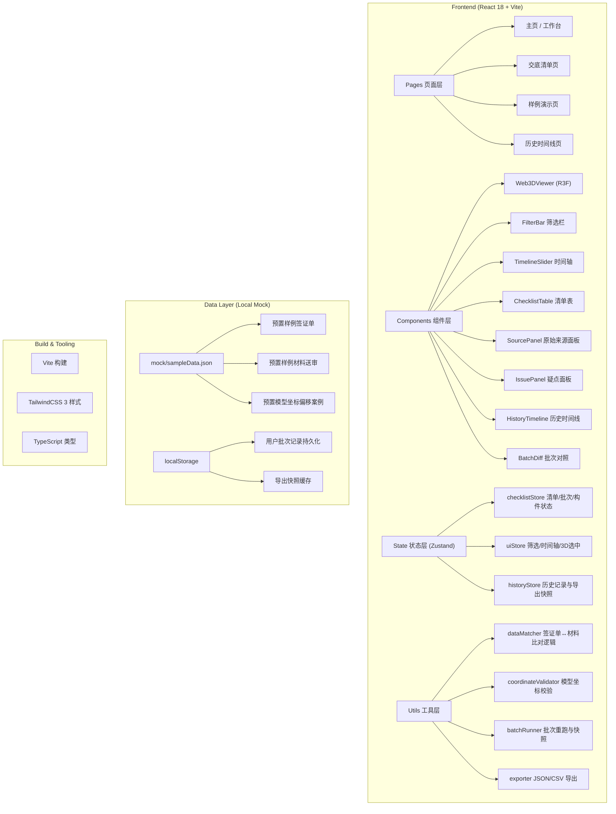
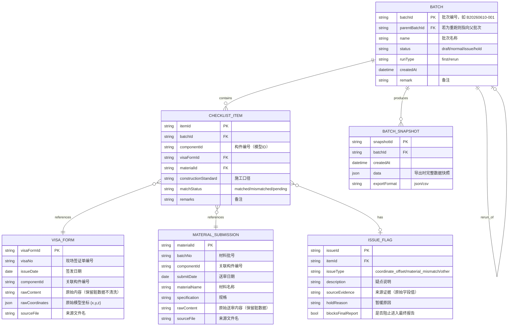

## 1. 架构设计



## 2. 技术描述

- **前端框架**：React@18 + TypeScript@5 + Vite@6
- **状态管理**：Zustand@4（扁平化 store，按领域分 3 个 slice）
- **路由**：react-router-dom@6
- **样式**：TailwindCSS@3 + CSS Variables（工程蓝图主题变量）
- **Web3D**：
  - three@0.164
  - @react-three/fiber@8 （声明式 Three.js）
  - @react-three/drei@9 （OrbitControls、Environment、Text 等）
  - @react-three/postprocessing@2 （Bloom、FXAA）
- **图标**：lucide-react@0.400
- **初始化工具**：vite-init（react-ts 模板）
- **后端**：None（纯前端本地应用，数据存储于 localStorage 和 JSON 文件）
- **数据库**：localStorage + 静态 JSON mock 数据
- **测试**：Vitest（核心比对逻辑单测）

## 3. 路由定义

| 路由路径 | 页面 | 用途 |
|----------|------|------|
| `/` | 主页（工作台） | 批次概览、快捷入口 |
| `/checklist/:batchId` | 交底清单页 | Web3D + 清单 + 时间轴 + 疑点面板 |
| `/sample` | 样例演示页 | 一键导入样例包、流程指引 |
| `/history` | 历史时间线页 | 批次记录、重跑痕迹、前后对照 |

## 4. 数据模型

### 4.1 ER 图



### 4.2 类型定义（TypeScript）

```typescript
// shared/types/index.ts

export type BatchStatus = 'draft' | 'normal' | 'issue' | 'hold';
export type RunType = 'first' | 'rerun';
export type MatchStatus = 'matched' | 'mismatched' | 'pending';
export type IssueType = 'coordinate_offset' | 'material_mismatch' | 'other';
export type ExportFormat = 'json' | 'csv';

export interface Coordinate {
  x: number;
  y: number;
  z: number;
}

export interface VisaForm {
  visaFormId: string;
  visaNo: string;
  issueDate: string;
  componentId: string;
  rawContent: string;
  rawCoordinates: Coordinate;
  sourceFile: string;
}

export interface MaterialSubmission {
  materialId: string;
  batchNo: string;
  componentId: string;
  submitDate: string;
  materialName: string;
  specification: string;
  rawContent: string;
  sourceFile: string;
}

export interface IssueFlag {
  issueId: string;
  itemId: string;
  issueType: IssueType;
  description: string;
  sourceEvidence: string;
  holdReason: string;
  blocksFinalReport: boolean;
}

export interface ChecklistItem {
  itemId: string;
  batchId: string;
  componentId: string;
  visaFormId: string | null;
  materialId: string | null;
  constructionStandard: string;
  matchStatus: MatchStatus;
  remarks: string;
}

export interface Batch {
  batchId: string;
  parentBatchId: string | null;
  name: string;
  status: BatchStatus;
  runType: RunType;
  createdAt: string;
  remark: string;
  items: ChecklistItem[];
  issues: IssueFlag[];
}

export interface BatchSnapshot {
  snapshotId: string;
  batchId: string;
  createdAt: string;
  data: Batch;
  exportFormat: ExportFormat;
}

export interface ModelComponent {
  id: string;
  name: string;
  type: 'beam' | 'column' | 'slab' | 'wall';
  position: Coordinate;
  size: Coordinate;
  color: string;
}

export interface FilterState {
  componentIds: string[];
  visaNos: string[];
  materialBatchNos: string[];
  statuses: MatchStatus[];
  dateRange: [string, string] | null;
}
```

## 5. 核心 Store 设计

### 5.1 checklistStore

```typescript
// src/store/checklistStore.ts
// state:
//   batches: Record<string, Batch>
//   currentBatchId: string | null
//   visaForms: Record<string, VisaForm>
//   materialSubmissions: Record<string, MaterialSubmission>
//   modelComponents: Record<string, ModelComponent>
// actions:
//   createBatch(name, parentId?, remark?) : string
//   runBatch(batchId) : void (执行比对，生成 items + issues)
//   addItemRemark(itemId, remark) : void
//   rerunBatch(batchId, newRemark) : string (复制并生成新批次)
//   loadSampleData() : void (从 mock JSON 载入样例)
//   importVisaForms(list) : void
//   importMaterialSubmissions(list) : void
```

### 5.2 uiStore

```typescript
// src/store/uiStore.ts
// state:
//   selectedComponentId: string | null
//   selectedItemId: string | null
//   filters: FilterState
//   timelineDate: string | null
//   viewMode: '3d' | 'list' | 'split'
// actions:
//   selectComponent(id) : void
//   setFilters(partial) : void
//   setTimelineDate(date) : void
//   resetFilters() : void
```

### 5.3 historyStore

```typescript
// src/store/historyStore.ts
// state:
//   snapshots: Record<string, BatchSnapshot>
//   historyEvents: HistoryEvent[] (时间线事件)
// actions:
//   createSnapshot(batchId, format) : string
//   getBatchHistory(batchId) : Batch[] (含父批次)
//   compareBatches(id1, id2) : DiffResult
```

## 6. 核心业务逻辑（伪代码）

### 6.1 比对逻辑（dataMatcher.ts）

```
function runBatchMatching(batchId):
  ForEach 构件 in modelComponents:
    找到关联的 VisaForm (按 componentId)
    找到关联的 MaterialSubmission (按 componentId)
    创建 ChecklistItem
    If VisaForm 存在 && MaterialSubmission 存在:
      If VisaForm.施工口径 == MaterialSubmission.施工口径:
        item.matchStatus = 'matched'
      Else:
        item.matchStatus = 'mismatched'
        创建 IssueFlag (material_mismatch)
      调用 coordinateValidator 校验模型坐标
      If 坐标偏移 > 阈值:
        创建 IssueFlag (coordinate_offset)
        IssueFlag.blocksFinalReport = true
    Else:
      item.matchStatus = 'pending'
  更新 batch.status (若有 blocksFinalReport 的 issue 则为 'hold')
```

### 6.2 重跑逻辑（batchRunner.ts）

```
function rerunBatch(originalId, newRemark):
  original = batches[originalId]
  newId = generateBatchId()
  复制 original 所有 items -> newItems
  复制 original 所有 issues -> newIssues
  ForEach newItem: item.remarks += ('\n' + newRemark)
  创建新 Batch:
    batchId = newId
    parentBatchId = originalId
    runType = 'rerun'
    name = original.name + '（重跑）'
  重新运行 runBatchMatching(newId) (基于最新签证/材料)
  记录到 historyEvents
  返回 newId
```

## 7. 目录结构

```
.
├── public/
│   └── mock/
│       └── sampleData.json       # 样例数据包
├── src/
│   ├── shared/
│   │   └── types/
│   │       └── index.ts          # 全局 TS 类型
│   ├── store/
│   │   ├── checklistStore.ts
│   │   ├── uiStore.ts
│   │   └── historyStore.ts
│   ├── utils/
│   │   ├── dataMatcher.ts
│   │   ├── coordinateValidator.ts
│   │   ├── batchRunner.ts
│   │   ├── exporter.ts
│   │   └── diff.ts
│   ├── components/
│   │   ├── Web3DViewer/
│   │   │   ├── Scene.tsx
│   │   │   ├── StructureMesh.tsx
│   │   │   ├── SelectedBubble.tsx
│   │   │   └── index.tsx
│   │   ├── FilterBar.tsx
│   │   ├── TimelineSlider.tsx
│   │   ├── ChecklistTable.tsx
│   │   ├── SourcePanel.tsx
│   │   ├── IssuePanel.tsx
│   │   ├── RemarkRerunBar.tsx
│   │   ├── BatchCard.tsx
│   │   ├── HistoryTimeline.tsx
│   │   └── BatchDiff.tsx
│   ├── pages/
│   │   ├── Home.tsx
│   │   ├── Checklist.tsx
│   │   ├── Sample.tsx
│   │   └── History.tsx
│   ├── App.tsx
│   ├── main.tsx
│   └── index.css
├── README.md
├── package.json
├── vite.config.ts
├── tsconfig.json
└── tailwind.config.js
```

## 8. 样例数据包规格

`public/mock/sampleData.json` 包含：

```json
{
  "visaForms": [
    {
      "visaFormId": "v001",
      "visaNo": "XZ-2026-0610-003（手写有涂改）",
      "issueDate": "2026-06-05",
      "componentId": "C-Beam-012",
      "rawContent": "【原始扫描件文本】...梁底碳纤维加固3层...此处有手写备注字迹潦草...",
      "rawCoordinates": {"x": 12.45, "y": 3.20, "z": 8.88},
      "sourceFile": "现场签证单_XZ-2026-0610-003.jpg"
    }
  ],
  "materialSubmissions": [
    {
      "materialId": "m001",
      "batchNo": "CFRP-B20260608（批号有磨损）",
      "componentId": "C-Beam-012",
      "submitDate": "2026-06-08",
      "materialName": "碳纤维布",
      "specification": "300g/m² 2层（与签证单3层不符）",
      "rawContent": "【送审单原文】...数量300㎡...备注栏空...",
      "sourceFile": "材料送审单_CFRP-B20260608.pdf"
    }
  ],
  "modelComponents": [
    {
      "id": "C-Beam-012",
      "name": "2层3轴主梁",
      "type": "beam",
      "position": {"x": 12.00, "y": 3.00, "z": 9.00},
      "size": {"x": 6.0, "y": 0.4, "z": 0.8},
      "color": "#64748B"
    }
  ],
  "expectedIssues": [
    "C-Beam-012 签证单坐标(12.45,3.20,8.88)与模型(12.00,3.00,9.00)偏移>0.5m → 疑点",
    "C-Beam-012 签证单3层碳纤维 vs 材料送审2层 → 口径对不上"
  ]
}
```

## 9. README 关键内容

README 开头给出阿乔最关心的命令顺序：

```
# 结构加固交底清单

## 阿乔，先跑这几条

# 1. 装依赖
npm install

# 2. 启动本地服务
npm run dev

# 3. 浏览器打开 http://localhost:5173

# 4. 先点【载入样例】看效果 → 再去【历史时间线】
```

然后附：样例内容说明、重跑怎么操作、历史时间线怎么看对照。
