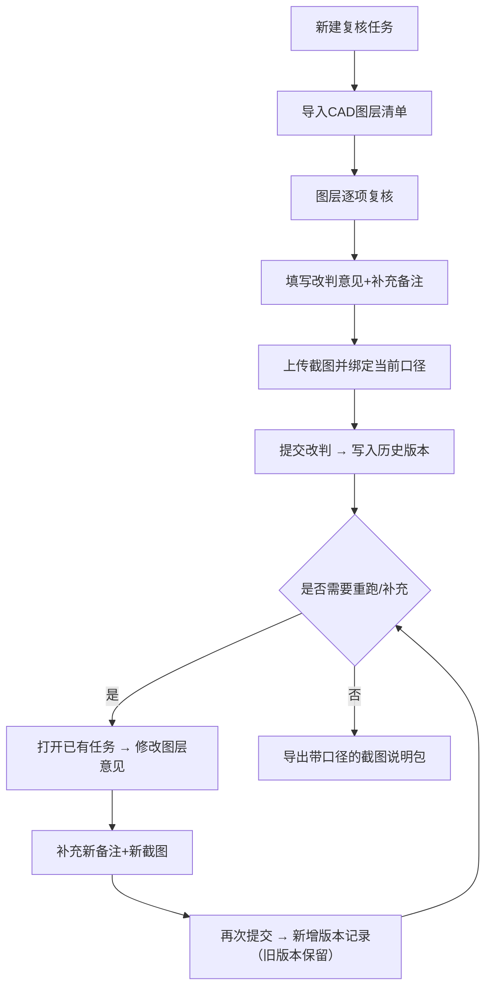

## 1. 产品概述

机电管综图纸复核系统，面向建筑设计院的建筑师和机电工程师，解决 CAD 图层复核过程中"旧意见反复冒头、图层命名混乱、历史记录丢失"的痛点。通过图层级别的可追溯管理、版本化历史留痕、口径一致的截图说明，让复核工作既能跑通一次，也能支持反复迭代重跑。

## 2. 核心特性

### 2.1 用户角色

| 角色 | 注册方式 | 核心权限 |
|------|----------|----------|
| 建筑师/复核人 | 本地系统默认用户 | 创建复核任务、导入图层、改判意见、查看历史、导出截图 |

### 2.2 功能模块

1. **复核任务列表页**：任务卡片、状态筛选、搜索、快速新建任务
2. **复核任务详情页**：CAD图层列表、单项复核详情、改判操作面板、截图说明
3. **历史版本对比**：按时间线展示每次修改，支持前后版本差异对照
4. **截图说明中心**：绑定当前复核口径的截图上传与标注，文件与页面口径一致
5. **图层溯源**：展示 CAD 图层原始命名，支持备注补充与历史留痕

### 2.3 页面详情

| 页面名称 | 模块名称 | 功能描述 |
|----------|----------|----------|
| 复核任务列表页 | 顶部导航栏 | 系统标题、新建任务按钮、全局搜索 |
| 复核任务列表页 | 状态筛选区 | 待复核/复核中/已完成/有遗留，四态筛选 |
| 复核任务列表页 | 任务卡片列表 | 项目名称、图纸版本、图层数量、未关闭意见数、更新时间、快捷操作 |
| 复核任务详情页 | 任务信息头 | 项目基本信息、CAD版本号、整体状态、导出截图按钮 |
| 复核任务详情页 | 图层复核列表 | 图层原始名称、图层分类、复核状态、最新意见标签、展开操作 |
| 复核任务详情页 | 图层展开详情 | 图层元信息、历次改判记录、备注补充、关联截图 |
| 复核任务详情页 | 改判操作面板 | 意见类型选择（通过/修改/驳回）、改判说明、口径标注、提交 |
| 复核任务详情页 | 截图上传区 | 拖拽上传、自动绑定当前口径、预览与替换 |
| 历史版本页 | 时间线视图 | 按操作时间倒序展示所有变更，高亮差异字段 |
| 历史版本页 | 版本对比面板 | 左右对照两次版本的图层意见、备注、截图差异 |
| 上手说明文档 | 启动指引 | 启动命令、端口说明、数据目录位置 |
| 上手说明文档 | 重跑方式 | 如何补充备注后重跑、历史记录保留规则、导出一致性说明 |
| 上手说明文档 | 截图说明规范 | 截图命名规则、口径绑定逻辑、文件与页面对照方法 |

## 3. 核心流程

复核任务创建 → 导入 CAD 图层元数据 → 逐层复核填写意见 → 补充备注与截图 → 提交改判 → 历史留痕 → 如需修改可重跑（旧记录保留）→ 导出带口径的截图说明

## 4. 用户界面设计

### 4.1 设计风格

- **主色**：工程蓝 `#2563EB`，辅以警示橙 `#F59E0B` 和驳回红 `#DC2626`
- **底色**：工业灰阶 `#0F172A`（深灰背景）配 `#1E293B`（卡片底色），营造专业工程氛围
- **字体**：标题用 `Space Grotesk` 硬朗几何感，正文用 `Noto Sans SC` 保证中文可读，代码/图层名用 `JetBrains Mono` 等宽
- **按钮风格**：微立体方角按钮，`4px` 圆角，hover 时轻微上浮 + 阴影加深
- **布局风格**：左侧图层列表 + 右侧详情面板的经典双栏结构，详情面板内嵌时间线历史
- **图标风格**：lucide-react 线性图标，工程感强，图层用堆叠方块、历史用时钟图标、截图用相机图标

### 4.2 页面设计概览

| 页面名称 | 模块名称 | UI要素 |
|----------|----------|--------|
| 任务列表页 | 任务卡片 | 深色卡片+左侧色条标识状态，标题用 Space Grotesk Bold，图层数用大号数字徽章，hover 时卡片轻微上移+蓝色描边 |
| 任务列表页 | 筛选区 | 水平标签栏，选中态填充主色蓝带白色文字，未选中态半透明灰 |
| 详情页 | 图层列表 | 左栏固定宽度，每一行是图层项，左侧状态圆点，中间显示原始图层名（等宽字体），右侧箭头，hover灰底，选中态左侧蓝色竖条高亮 |
| 详情页 | 改判面板 | 三态单选按钮（通过/修改/驳回），各自对应绿/橙/红，下方文本域 + 口径标签输入，底部提交按钮 |
| 详情页 | 历史时间线 | 右侧内嵌垂直时间线，节点用圆圈，连接线灰色，每条记录显示操作人+时间+意见类型徽章，点击展开对比 |
| 详情页 | 截图区 | 卡片式缩略图网格，每张图下方显示绑定的口径标签，点击放大预览，支持替换和下载 |
| 历史对比页 | 双栏对照 | 左右两个半透明卡片，顶部版本标签，中间差异字段高亮（新增绿底、删除红底删除线、修改橙底） |
| 上手文档页 | 代码块 | 暗色终端风格代码块，命令行高亮，关键参数用橙字标注 |

### 4.3 响应式

桌面端优先（≥1280px），双栏布局；平板端单栏上下堆叠；移动端隐藏次要信息，保留核心改判和查看功能。触控目标 ≥44px。

### 4.4 视觉动效

- 页面加载：卡片渐入（fade-in + translateY 10px），按位置 stagger 延迟
- 图层切换：详情面板内容交叉淡入淡出（200ms）
- 改判提交：按钮旋转勾号动画，顶部出现成功 Toast 后自动消失
- 历史时间线：滚动时节点逐个弹入（scale 0.8 → 1）
- 截图上传：拖拽时整个区域变蓝边框，文件悬停时缩略图 +1 半透明预览
