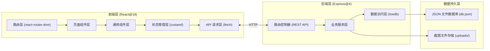
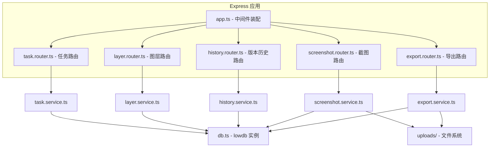
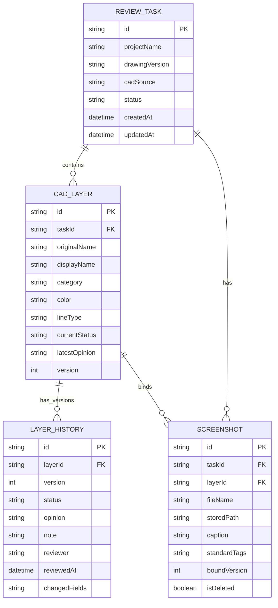

## 1. 架构设计



## 2. 技术说明

- **前端**：React@18 + TypeScript + react-router-dom@6 + zustand + tailwindcss@3 + lucide-react
- **初始化工具**：vite-init，使用 react-express-ts 模板（前后端一体）
- **后端**：Express@4 + TypeScript + lowdb（轻量级 JSON 文件数据库，零配置即可运行，符合"别藏着"的易上手要求）
- **文件存储**：截图上传至 `uploads/` 目录，文件名使用 UUID 防冲突，元数据存数据库
- **Mock 数据**：初始化时内置 2 个示例复核任务 + 15 条图层记录 + 若干历史版本，可直接体验全部功能

## 3. 路由定义

### 前端路由

| 路由路径 | 页面用途 |
|----------|----------|
| `/` | 复核任务列表页（首页） |
| `/tasks/:taskId` | 复核任务详情页（含图层列表、改判面板、历史） |
| `/tasks/:taskId/history` | 历史版本对比页 |
| `/tasks/:taskId/screenshots` | 截图说明管理页 |
| `/guide` | 上手说明文档页 |

### 后端 API 路由

| 方法 | 路径 | 用途 |
|------|------|------|
| GET | `/api/tasks` | 获取复核任务列表（支持状态筛选、关键词搜索） |
| POST | `/api/tasks` | 新建复核任务 |
| GET | `/api/tasks/:taskId` | 获取单个任务详情（含图层汇总） |
| PUT | `/api/tasks/:taskId` | 更新任务基本信息 |
| GET | `/api/tasks/:taskId/layers` | 获取任务下所有图层（含最新复核状态） |
| GET | `/api/layers/:layerId` | 获取单个图层详情（含完整历史） |
| POST | `/api/layers/:layerId/reviews` | 对图层提交改判（自动生成历史版本） |
| PUT | `/api/layers/:layerId/notes` | 补充图层备注（不覆盖旧备注，追加历史） |
| GET | `/api/tasks/:taskId/history` | 获取任务完整历史时间线 |
| GET | `/api/tasks/:taskId/history/compare?v1=a&v2=b` | 对比两个版本的差异 |
| POST | `/api/tasks/:taskId/screenshots` | 上传截图（multipart/form-data），自动绑定当前口径 |
| GET | `/api/tasks/:taskId/screenshots` | 获取任务下所有截图及元信息 |
| GET | `/api/screenshots/:fileId/download` | 下载截图原图 |
| DELETE | `/api/screenshots/:fileId` | 删除截图（软删除，保留历史记录） |
| POST | `/api/tasks/:taskId/export` | 导出带口径的截图说明包（ZIP） |
| GET | `/api/guide` | 返回上手文档结构化内容 |

## 4. API 类型定义

```typescript
// 复核任务
interface ReviewTask {
  id: string;
  projectName: string;
  drawingVersion: string;
  cadSource: string;
  status: 'pending' | 'in_progress' | 'completed' | 'has_legacy';
  createdAt: string;
  updatedAt: string;
  layerCount: number;
  openIssueCount: number;
  description?: string;
}

// CAD 图层
interface CadLayer {
  id: string;
  taskId: string;
  originalName: string;        // CAD 图层原始命名（关键，不可修改）
  displayName?: string;        // 可读别名（可修改）
  category: string;            // 管线分类：给水/排水/暖通/电气/消防
  color: string;               // CAD 中的颜色编号
  lineType: string;            // 线型
  currentStatus: 'approved' | 'needs_modify' | 'rejected';
  latestOpinion: string;
  version: number;             // 当前版本号，每次改判自增
  createdAt: string;
  updatedAt: string;
}

// 图层历史版本
interface LayerHistory {
  id: string;
  layerId: string;
  version: number;
  status: 'approved' | 'needs_modify' | 'rejected';
  opinion: string;
  note: string;                // 补充备注（与 opinion 分开）
  reviewer: string;
  reviewedAt: string;
  standardTags: string[];      // 当前口径标签
  screenshotIds: string[];     // 绑定的截图
  changedFields: string[];     // 本次变更的字段
}

// 截图说明
interface Screenshot {
  id: string;
  taskId: string;
  layerId?: string;            // 可选：绑定到具体图层
  fileName: string;
  storedPath: string;
  fileSize: number;
  mimeType: string;
  uploadedAt: string;
  caption: string;             // 说明文字
  standardTags: string[];      // 绑定的当前口径
  boundVersion?: number;       // 绑定时的图层版本号
  isDeleted: boolean;
}
```

## 5. 后端服务架构



核心服务说明：
- **layer.service.ts**：改判时自动对比前后版本差异，生成 `LayerHistory` 记录，版本号自增，旧记录永不删除
- **history.service.ts**：对比两个版本时递归比对字段，输出统一的 diff 结构供前端高亮
- **screenshot.service.ts**：上传时强制校验 `standardTags` 非空，确保每张截图都带当前口径
- **export.service.ts**：导出时将截图文件名重命名为「图层名_版本_口径.jpg」，附带 JSON 说明文件，保证文件和页面口径一致

## 6. 数据模型

### 6.1 ER 图



### 6.2 初始化数据策略

- 系统首次启动时，`db.json` 为空则执行 `seed.ts` 种子脚本
- 插入 2 个示例任务：「商业综合体 A 座地下二层管综」「科技园 B 栋标准层管综」
- 每个任务插入 7-8 条图层，涵盖 5 大管线类别
- 每条图层插入 2-3 条历史版本，模拟「初次复核→补充备注→重跑改判」的真实流程
- 插入 5-6 条示例截图占位（使用占位图 URL），绑定不同口径标签和版本号
