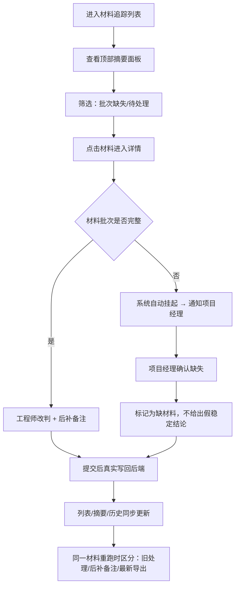

## 1. 产品概述
本系统用于机电管综（MEP）施工过程中的材料追踪管理，将原结构工程师老叶人工兜底的流程系统化。核心解决材料送审表与交底清单意见不一致、材料批次缺失导致假稳定结论、重跑时历史处理混淆等问题。
- 面向结构工程师、项目经理，提供材料追踪列表、详情、改判、历史记录和处理摘要
- 提供少量材料送审表导入能力，附带边界样本以便验证确认逻辑

## 2. 核心功能

### 2.1 用户角色
| 角色 | 登录方式 | 核心权限 |
|------|---------|---------|
| 结构工程师 | 本地演示账号 | 查看列表、详情、导入送审表、改判材料状态、添加备注、重跑 |
| 项目经理 | 本地演示账号 | 全部工程师权限 + 挂起材料的确认/驳回、查看汇总摘要 |

### 2.2 功能模块
1. **材料追踪列表页**：分页表格，支持按状态/专业/批次缺失筛选，顶部摘要面板
2. **材料详情页**：材料基本信息、批次清单、意见历史、改判操作区
3. **改判操作**：修改判定结果、添加后补备注、标记是否为最新导出
4. **历史记录页**：全量变更流水，按材料筛选，区分旧处理/后补备注/最新导出
5. **页面摘要面板**：处理完成数、待确认数、批次缺失挂起数、缺材料数统计卡片 + 明细入口
6. **送审表导入**：少量导入，携带边界样本（交底清单遗漏旧意见 + 批次缺失样本）
7. **挂起确认**：批次缺失时自动挂起，项目经理确认后才能给出稳定结论
8. **重跑机制**：同一材料重跑时，旧处理保留、后补备注独立显示、最新导出单独标记

### 2.3 页面详情
| 页面名称 | 模块名称 | 功能描述 |
|---------|---------|---------|
| 材料追踪列表 | 顶部摘要卡片 | 6个指标卡：已处理/待改判/批次缺失挂起/缺材料/待项目经理确认/总条目，点击跳转对应筛选 |
| 材料追踪列表 | 筛选栏 | 状态筛选（全部/已处理/挂起/待确认/缺材料）、专业筛选（暖通/电气/给排水/消防）、搜索（材料编号/名称） |
| 材料追踪列表 | 数据表格 | 材料编号、名称、专业、批次状态、判定结果、确认状态、最新导出标记、操作列（详情/改判/重跑/挂起） |
| 材料详情 | 基本信息卡 | 材料编号、名称、规格型号、专业、送审编号、来源送审表、导入时间 |
| 材料详情 | 批次清单 | 批次号、到厂日期、检验报告、质量证明文件、状态（完整/缺失）、缺失原因 |
| 材料详情 | 意见流水 | 时间轴：交底清单意见 → 送审表意见 → 旧处理记录 → 后补备注 → 最新导出意见，标记每条来源类型 |
| 材料详情 | 改判操作区 | 下拉选择判定结果、后补备注文本域、最新导出勾选、提交按钮 |
| 历史记录页 | 筛选 | 按材料编号、操作类型（改判/备注/重跑/挂起/确认）、时间范围筛选 |
| 历史记录页 | 流水表 | 时间、材料编号、操作人、操作类型、变更内容、来源标记（旧处理/后补备注/最新导出） |
| 挂起确认弹窗 | 确认表单 | 项目经理选择：确认缺失/补充批次/驳回，填写意见，电子签名框 |
| 送审表导入 | 导入面板 | 选择文件（JSON/CSV）、预览导入数据、显示边界样本标记、确认导入按钮 |

## 3. 核心流程

**主要用户流程**：
1. 结构工程师进入列表页，查看摘要面板了解整体处理进度
2. 筛选待处理/批次缺失的材料，点击详情查看完整信息
3. 发现交底清单遗漏旧意见时，在改判区补充后补备注
4. 发现材料批次缺失，系统自动挂起，通知项目经理确认
5. 项目经理通过挂起确认弹窗，确认缺失情况后，材料进入"缺材料"状态
6. 同一材料重跑时，系统自动保留旧处理记录，新增记录标记为后补或最新导出
7. 所有真实写回后端，列表/详情/历史/摘要实时同步

## 4. 用户界面设计

### 4.1 设计风格
- **主色**：工业蓝 `#1e40af`（代表可靠/工程感），状态色用 amber（挂起）/rose（缺材料）/emerald（已处理）/violet（待确认）
- **按钮样式**：方形微圆角（2px），实心主色按钮，次级边框按钮，危险按钮红色
- **字体**：正文用 `system-ui, -apple-system, "PingFang SC"` 保证中文工程文档可读性；数字和编号用 `JetBrains Mono` 等宽
- **布局**：左侧固定侧边导航 + 顶部面包屑 + 右侧内容区，卡片内固定高度滚动表格
- **图标**：lucide-react 线性图标，状态用彩色 badge + 小图标组合

### 4.2 页面设计概述
| 页面名称 | 模块名称 | UI 元素 |
|---------|---------|---------|
| 材料追踪列表 | 摘要卡片 | 6 色区分卡：emerald 已处理 / amber 待改判 / rose 批次缺失挂起 / orange 缺材料 / violet 待项目经理确认 / slate 总计；卡片带数字 + 趋势小箭头 |
| 材料追踪列表 | 数据表格 | 斑马纹行、状态彩色 badge、最新导出用 🆕 标记、批次缺失行浅红底色、悬停高亮、右对齐操作列 |
| 材料详情 | 意见流水时间轴 | 左侧竖线 + 彩色圆点（交底清单蓝 / 送审表青 / 旧处理灰 / 后补备注琥珀 / 最新导出紫），右侧卡片内容 |
| 材料详情 | 改判区 | 固定底部操作栏，滚动时跟随，判定结果下拉、备注多行文本、最新导出复选框 |
| 历史记录页 | 流水表 | 三列区分来源标记：旧处理（灰标签）/后补备注（琥珀标签）/最新导出（紫标签） |
| 挂起确认弹窗 | 表单 | 三段式状态切换（确认缺失/补充批次/驳回），底部签名区，主按钮紫色代表项目经理确认 |

### 4.3 响应性
- Desktop 优先（1280px+）：左栏 220px，内容区 1060px
- 平板（768-1279px）：左栏折叠为图标栏，表格横向滚动
- 移动端（<768px）：顶栏汉堡菜单，摘要卡片两列，表格卡片化

### 4.4 视觉记忆点
- 摘要卡片用渐变底色 + 右下几何斜切装饰，形成工程感视觉语言
- 意见流水时间轴的彩色圆点旁加"旧处理 / 后补备注 / 最新导出"标签，用户一眼分清来源
- 批次缺失挂起的材料在列表中用浅红底 + 红色左竖条，不给出假稳定结论
