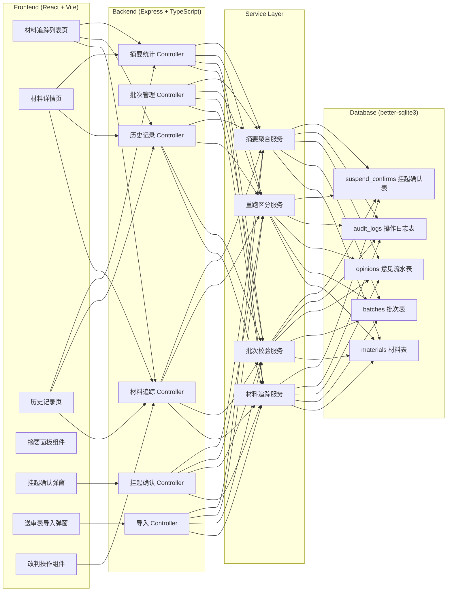
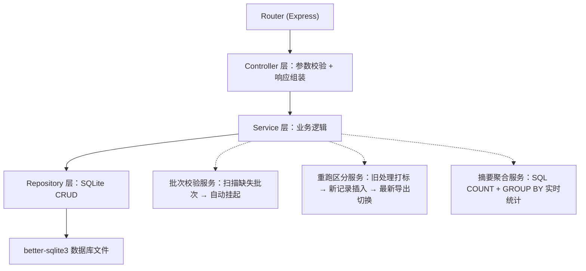
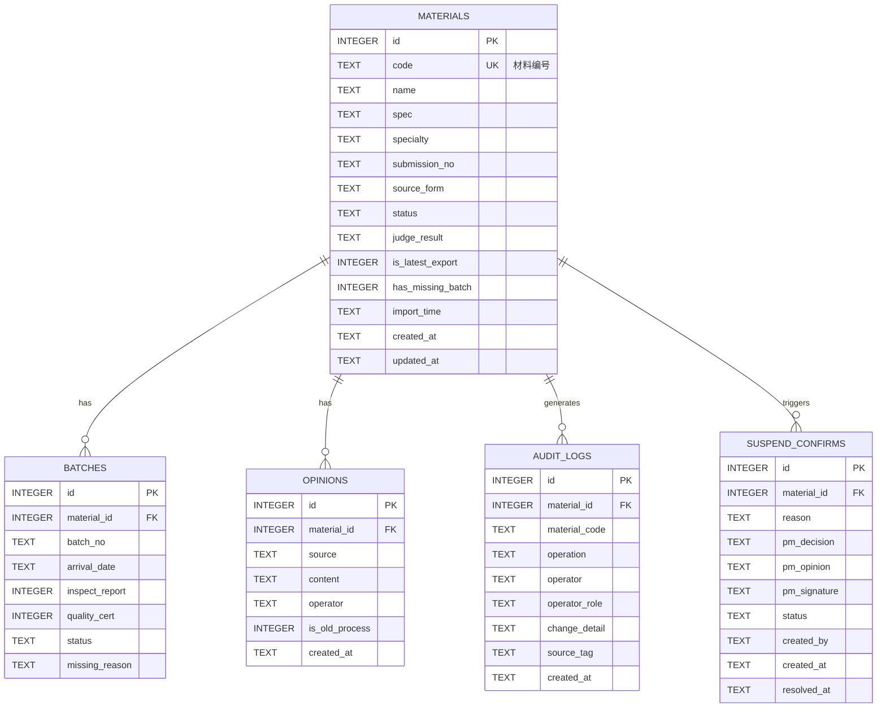

## 1. 架构设计



## 2. 技术描述
- **前端**：React@18 + TypeScript + Vite@5 + tailwindcss@3 + zustand@4 + react-router-dom@6 + lucide-react
- **后端**：Express@4 + TypeScript + better-sqlite3（零配置嵌入式数据库，适合单用户演示场景）
- **初始化工具**：vite-init 使用 `react-express-ts` 全栈模板
- **数据库**：SQLite（文件存储在 `api/data/mep-tracker.db`，首次启动自动建表+种子数据）
- **状态管理**：前端 zustand 管理筛选/弹窗/导入预览状态；后端纯 REST，无 session，用 JWT 简化版（固定 token 演示角色切换）

## 3. 路由定义

### 前端路由
| 路由 | 页面用途 |
|------|---------|
| `/` | 材料追踪列表页（含摘要面板） |
| `/material/:id` | 材料详情页（含批次、意见流水、改判区） |
| `/history` | 历史记录页（全量操作日志 + 来源标记筛选） |
| `/import` | 送审表导入页（预览 + 边界样本标记） |

### 后端 API 路由（`/api` 前缀）
| 方法 | 路由 | 用途 |
|------|------|------|
| GET | `/materials` | 材料列表（支持 status/specialty/search/page 分页） |
| GET | `/materials/:id` | 材料详情（含批次、意见） |
| PATCH | `/materials/:id/judge` | 改判（判定结果 + 后补备注 + 最新导出标记） |
| POST | `/materials/:id/rerun` | 重跑（自动区分旧处理，返回新增记录） |
| POST | `/materials/import` | 导入送审表（JSON/CSV，返回导入结果） |
| GET | `/materials/summary` | 页面摘要（6 项统计 + 按专业分组） |
| GET | `/batches?materialId=` | 批次列表 |
| POST | `/suspends` | 创建挂起确认（批次缺失时自动触发） |
| PATCH | `/suspends/:id/confirm` | 项目经理确认挂起 |
| GET | `/audit-logs` | 历史记录（筛选 + 来源标记） |
| GET | `/opinions?materialId=` | 意见流水 |

## 4. API 定义（TypeScript 类型）

```ts
// ---------- 共享类型（shared/types.ts）----------
export type Specialty = 'HVAC' | 'ELECTRICAL' | 'PLUMBING' | 'FIRE';
export type MaterialStatus =
  | 'PENDING'      // 待改判
  | 'PROCESSED'    // 已处理
  | 'SUSPENDED'    // 挂起（批次缺失）
  | 'MISSING'      // 缺材料（项目经理确认后）
  | 'AWAITING_PM'; // 待项目经理确认

export type JudgeResult = 'PASS' | 'FAIL' | 'CONDITIONAL_PASS' | 'NEED_REVIEW';
export type OpinionSource =
  | 'HANDOVER_LIST'   // 交底清单
  | 'SUBMISSION_FORM' // 送审表
  | 'OLD_PROCESS'     // 旧处理
  | 'SUPPLEMENT_NOTE' // 后补备注
  | 'LATEST_EXPORT';  // 最新导出

export type OperationType =
  | 'JUDGE' | 'NOTE' | 'RERUN' | 'SUSPEND'
  | 'CONFIRM_MISSING' | 'CONFIRM_BATCH' | 'REJECT' | 'IMPORT';

export interface Material {
  id: number;
  code: string;          // 材料编号，如 MEP-HV-001
  name: string;
  spec: string;          // 规格型号
  specialty: Specialty;
  submissionNo: string;  // 送审编号
  sourceForm: string;    // 来源送审表
  status: MaterialStatus;
  judgeResult: JudgeResult | null;
  isLatestExport: boolean;
  hasMissingBatch: boolean;
  importTime: string;
  createdAt: string;
  updatedAt: string;
}

export interface Batch {
  id: number;
  materialId: number;
  batchNo: string;
  arrivalDate: string | null;
  inspectReport: boolean;
  qualityCert: boolean;
  status: 'COMPLETE' | 'MISSING';
  missingReason: string | null;
}

export interface Opinion {
  id: number;
  materialId: number;
  source: OpinionSource;
  content: string;
  operator: string;
  isOldProcess: boolean;   // 重跑时是否为旧处理（true=保留不覆盖）
  createdAt: string;
}

export interface AuditLog {
  id: number;
  materialId: number | null;
  materialCode: string;
  operation: OperationType;
  operator: string;
  operatorRole: 'ENGINEER' | 'PM';
  changeDetail: string;    // JSON 字符串，记录变更前后
  sourceTag: OpinionSource | null; // 来源标记
  createdAt: string;
}

export interface SuspendConfirm {
  id: number;
  materialId: number;
  reason: string;
  pmDecision: 'CONFIRM_MISSING' | 'SUPPLEMENT_BATCH' | 'REJECT' | null;
  pmOpinion: string | null;
  pmSignature: string | null;
  status: 'OPEN' | 'RESOLVED';
  createdBy: string;
  createdAt: string;
  resolvedAt: string | null;
}

export interface SummaryStat {
  processed: number;
  pending: number;
  suspended: number;
  missing: number;
  awaitingPm: number;
  total: number;
  bySpecialty: Record<Specialty, { total: number; processed: number; missing: number }>;
}

// ---------- 请求/响应 ----------
export interface JudgeRequest {
  judgeResult: JudgeResult;
  supplementNote?: string;
  isLatestExport: boolean;
  operator: string;
}

export interface RerunRequest {
  operator: string;
  newOpinions?: Array<{ source: OpinionSource; content: string }>;
}

export interface ImportItem {
  code: string;
  name: string;
  spec: string;
  specialty: Specialty;
  submissionNo: string;
  sourceForm: string;
  handoverOpinion: string;
  submissionOpinion: string;
  oldOpinionMissing: boolean; // 边界样本：交底清单是否漏掉旧意见
  batches: Array<{
    batchNo: string;
    inspectReport: boolean;
    qualityCert: boolean;
    isMissing: boolean;       // 边界样本：批次是否缺失
    missingReason?: string;
  }>;
  isBoundarySample?: boolean;
}
```

## 5. 服务端分层



**核心服务职责**：
- `JudgeService.judge(materialId, req)`：校验挂起状态 → 写入改判 → 写入后补备注（SUPPLEMENT_NOTE）→ 如标记最新导出则切换其他条目的 isLatestExport → 写审计日志
- `BatchService.scanAndSuspend(materialId)`：检查批次，任意缺失 → 写挂起记录 → 状态改为 SUSPENDED → 不写入稳定判定
- `RerunService.rerun(materialId, req)`：所有现有 opinion 打 isOldProcess=true → 插入新意见（标记来源）→ 重置 isLatestExport → 写审计日志（来源区分）
- `SummaryService.getSummary()`：6 项统计 + 专业分组 + 缺材料明细 ID 列表（供摘要卡片跳转）

## 6. 数据模型

### 6.1 ER 图



### 6.2 DDL（SQLite）+ 种子数据

```sql
-- materials
CREATE TABLE IF NOT EXISTS materials (
  id INTEGER PRIMARY KEY AUTOINCREMENT,
  code TEXT UNIQUE NOT NULL,
  name TEXT NOT NULL,
  spec TEXT,
  specialty TEXT NOT NULL CHECK(specialty IN ('HVAC','ELECTRICAL','PLUMBING','FIRE')),
  submission_no TEXT,
  source_form TEXT,
  status TEXT NOT NULL DEFAULT 'PENDING',
  judge_result TEXT,
  is_latest_export INTEGER DEFAULT 0,
  has_missing_batch INTEGER DEFAULT 0,
  import_time TEXT,
  created_at TEXT DEFAULT (datetime('now')),
  updated_at TEXT DEFAULT (datetime('now'))
);
CREATE INDEX IF NOT EXISTS idx_materials_status ON materials(status);
CREATE INDEX IF NOT EXISTS idx_materials_specialty ON materials(specialty);

-- batches
CREATE TABLE IF NOT EXISTS batches (
  id INTEGER PRIMARY KEY AUTOINCREMENT,
  material_id INTEGER NOT NULL,
  batch_no TEXT NOT NULL,
  arrival_date TEXT,
  inspect_report INTEGER DEFAULT 0,
  quality_cert INTEGER DEFAULT 0,
  status TEXT NOT NULL DEFAULT 'COMPLETE',
  missing_reason TEXT,
  FOREIGN KEY(material_id) REFERENCES materials(id) ON DELETE CASCADE
);

-- opinions
CREATE TABLE IF NOT EXISTS opinions (
  id INTEGER PRIMARY KEY AUTOINCREMENT,
  material_id INTEGER NOT NULL,
  source TEXT NOT NULL,
  content TEXT NOT NULL,
  operator TEXT,
  is_old_process INTEGER DEFAULT 0,
  created_at TEXT DEFAULT (datetime('now')),
  FOREIGN KEY(material_id) REFERENCES materials(id) ON DELETE CASCADE
);
CREATE INDEX IF NOT EXISTS idx_opinions_material ON opinions(material_id);

-- audit_logs
CREATE TABLE IF NOT EXISTS audit_logs (
  id INTEGER PRIMARY KEY AUTOINCREMENT,
  material_id INTEGER,
  material_code TEXT,
  operation TEXT NOT NULL,
  operator TEXT NOT NULL,
  operator_role TEXT NOT NULL,
  change_detail TEXT,
  source_tag TEXT,
  created_at TEXT DEFAULT (datetime('now'))
);
CREATE INDEX IF NOT EXISTS idx_logs_material ON audit_logs(material_id);
CREATE INDEX IF NOT EXISTS idx_logs_created ON audit_logs(created_at);

-- suspend_confirms
CREATE TABLE IF NOT EXISTS suspend_confirms (
  id INTEGER PRIMARY KEY AUTOINCREMENT,
  material_id INTEGER NOT NULL,
  reason TEXT NOT NULL,
  pm_decision TEXT,
  pm_opinion TEXT,
  pm_signature TEXT,
  status TEXT NOT NULL DEFAULT 'OPEN',
  created_by TEXT,
  created_at TEXT DEFAULT (datetime('now')),
  resolved_at TEXT,
  FOREIGN KEY(material_id) REFERENCES materials(id)
);
```

**种子数据（6 条，含 2 条边界样本）**：
1. MEP-HV-001 镀锌钢板（已处理，完整批次）
2. MEP-EL-002 阻燃电缆（待改判，完整批次）
3. MEP-PL-003 PPR 给水管道 — **边界样本 1：交底清单遗漏旧意见**
4. MEP-FR-004 喷淋头 — **边界样本 2：批次缺失 → 挂起**
5. MEP-HV-005 消声器（项目经理已确认缺材料）
6. MEP-EL-006 配电箱（待项目经理确认挂起）
