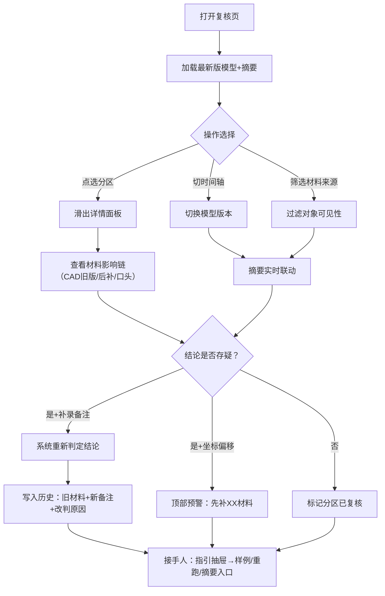

## 1. 产品概述

面向施工早会场景的消防分区图纸复核工具，解决"图纸版本混杂没人敢确认最新版"的核心痛点。Web3D 仅服务复核判断，通过点选对象、切时间轴、材料筛选与页面摘要的联动，让施工经理能快速分清 CAD 旧图层、后补备注、口头备注各自对结论的影响，并在补录后追溯历史改判。

- 目标用户：施工经理（阿乔类角色）、接手复核的现场工程师
- 产品价值：把"不敢确认"变成"有据可查"，把版本混乱变成影响链可追溯

## 2. 核心功能

### 2.1 用户角色

| 角色 | 说明 | 核心能力 |
|------|------|----------|
| 复核人（施工经理/现场工程师） | 使用系统完成图纸复核 | 查看3D模型、切时间轴、筛选材料来源、点选分区、查看摘要、追溯历史、补录备注 |
| 接手人 | 中途接手复核工作的工程师 | 查看坐标偏移预警、阅读操作说明、定位样例、重跑复核流程 |

### 2.2 功能模块

1. **主复核页**：Web3D 分区模型画布 + 版本时间轴 + 材料来源筛选 + 实时页面摘要
2. **对象详情面板**：点选分区后，展示该分区关联的所有材料（CAD图层/后补备注/口头备注）与结论影响链
3. **历史追溯面板**：展示补录前后的旧材料、新备注、改判原因，支持时间点回跳
4. **坐标偏移预警条**：检测到模型坐标偏移时置顶提示，明确告知先补哪份材料
5. **接手人指引抽屉**：样例位置、重跑步骤、页面摘要入口的操作说明

### 2.3 页面详情

| 页面名称 | 模块名称 | 功能描述 |
|----------|----------|----------|
| 主复核页 | Web3D 画布 | 展示消防分区模型，支持旋转/缩放/点选，点选后高亮分区并联动其他模块 |
| 主复核页 | 版本时间轴 | 横向排列版本节点，点击切换当前视角下的模型版本，拖动播放版本演化 |
| 主复核页 | 材料来源筛选 | 三档开关：CAD图层旧版 / 后补备注 / 口头备注，可多选组合筛选，联动3D对象可见性与摘要 |
| 主复核页 | 页面摘要卡 | 实时显示：当前版本、已复核分区数、存疑数、结论（通过/待定/驳回）、关键影响材料标签 |
| 主复核页 | 对象详情面板 | 右侧滑出，展示点选分区的所有关联材料，每条标注来源类型、录入时间、是否影响结论，影响链可视化 |
| 主复核页 | 历史追溯面板 | 底部展开，按时间线列出补录事件，每条含：旧材料快照、新备注内容、改判原因、操作人，支持点击跳转到对应版本 |
| 主复核页 | 坐标偏移预警条 | 顶部红色横幅，显示偏移量与优先级，并列出需补充的材料清单（CAD对齐文件/现场测量记录等） |
| 主复核页 | 接手人指引抽屉 | 右侧问号按钮展开，含：样例数据位置、重跑复核步骤、页面摘要查看路径三步说明 |

## 3. 核心流程

复核人打开页面 → 默认加载最新版模型与摘要 → 拖动时间轴或筛选来源 → 观察摘要联动变化 → 点选可疑分区查看材料影响链 → 发现坐标偏移则按预警提示补材 → 补录备注后系统重新判定 → 结论变更自动写入历史 → 接手人打开指引抽屉按步骤重跑

## 4. 用户界面设计

### 4.1 设计风格

- **主色调**：工程蓝 `#1E40AF`（分区边界、按钮） + 警示橙 `#EA580C`（存疑、预警） + 确认绿 `#15803D`（已复核） + 深灰底 `#0F172A`（画布背景）
- **配色逻辑**：四种颜色对应四种复核状态，避免渐变色，纯工程配色
- **按钮风格**：直角硬边、2px 描边、点击下沉 1px，工业控制面板质感
- **字体**：标题用 `JetBrains Mono` 等宽字母数字感（版本号、坐标），正文用 `Noto Sans SC` 中文清晰
- **布局**：左侧竖排筛选+时间轴占 220px，中央 Web3D 画布自适应，右侧叠层详情面板可滑出，顶部固定预警条+摘要卡
- **图标风格**：线性细描边 SVG（1.5px），工程图符号化，不使用彩色 emoji

### 4.2 页面设计总览

| 页面名称 | 模块名称 | UI 元素 |
|----------|----------|---------|
| 主复核页 | Web3D 画布 | 深灰背景 + 蓝色分区线框 + 点选后橙色高亮描边 + 悬浮分区编号标签 |
| 主复核页 | 版本时间轴 | 左侧竖排圆形节点，连线分隔，当前节点橙色实心+脉冲环，悬停显示版本备注 |
| 主复核页 | 材料来源筛选 | 三行开关行，每行左侧图标+名称，右侧拨动开关，选中行背景微亮 |
| 主复核页 | 页面摘要卡 | 右上角固定，四格数字面板（版本/已复核/存疑/结论） + 标签云（影响材料） |
| 主复核页 | 对象详情面板 | 右侧 360px 滑出，卡片式材料列表，每条左侧来源色块，右侧"影响结论"徽标 |
| 主复核页 | 历史追溯面板 | 底部 240px 上滑，时间线竖排，每条事件左右分栏（旧→新），中间箭头 |
| 主复核页 | 坐标偏移预警条 | 顶部红色实心条，左侧⚠图标，中间文字+偏移数值，右侧"查看补材清单"按钮 |
| 主复核页 | 接手人指引抽屉 | 右下角悬浮？按钮，点击右侧全屏半透明遮罩+白色面板，分三步骤卡片 |

### 4.3 响应性

- Desktop-first 设计，画布最小宽度 800px
- 时间轴在 <1200px 时改为底部横向排列
- 详情面板在 <960px 时改为底部全屏上滑
- 触控设备：3D 画布双指缩放、单指旋转、单击选中

### 4.4 3D 场景指引

- **环境**：纯深灰 `#0F172A` 背景，无 HDRI，避免干扰分区边界
- **光照**：半球光+方向光组合，分区材质为 30% 透明度蓝色自发光线框，不投射阴影
- **相机**：正交相机初始俯视角 45°，支持 OrbitControls，禁用平移只保留旋转缩放
- **构图**：模型居中，四周留 20% 空白，分区编号贴顶悬浮
- **交互**：点选分区后该分区线框加粗变橙 + 轻微上浮 + 联动其他模块高亮
- **后处理**：仅启用 FXAA，不加 Bloom（避免工程图失真）
- **资源**：内置程序化生成的示例分区模型（~20 个分区盒子），无外部资源依赖
