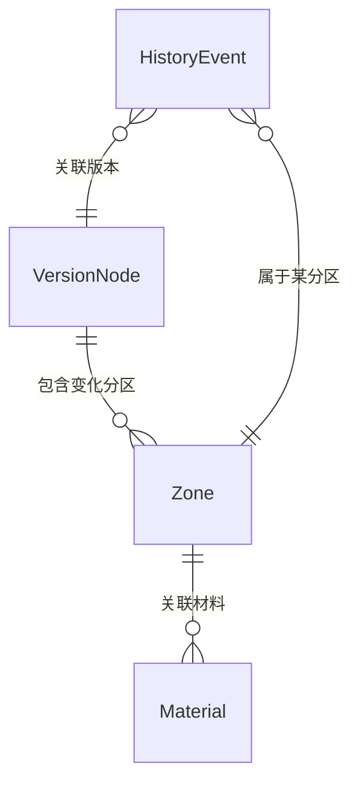

## 1. 架构设计


整体为纯前端单页应用，无后端依赖。Zustand 作为唯一状态源，通过事件总线实现「点选对象→切时间轴→筛选→摘要」的四方联动。3D 场景通过 @react-three/fiber 与 React 组件树打通。

## 2. 技术说明

- **前端框架**：React@18 + TypeScript@5
- **构建工具**：Vite@5
- **样式方案**：Tailwind CSS@3（原子化 + CSS 变量统一工程配色）
- **3D 引擎**：three@0.160 + @react-three/fiber@8 + @react-three/drei@9（OrbitControls、正交相机、线框材质工具）
- **状态管理**：Zustand@4（轻量、无 Provider 嵌套、易做跨组件联动）
- **图标方案**：@phosphor-icons/react（线性细描边，符合工程图风格）
- **字体方案**：Google Fonts 引入 JetBrains Mono + Noto Sans SC
- **后端**：无（纯前端 Mock，数据内置于 TypeScript 文件）
- **数据库**：无（内存中 Zustand Store 初始化时加载 Mock）

## 3. 路由定义

| 路由 | 用途 |
|------|------|
| `/` | 主复核页（唯一页面，所有模块在此组合） |

单页应用，使用 HashRouter 预留扩展但当前仅有单路由。

## 4. API 定义（无后端，使用本地 TS 类型约束）

核心类型定义如下，所有 Mock 数据严格遵循：

```typescript
// ========== 材料来源类型 ==========
type MaterialSource = 'cad_old' | 'note_added' | 'note_oral';

// ========== 单条材料（影响结论的证据）==========
interface Material {
  id: string;
  source: MaterialSource;
  title: string;           // 如「2024-05 B1层CAD图层」
  content: string;         // 详细描述
  recordedAt: string;      // ISO 时间
  operator: string;        // 录入人
  affectsConclusion: boolean; // 是否影响当前结论
}

// ========== 消防分区 ==========
interface Zone {
  id: string;              // 分区编号如 F1-A03
  name: string;            // 分区名称
  position: [number, number, number]; // 3D 位置
  size: [number, number, number];     // 3D 尺寸
  status: 'passed' | 'pending' | 'rejected';
  materials: Material[];   // 关联材料列表
  versionTags: string[];   // 出现在哪些版本
}

// ========== 图纸版本节点 ==========
interface VersionNode {
  tag: string;             // 如 v2024.05.12
  label: string;           // 如「设计院正式版」
  releasedAt: string;
  note: string;            // 版本备注
  zonesWithDelta: string[]; // 相对上一版本有变化的分区ID
  coordinateOffset: number; // 坐标偏移量 mm，0 表示无偏移
  missingMaterials: string[]; // 需要补的材料清单
}

// ========== 历史改判记录 ==========
interface HistoryEvent {
  id: string;
  at: string;
  zoneId: string;
  oldConclusion: 'passed' | 'pending' | 'rejected';
  newConclusion: 'passed' | 'pending' | 'rejected';
  oldMaterialsSnapshot: Material[];
  newNote: string;
  reason: string;          // 改判原因
  operator: string;
  relatedVersionTag: string;
}

// ========== 页面摘要 ==========
interface PageSummary {
  currentVersion: string;
  totalZones: number;
  reviewedCount: number;
  pendingCount: number;
  rejectedCount: number;
  overallConclusion: '通过' | '待定' | '驳回';
  keyInfluencingMaterials: { source: MaterialSource; count: number }[];
  hasCoordinateOffset: boolean;
  offsetMm: number;
}
```

## 5. 服务端架构图（无后端，省略）

本项目为纯前端工程，无服务端。

## 6. 数据模型（前端 Mock 数据结构）

### 6.1 数据模型关系



### 6.2 初始化数据规模

- **VersionNode**：5 个版本节点（含 1 个带坐标偏移）
- **Zone**：20 个消防分区盒子（按楼层+字母编号）
- **Material**：每分区 2-4 条，三类来源混合，其中 40% 标注 affectsConclusion=true
- **HistoryEvent**：8 条典型改判记录（含 CAD 旧版混入、后补备注、口头备注三类场景各 2-3 条）
- **坐标偏移案例**：v2024.04.20 版本 offset=35mm，missingMaterials 列出 3 项

### 6.3 联动计算规则（Zustand Store 内纯函数）

1. **切时间轴 → 联动**：根据选中版本过滤出该版本生效的 Zone，同步过滤材料（仅展示 versionTags 含当前版本的材料），重新计算 PageSummary
2. **筛选来源 → 联动**：按勾选的 MaterialSource 过滤 Zone.materials，若分区过滤后无影响结论的材料，则 summary 中该分区状态降级为「未复核」
3. **点选对象 → 联动**：selectedZoneId 写入 Store，详情面板滑出，3D 场景高亮，历史面板仅显示该分区事件，摘要卡标注该分区状态
4. **补录备注 → 联动**：新增 Material(source='note_added') → 触发重算结论 → 生成 HistoryEvent → 推入历史数组 → 摘要刷新

### 6.4 目录结构

```
src/
├── App.tsx                  # 根组件，组装全部模块
├── main.tsx
├── index.css                # Tailwind + CSS 变量（工程配色）
├── store/
│   └── reviewStore.ts       # Zustand Store：状态+联动计算纯函数
├── data/
│   └── mockData.ts          # Mock 数据：版本/分区/材料/历史
├── types/
│   └── index.ts             # 类型定义
├── components/
│   ├── Scene3D.tsx          # Three.js 场景：分区盒子+点选
│   ├── VersionTimeline.tsx  # 左侧版本时间轴
│   ├── SourceFilter.tsx     # 材料来源筛选
│   ├── SummaryCard.tsx      # 页面摘要卡
│   ├── ZoneDetailPanel.tsx  # 右侧分区详情+材料影响链
│   ├── HistoryPanel.tsx     # 底部历史追溯
│   ├── OffsetWarningBar.tsx # 顶部坐标偏移预警
│   ├── GuideDrawer.tsx      # 接手人指引抽屉
│   └── ui/                  # 基础UI：Toggle/TimelineNode/Tag 等
└── utils/
    └── conclusion.ts        # 结论计算工具函数
```
