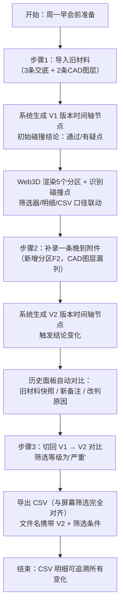

## 1. 产品概述

面向建筑设计院消防预审岗位的专业 Web3D 工具，聚焦"消防分区碰撞预审"单一业务场景。解决建筑师小赵长期困扰的 CAD 图层不齐整、交底清单漏旧意见、碰撞点重复靠人眼扫、结论变化无历史追溯、CSV 导出与屏幕口径不一致等痛点。

产品仅服务于消防分区碰撞判断的业务闭环，不做通用的 3D 模型浏览或 CAD 替换。

## 2. 核心功能

### 2.1 用户角色

| 角色 | 注册方式 | 核心权限 |
|------|----------|----------|
| 建筑师/预审员 | 无需注册（本地工具） | 导入材料、补录附件、切换时间轴、点选对象、筛选、导出 CSV、查看历史、修改结论并留痕 |

### 2.2 功能模块

1. **预审工作台（主页面）**：Web3D 场景 + 左侧筛选/时间轴 + 右侧碰撞明细/历史面板 + 底部 CSV 操作栏
2. **材料导入抽屉**：旧材料批量导入、晚到附件补录、保留原始字段（`raw_` 前缀不自动清洗）
3. **时间轴控件**：按版本节点切换（导入 V1 → 补录 V2 → 未来 Vn），切换时同步刷新 3D、筛选、明细
4. **筛选器面板**：分区、碰撞等级、来源类型、关键词搜索，与 3D 高亮和 CSV 口径绑定
5. **碰撞点去重展示**：按位置 hash 归并，展开查看影响范围和 source_rows 所有来源行
6. **结论历史面板**：结论变化时对比旧材料快照 / 新备注 / 改判原因，时间戳和操作人留痕
7. **CSV 导出栏**：直接序列化当前筛选结果，不另起计算口径；导出文件名携带时间轴版本号

### 2.3 页面详情

| 页面名称 | 模块名称 | 功能描述 |
|----------|----------|----------|
| 预审工作台 | Web3D 场景区 | 半透明消防分区盒体（BoxGeometry）、红色碰撞点标记（Sphere + Glow）、标签层；点击分区高亮 + 右侧筛选联动；点击碰撞点展开来源行 |
| 预审工作台 | 左侧操作栏 | 版本时间轴（可点击回退）、筛选器（分区多选 / 等级单选 / 来源类型 / 关键词）、原始字段保留提示徽章 |
| 预审工作台 | 右侧面板（Tab 切换） | Tab1 碰撞明细列表（含去重徽章 + 影响范围）；Tab2 历史快照（旧材料 / 新备注 / 改判原因对比）；Tab3 补录附件表单 |
| 预审工作台 | 底部操作栏 | 导入旧材料按钮、补录附件按钮、CSV 导出（显示当前筛选命中数）、当前版本号徽标、结论状态横幅 |
| 材料导入抽屉 | 导入预览表 | 显示 `raw_` 原始列名与脏数据原样，旁边提示"将保留原始来源不做自动清洗"；支持取消导入 |

## 3. 核心流程

周一早会真实节奏：建筑师小赵在周一早会前 10 分钟完成以下三步操作

## 4. 用户界面设计

### 4.1 设计风格

**审美方向：建筑蓝图工业风（Blueprint Industrial）**
- **主色**：蓝图靛蓝 `#0a2463`、工程纸米白 `#f5f0e8`
- **强调色**：消防警报红 `#d62828`（碰撞/严重）、施工警戒黄 `#f77f00`（警告）、合规绿 `#40916c`（通过）
- **点缀色**：钢灰 `#495057`、墨黑 `#212529`
- **按钮风格**：直角 / 轻微内凹阴影 / 蓝图网格纹理 hover 态；危险操作用红底白字加斜线边框
- **字体**：标题用工程制图字体 "JetBrains Mono"（等宽、带刻度感）；正文用 "IBM Plex Sans SC"
- **布局风格**：三栏工作台（左控制 / 中 3D / 右明细）+ 固定底部操作栏；背景使用浅蓝图栅格线底纹
- **图标风格**：Lucide 线性图标 + 轻微像素化处理，模拟 CAD 十字光标感受
- **动效**：碰撞点脉冲发光；时间轴节点步进动画；结论变化时横幅滑入带工程签字章水印

### 4.2 页面设计概述

| 页面名称 | 模块名称 | UI 元素 |
|----------|----------|---------|
| 预审工作台 | Web3D 场景区 | 靛蓝半透明盒体分区（带标签浮层）、红色脉冲球形碰撞点、右上角指南针/重置相机、底部缩放轴 |
| 预审工作台 | 左侧操作栏 | 顶部版本时间轴（节点圆点 + 连接线 + step 步进动效）、分区筛选 chip 组、等级/来源下拉、关键词搜索框、"raw 原始保留" 徽章 |
| 预审工作台 | 右侧面板 | Tab 切换（碰撞/历史/补录）、碰撞卡片（影响范围 + source_rows 展开）、历史对比（双栏 diff 样式 + 改判原因黄底标注） |
| 预审工作台 | 底部操作栏 | 工程纸米白底 + 钢灰分割线、左中右三段式（导入/补录按钮居左、筛选计数居中、CSV导出 + 版本徽标居右）、结论状态横幅（顶/底双杠色带） |
| 导入抽屉 | 导入预览 | 蓝图底色 + 等宽字体表格、`raw_` 列用灰色斜体、脏数据单元格加红色斜线角标、确认/取消按钮 |

### 4.3 响应式

桌面优先（≥1440px），支持 1024px 折叠右侧面板为抽屉；移动端不支持 Web3D 操作，仅提示"请在桌面端使用"。

### 4.4 3D 场景指导

- **环境/HDRI**：不使用 HDRI，改用纯蓝图渐变背景（上深下浅）+ 网格地板（GridHelper），模拟 CAD 模型空间
- **灯光**：AmbientLight + 两盏 DirectionalLight（冷白+暖白），让分区盒体边缘清晰锐利
- **相机**：PerspectiveCamera，默认 45° 俯视等轴测角度；支持 OrbitControls；禁用 pan，限制 zoom 范围
- **构图与焦点**：场景中心对齐分区集群；碰撞点放大 1.2 倍并始终在 z-index 上层
- **交互与动画**：碰撞点 `onClick` 高亮（scale + emissive）+ 右侧跳转；分区 `onHover` 描边加粗；时间轴切换时分区淡入淡出（1s opacity transition）
- **后处理**：Bloom（给碰撞点光晕）+ FXAA
- **资产来源与性能**：纯程序化几何体（无外部模型）；分区 ≤ 10 个，碰撞点 ≤ 50 个，保持 60fps
