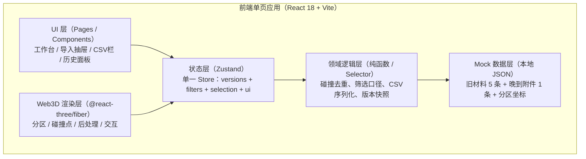
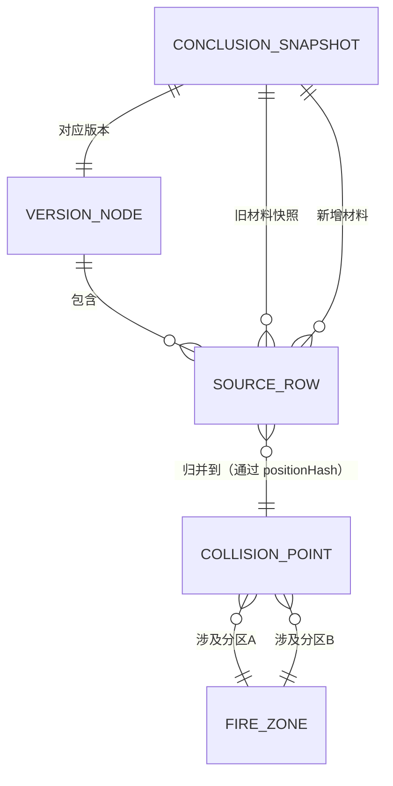

## 1. 架构设计



纯前端架构，无后端；所有数据与状态在前端完成；CSV 文件通过 Blob 在浏览器端生成下载。

## 2. 技术描述

- **前端框架**：React@18 + TypeScript@5 + Vite@5
- **初始化工具**：vite-init（模板 `react-ts`，含 react-router-dom / tailwindcss@3 / zustand）
- **3D 技术栈**：three@^0.160 + @react-three/fiber@^8.15 + @react-three/drei@^9.96 + @react-three/postprocessing@^2.16
- **状态管理**：zustand@^4.4（含 devtools / persist 中间件，persist 仅存版本历史快照）
- **UI 图标**：lucide-react@^0.344
- **CSV 导出**：浏览器原生 Blob + URL.createObjectURL（不引第三方库）
- **路由**：react-router-dom@^6（单页，当前仅 `/` 工作台路由）
- **样式**：TailwindCSS@3 + 自定义工程蓝图主题（tailwind.config 扩展 colors / fontFamily / backgroundImage）
- **后端**：无
- **数据库**：无，Mock 数据以 TypeScript 常量 + 对象字面量嵌入 `src/data/`

## 3. 路由定义

| 路由 | 用途 |
|------|------|
| `/` | 消防分区碰撞预审工作台（唯一页面） |

## 4. API 定义

无后端 API，以下为内部状态操作的 Action 契约：

```typescript
// ---------- 核心类型定义 ----------
export type CollisionLevel = 'critical' | 'warning' | 'info';
export type SourceType = 'cad_layer' | 'disclosure_doc' | 'attachment';
export type Conclusion = 'pass' | 'doubt' | 'fail';

// 原始来源行（保留 raw_ 字段，不做自动清洗）
export interface SourceRow {
  id: string;
  versionId: string;
  sourceType: SourceType;
  raw_source_name: string;        // 原始来源名（可能含脏数据）
  raw_fire_zone_a: string;        // 原始分区A（可能漏写/拼写错）
  raw_fire_zone_b: string;        // 原始分区B
  raw_position: string;           // 原始位置描述（非结构化）
  raw_level: string;              // 原始等级（可能是中文"严重"/英文/空）
  raw_note?: string;              // 原始备注
  importedAt: number;
  normalized?: {                  // 仅做展示时的"人工对齐参考"，不覆盖 raw_
    zoneA?: string;
    zoneB?: string;
    level?: CollisionLevel;
    positionHash?: string;
  };
}

// 去重后的碰撞点（归并 source_rows）
export interface CollisionPoint {
  id: string;
  positionHash: string;
  zoneA: string;
  zoneB: string;
  level: CollisionLevel;
  position3D: [number, number, number];
  impactZone: string;             // 影响范围描述
  sourceRows: string[];           // SourceRow.id[]，按版本号倒序
  firstSeenVersionId: string;
  lastUpdatedVersionId: string;
  duplicateCount: number;         // 原始重复条数（≥1）
}

// 分区（用于 3D 渲染）
export interface FireZone {
  id: string;
  name: string;
  color: string;
  position: [number, number, number];
  size: [number, number, number];
  floor: number;
}

// 结论变化快照（历史留痕）
export interface ConclusionSnapshot {
  id: string;
  versionId: string;
  conclusion: Conclusion;
  previousConclusion?: Conclusion;
  operatorName: string;
  reason: string;                 // 改判原因
  note: string;                   // 新备注
  previousMaterialsSnapshot: SourceRow[]; // 旧材料完整快照
  newMaterialsAdded: SourceRow[];         // 本次新增
  createdAt: number;
}

// 版本节点（时间轴）
export interface VersionNode {
  id: string;
  name: string;                   // V1 初始导入 / V2 补录晚到附件 / ...
  description: string;
  createdAt: number;
  sourceRowIds: string[];
  conclusion: Conclusion;
}
```

## 5. 服务端架构图

无后端，跳过。

## 6. 数据模型

### 6.1 数据模型 ER 图



### 6.2 初始 Mock 数据（满足周一早会三步测试场景）

**V1 初始旧材料（5 条）**：
1. `cad_layer` CAD-F1 层 - 分区 F1 × F2 走廊处碰撞（位置 3F-01），严重
2. `cad_layer` CAD-F3 层 - 分区 F3 × F4 设备间碰撞（位置 B1-07），警告
3. `disclosure_doc` 交底 2026-05-28 - 分区 F1 × F2 走廊处碰撞（同 1，构成重复），严重
4. `disclosure_doc` 交底 2026-06-01 - 分区 F2 × F3 楼梯碰撞（位置 2F-03），警告
5. `cad_layer` CAD-F5 层（数据脏：`raw_fire_zone_b = "  F5"` 有空格） - F4 × F5 外墙碰撞（位置 1F-11），提示

**V2 晚到附件（第 6 条）**：
6. `attachment` 晚到附件 2026-06-09 - 分区 F2 × 防火卷帘门（漏列分区，`raw_fire_zone_b = ""` 空值） - 卷帘槽侵入 F2（位置 3F-01 与 V1#1 相同位置 → 构成重复来源），结论由"有疑点"改判为"不通过"

**分区坐标（FireZone × 5）**：
- F1 / F2 / F3 / F4 / F5，按 3 层分布，相邻分区刻意留出 3 处边界重叠用于碰撞展示
