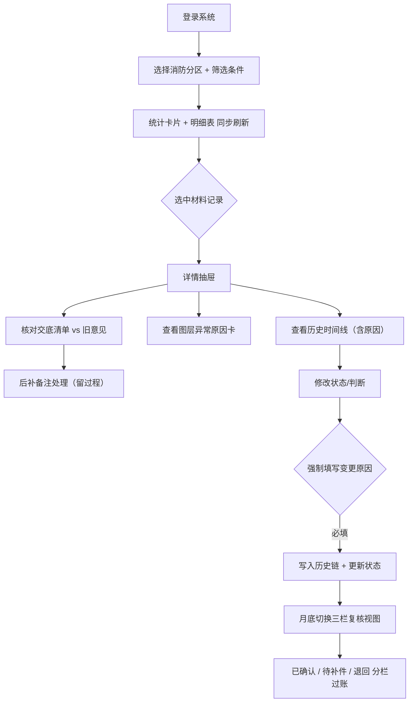

## 1. 产品概述

面向BIM协调员的消防分区材料送审追踪系统，解决交底清单遗漏旧意见、图层命名混乱掩盖异常、状态流转无迹可查的痛点。统一数据源驱动筛选、统计、明细表与历史时间线，后补备注处理过程全程留痕，异常原因显性暴露，月底复核一目了然。

## 2. 核心功能

### 2.1 用户角色

| 角色 | 注册方式 | 核心权限 |
|------|---------|---------|
| BIM协调员（小岑） | 本地系统登录 | 筛选查看、状态流转、后补备注处理、异常标记、修改判断并留原因、月底复核导出 |

### 2.2 功能模块

1. **主工作台**：多维度筛选面板、状态统计卡片、材料明细表
2. **详情抽屉**：交底清单与旧意见比对、后补备注处理链路、图层异常说明、完整历史时间线
3. **月底复核视图**：按已确认/待补件/退回三栏分列，快速过账

### 2.3 页面详情

| 页面名称 | 模块名称 | 功能描述 |
|---------|---------|---------|
| 主工作台 | 筛选面板 | 消防分区、材料类型、状态、图层异常标记、日期范围；所有筛选条件与统计/明细表/时间线共享同一结果集 |
| 主工作台 | 统计卡片 | 总数、已确认、待补件、退回、异常图层数；点击可联动筛选 |
| 主工作台 | 材料明细表 | 序号、材料编号/名称、消防分区、送审日期、状态标签、图层异常角标、操作列（查看详情/修改状态） |
| 详情抽屉 | 基本信息 | 完整材料信息，交底清单 vs 旧意见对比，高亮遗漏项 |
| 详情抽屉 | 后补备注处理区 | 备注列表 + 新增面板，每条备注含：内容、处理人、处理时间、处理结果、处理过程说明 |
| 详情抽屉 | 图层异常说明卡 | 当图层命名混乱时红色卡片展示：异常原因、建议修正方式、是否已复核 |
| 详情抽屉 | 历史时间线 | 倒序展示所有变更：时间、操作人、字段、旧值→新值、修改原因；非仅最终值 |
| 月底复核视图 | 三栏分栏 | 左：已确认；中：待补件；右：退回；每栏卡片式列表，支持拖拽切换状态并强制填写原因 |

## 3. 核心流程

小岑每日处理材料送审：打开系统→筛选目标消防分区→查看统计卡片关注异常数→点击明细表进入详情→核对交底清单是否遗漏旧意见→处理后补备注并记录过程→若图层命名异常则查看异常卡说明→修改状态时填写变更原因→月底切换至三栏复核视图完成过账。

## 4. 用户界面设计

### 4.1 设计风格

- **主色调**：消防安全警示红 `#D7263D` + 工业深蓝 `#1B2845`，中性色用灰 `#F4F4F6` 与深灰 `#333`
- **强调色**：已确认绿 `#2E933C`、待补件琥珀 `#E8A317`、退回深红 `#A4161A`、异常紫 `#7B2CBF`
- **按钮风格**：直角偏硬朗，2px 实色描边，hover 轻微下沉阴影；危险操作（退回）用红底白字
- **字体**：中文思源宋体（标题，专业厚重感）+ 思源黑体（正文，表格数字等宽对齐）；英文数字用 JetBrains Mono 等宽字体
- **布局风格**：顶部工具栏 + 下方双栏（左列表70% / 右详情30%，抽屉式展开），重数据密度，表格斑马纹 + 行悬浮高亮
- **视觉标识**：状态用彩色实心圆 + 文字；异常用红色斜角标签（类似消防封条样式）；历史时间线用左侧竖线 + 节点圆点

### 4.2 页面设计概述

| 页面名称 | 模块名称 | UI元素 |
|---------|---------|--------|
| 主工作台 | 筛选面板 | 横向排列下拉/日期/搜索框，右端「重置」「导出」按钮，背景浅灰带微妙噪点纹理 |
| 主工作台 | 统计卡片 | 5张卡片横向排列，左侧大号数字（等宽字体）+ 右侧图标和状态色块，点击有按压动效 |
| 主工作台 | 明细表 | 表头深蓝底白字，斑马纹行，状态标签圆角胶囊，异常行加左侧3px红竖条，操作列链接色下划线 |
| 详情抽屉 | 头部 | 材料编号大字 + 状态胶囊 + 关闭按钮，背景深蓝渐变条 |
| 详情抽屉 | 旧意见比对 | 左右双栏：左「交底清单」右「旧意见」，交集灰底，遗漏项红底高亮 + 警示三角图标 |
| 详情抽屉 | 后补备注区 | 卡片堆叠，每条卡片顶部处理时间/人，中部内容+处理过程说明，底部处理结果标签 |
| 详情抽屉 | 异常说明卡 | 红描边红底纹，左侧大号 ⚠️ 图标，标题「图层命名异常」，正文分点列原因与建议 |
| 详情抽屉 | 历史时间线 | 左侧竖实线，每个节点圆圈填充对应状态色，右侧：时间（小字灰）+ 操作人 + 变更内容（旧值→新值删除线/下划线）+ 原因标签 |
| 月底复核 | 三栏视图 | 三列等宽，列头带状态色底纹和计数，卡片可拖拽，拖拽目标列高亮，松手弹模态框填原因 |

### 4.3 响应性

- **桌面优先**：1440px 基准设计，双栏布局
- **中等屏（1024-1440）**：统计卡片换行，详情抽屉宽度自适应
- **小屏（<1024）**：转为单栏堆叠，详情抽屉改全屏模态，触摸目标≥44px

