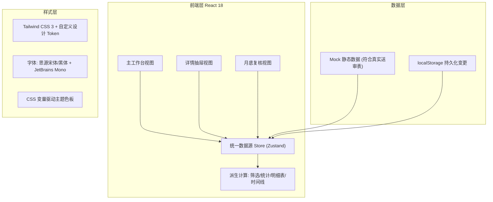

## 1. 架构设计



## 2. 技术描述

- **前端框架**: React 18 (函数组件 + Hooks)
- **构建工具**: Vite 5
- **状态管理**: Zustand（单一 store 派生筛选/统计/明细表/时间线，确保同一套结果）
- **样式方案**: Tailwind CSS 3 + 自定义主题扩展（消防安全红+工业深蓝）
- **拖拽交互**: @dnd-kit/core（月底复核三栏拖拽流转）
- **字体**: 思源宋体/黑体（Google Fonts CDN）+ JetBrains Mono
- **图标**: Lucide React
- **数据层**: TypeScript 类型 + Mock 数据 + localStorage 持久化（无需后端）
- **路由**: React Router DOM 6（/workbench, /review）

## 3. 路由定义

| 路由 | 用途 |
|------|------|
| `/` | 重定向至 `/workbench` |
| `/workbench` | 主工作台：筛选面板 + 统计卡片 + 材料明细表 + 详情抽屉 |
| `/review` | 月底复核：已确认/待补件/退回 三栏视图 |

## 4. 数据模型

### 4.1 核心类型定义

```typescript
type MaterialStatus = 'CONFIRMED' | 'PENDING' | 'REJECTED';

interface OpinionItem {
  id: string;
  content: string;
  isInDisclosure: boolean;   // 是否在交底清单中
  isOld: boolean;            // 是否为旧意见
  isMissed: boolean;         // 旧意见但未出现在交底清单中（遗漏）
}

interface SupplementaryNote {
  id: string;
  content: string;           // 后补备注内容
  handler: string;           // 处理人
  handledAt: string;         // 处理时间 ISO
  process: string;           // 处理过程说明
  result: 'RESOLVED' | 'IN_PROGRESS' | 'ESCALATED';
  resultText: string;        // 处理结果描述
}

interface LayerAbnormality {
  hasAbnormality: boolean;
  reason: string;            // 异常原因（图层命名混乱等）
  suggestion: string;        // 建议修正方式
  reviewed: boolean;         // 是否已复核
  affectedLayers: string[];  // 受影响图层列表
}

interface HistoryEntry {
  id: string;
  timestamp: string;
  operator: string;
  field: string;             // 修改的字段：status / note / opinion 等
  oldValue: string;
  newValue: string;
  reason: string;            // 修改原因（必填）
}

interface MaterialRecord {
  id: string;
  code: string;              // 材料编号
  name: string;              // 材料名称
  type: string;              // 材料类型
  fireZone: string;          // 消防分区
  submissionDate: string;    // 送审日期
  layerName: string;         // 图层名称
  status: MaterialStatus;
  opinions: OpinionItem[];   // 交底清单 + 旧意见
  supplementaryNotes: SupplementaryNote[];
  layerAbnormality: LayerAbnormality;
  history: HistoryEntry[];
  submitter: string;         // 送审人
  reviewer: string;          // 当前审核人
}
```

### 4.2 Store 设计（Zustand）

```typescript
interface MaterialStore {
  // 源数据
  records: MaterialRecord[];

  // 筛选条件（驱动所有派生）
  filters: {
    fireZone: string | null;
    type: string | null;
    status: MaterialStatus | null;
    hasAbnormality: boolean | null;
    dateFrom: string | null;
    dateTo: string | null;
    keyword: string;
  };

  // 派生（getter，保证同一套结果）
  filteredRecords: MaterialRecord[];
  stats: {
    total: number;
    confirmed: number;
    pending: number;
    rejected: number;
    abnormal: number;
  };

  // 选中记录
  selectedId: string | null;
  selectedRecord: MaterialRecord | null;

  // Actions
  setFilters: (patch: Partial<MaterialStore['filters']>) => void;
  resetFilters: () => void;
  selectRecord: (id: string | null) => void;
  updateStatus: (id: string, status: MaterialStatus, reason: string) => void;
  addSupplementaryNote: (id: string, note: Omit<SupplementaryNote, 'id'>) => void;
  markAbnormalityReviewed: (id: string) => void;
}
```

## 5. 状态派生一致性保障

所有视图（筛选、统计卡片、明细表、时间线）均从 `filteredRecords` 派生：
- 统计卡片：`filteredRecords` 上做 reduce 聚合
- 明细表：直接渲染 `filteredRecords`
- 详情抽屉的历史时间线：`selectedRecord.history`（已包含在源数据中）
- 月底复核三栏：`filteredRecords` 按 `status` 分三组

**绝不**在各组件内独立计算，确保结果一致。

## 6. 变更留痕机制

任何状态/判断修改：
1. 触发 action 前弹出模态框强制填写 `reason`
2. reason 为空则不允许提交
3. 生成 `HistoryEntry` 并 `unshift` 至 `record.history`（倒序）
4. 持久化到 localStorage

后补备注处理：
- 每条 `SupplementaryNote` 自带 `process` 字段，强制记录处理过程
- 备注与历史时间线独立存储但在同一抽屉内上下排列展示

