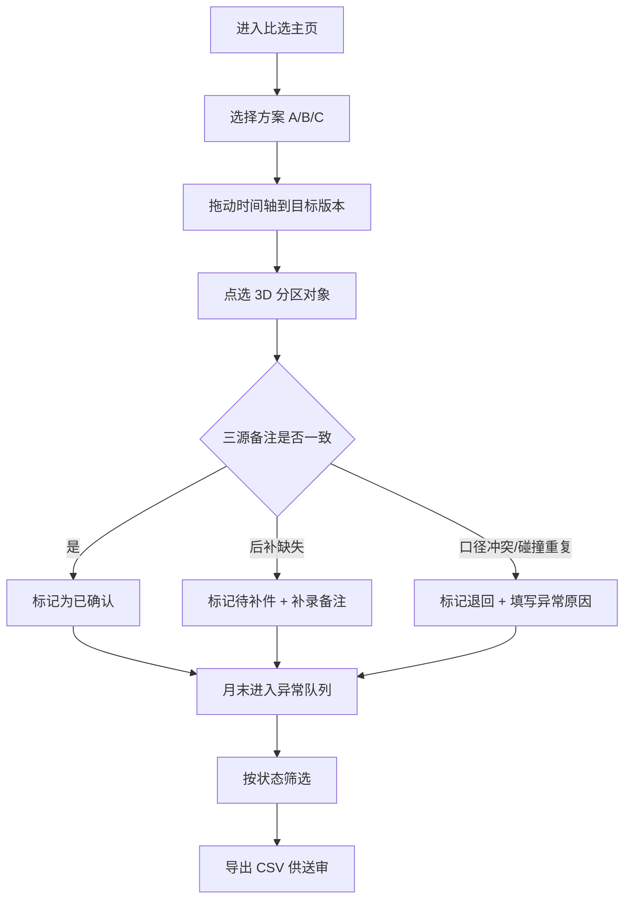

## 1. 产品概述

面向建筑设计院消防报审阶段的 Web3D 比选工具，帮助建筑师小赵在月底材料送审前，快速在 BIM 模型上比对不同消防分区方案、追踪备注口径变更、识别碰撞点重复等脏数据、区分已确认/待补件/退回状态，避免送审材料与施工口径对不上。

- 解决问题：消防分区方案比选依赖手工核对 BIM 备注，月底复核容易遗漏口径变更和脏数据，导致送审返工
- 目标用户：建筑设计院建筑师（以小赵为代表）、消防专业负责人
- 核心价值：将 Web3D 模型点选、时间轴、筛选、异常队列四者联动，方案比选全程可视化、可追溯、可导出

---

## 2. 核心功能

### 2.1 用户角色

| 角色 | 登录方式 | 核心权限 |
|------|----------|----------|
| 建筑师（小赵） | 项目工号登录 | 记录方案、补录备注、标记异常、导出异常队列 |
| 消防负责人 | 工号+权限标识 | 复核状态、确认方案、查看全量异常 |

### 2.2 功能模块

1. **Web3D 比选主页**：3D 建筑模型渲染区、分区方案切换、对象点选高亮、时间轴回溯
2. **多源备注层**：BIM 模型原始备注、后补备注、临时口头说明三类入口，口径变更自动标红
3. **筛选与状态面板**：按分区、按方案、按状态（已确认/待补件/退回）筛选，计数实时更新
4. **异常队列**：碰撞点重复、口径不一致、备注缺失三类脏数据明细列表，逐个定位至 3D 对象
5. **导出中心**：异常队列 CSV/Excel 导出，字段含状态、备注、文件结论三者互相对应
6. **演示数据集**：预留 3-4 条典型小数据，支持负责人走通"顺利记录→补录→异常"全流程

### 2.3 页面详情

| 页面名称 | 模块名称 | 功能描述 |
|----------|----------|----------|
| Web3D 比选主页 | 3D 视图区 | Three.js 渲染简化楼层/分区体块，鼠标悬停高亮，点击选中并联动右侧面板 |
| Web3D 比选主页 | 方案切换栏 | 方案 A/B/C 切换按钮，切换时 3D 分区颜色与备注面板同步刷新 |
| Web3D 比选主页 | 时间轴滑块 | 可拖动按日期回溯方案版本，节点处显示备注修改气泡 |
| 多源备注面板 | 备注三栏 | BIM 原备注 / 后补备注 / 口头说明三栏并列，不同口径文字下划虚线标红 |
| 筛选与状态面板 | 筛选器 | 分区编号下拉、方案 Tab、状态三态（已确认/待补件/退回） |
| 筛选与状态面板 | 状态计数器 | 三态计数卡片，点击跳转到异常队列对应过滤 |
| 异常队列页 | 脏数据明细 | 行内展示碰撞点重复、口径差异、缺失备注，带"定位 3D"按钮 |
| 导出中心 | 导出配置 | 勾选导出范围，预览表头（状态/备注/文件结论三列必须对齐），一键下载 CSV |
| 演示引导 | 新手引导 | 三条固定小数据，引导依次完成记录、补录、标记异常三步 |

---

## 3. 核心流程

**主流程（建筑师小赵日常）**：
进入主页 → 选择方案 A → 时间轴切到最新版本 → 点选 3D 分区对象 → 右侧查看三源备注是否口径一致 → 若一致点"已确认"；若缺后补备注点"待补件"并补录；若发现碰撞点重复或口径前后矛盾点"退回"并填异常原因 → 月末切到异常队列 → 按状态筛选 → 导出 CSV 作为送审附件。

---

## 4. 用户界面设计

### 4.1 设计风格

- **主色**：消防警示红 `#E53935` + 图纸蓝灰 `#1E2A3A`，辅以分区彩色标识（青绿 3FA、橙 7C3、紫 9A5）
- **按钮风格**：直角切边、2px 描边的工程制图风，hover 时内侧发光模拟 CAD 选中框
- **字体**：标题用 `Archivo Black` 工业粗体，正文用 `JetBrains Mono` 等宽工程字体，数字列用等宽对齐
- **布局**：左 3D 视图（占 65% 宽度）+ 右侧双面板（上备注三栏 / 下状态与异常），顶部导航为工程图纸标题栏样式
- **图标风格**：线性工程图标（lucide），配合 CAD 风格的十字准星、量尺、印章图标
- **装饰元素**：3D 视图叠加工程网格地面、分区编号半透明铭牌；异常队列行用红边虚线模拟图纸涂改框

### 4.2 页面设计概览

| 页面名称 | 模块名称 | UI 元素 |
|----------|----------|----------|
| Web3D 比选主页 | 3D 视图区 | 深色工程背景 + 网格地面 + 半透明分区体块 + 编号铭牌 + 选中高亮描边 |
| Web3D 比选主页 | 顶部导航栏 | 图纸标题栏样式：项目名/方案号/当前日期/导出按钮 |
| Web3D 比选主页 | 方案切换栏 | 切边 Tab：方案A(青绿)/方案B(橙)/方案C(紫)，选中态 2px 外发光 |
| 多源备注面板 | 三栏对比 | 三列并列卡片，每列带来源标签，口径差异文字红色虚线下划 + 悬浮 diff 气泡 |
| 筛选与状态面板 | 状态三卡 | 已确认(绿)/待补件(黄)/退回(红) 三张大数字卡片 + 点击联动筛选 |
| 异常队列页 | 脏数据表 | 斑马纹行 + 异常类型彩色标签 + "定位3D"实心小按钮 + 复选框 |
| 导出中心 | 导出预览 | 表格预览区 + CSV 下载按钮 + 字段对齐校验提示 |
| 演示引导 | 引导气泡 | 箭头指向 3D 对象/补录按钮/异常按钮的三步引导 |

### 4.3 响应式

- **Desktop-first**：主布局锁定 1920+ 宽度，低于 1440 时右侧面板改为可折叠抽屉
- **触控设备**：3D 视图支持双指缩放旋转，按钮最小触控区 44px
- **打印适配**：导出 CSV 配套可打印的 HTML 报告视图，A4 宽度优化

### 4.4 3D 场景指引

- **环境**：`#1E2A3A` 深色工程背景 + 微弱蓝灰色环境光 + 方向光投射分区阴影
- **灯光**：一盏主方向光模拟太阳光（角度 45°），一盏弱补光消除死黑，一盏点光跟随选中对象
- **相机**：初始 45° 俯角透视，OrbitControls 限制在楼层上方，禁止钻到地下
- **合成与焦点**：楼层体块为主角，分区颜色饱和度区分方案；选中对象使用后处理描边（OutlineEffect）
- **交互动画**：悬停对象微上浮 + 外轮廓发光；切换方案时 500ms 颜色渐变过渡；时间轴拖动播放版本切换淡入淡出
- **后处理**：轻微 Bloom 让选中高亮发光，轻微 Vignette 压暗四角聚焦中心模型
- **性能预算**：单分区体块为 200 面以内 Box/Cylinder 组合，总面数 < 5000，禁用阴影贴图投射即可保持 60fps
