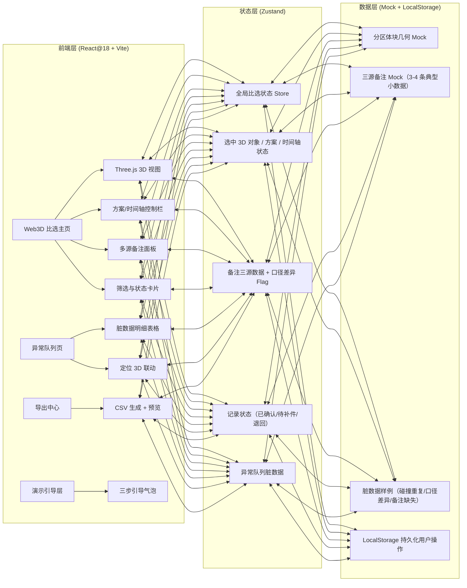
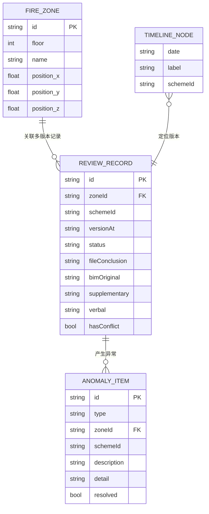

## 1. 架构设计



## 2. 技术说明

- **前端**：React@18 + TypeScript + Vite@5 + TailwindCSS@3 + Zustand@4
- **3D 引擎**：Three@0.160 + @react-three/fiber@8 + @react-three/drei@9 + @react-three/postprocessing@2
- **初始化工具**：vite-init（模板 `react-ts`，纯前端，无需后端）
- **后端**：无（数据全部 Mock + LocalStorage 持久化）
- **数据库**：无；演示数据内置于 TypeScript 常量，用户操作写入 `localStorage`
- **图标**：lucide-react（工程线性图标）
- **导出**：原生 `Blob` + `URL.createObjectURL` 生成 CSV，不引入额外 Excel 库

## 3. 路由定义

| 路由 | 用途 |
|------|------|
| `/` | Web3D 比选主页（默认入口，含 3D 视图 + 备注面板 + 状态卡片） |
| `/anomaly` | 异常队列页（脏数据明细表格 + 定位 3D 快捷入口） |
| `/export` | 导出中心（预览字段对齐 + CSV 下载） |

## 4. API 定义（无后端，类型契约）

```typescript
/** 消防分区对象（3D 体块对应元数据） */
export interface FireZone {
  id: string;            // 分区编号，如 "F1-Z03"
  floor: number;         // 楼层
  name: string;          // 分区名称，如 "东侧商业区"
  position: [number, number, number]; // 3D 位置 [x, y, z]
  size: [number, number, number];     // 体块尺寸 [w, h, d]
  color: Record<SchemeId, string>;    // 每个方案的配色
}

/** 方案 ID */
export type SchemeId = 'A' | 'B' | 'C';

/** 三源备注 */
export interface RemarksTriple {
  bimOriginal: string | null;   // BIM 模型原始备注
  supplementary: string | null; // 后补备注
  verbal: string | null;        // 临时口头说明
  lastModified: string;         // ISO 时间戳
  hasConflict: boolean;         // 三源口径是否不一致
}

/** 单条记录状态 */
export type RecordStatus = 'confirmed' | 'pending' | 'returned';

/** 比选记录 */
export interface ReviewRecord {
  id: string;
  zoneId: string;
  schemeId: SchemeId;
  versionAt: string;          // 时间轴对应 ISO 版本点
  remarks: RemarksTriple;
  status: RecordStatus;
  fileConclusion: string;     // 文件结论，导出时对应
  anomalyIds: string[];       // 关联异常
}

/** 脏数据类型 */
export type AnomalyType = 'collision_duplicate' | 'remark_conflict' | 'remark_missing';

/** 异常队列条目 */
export interface AnomalyItem {
  id: string;
  type: AnomalyType;
  zoneId: string;
  schemeId: SchemeId;
  description: string;
  detail: string;             // 碰撞点重复清单/口径差异明细
  createdAt: string;
  resolved: boolean;
}

/** 时间轴节点 */
export interface TimelineNode {
  date: string;               // YYYY-MM-DD
  label: string;              // "方案初版" / "后补备注" / "口头说明更新"
  schemeId: SchemeId;
}
```

## 5. 服务器架构（无后端，省略）

## 6. 数据模型

### 6.1 数据模型关系



### 6.2 初始化 Mock 数据（3-4 条典型小数据）

| 分区 | 方案 | 三源备注情况 | 状态 | 脏数据 |
|------|------|--------------|------|--------|
| F1-Z01 东侧商业区 | A | BIM/后补/口头 完全一致 | 已确认（顺利） | 无 |
| F1-Z02 核心筒走道 | B | BIM 有、后补缺失、口头有不同说法 | 待补件（补录场景） | remark_missing + remark_conflict |
| F2-Z03 西侧库房 | B | 三源都有但面积口径 1200 vs 1350 | 退回 | remark_conflict + collision_duplicate（碰撞点2次重复） |
| F1-Z04 消防电梯厅 | C | 三源一致 | 已确认 | 无 |
