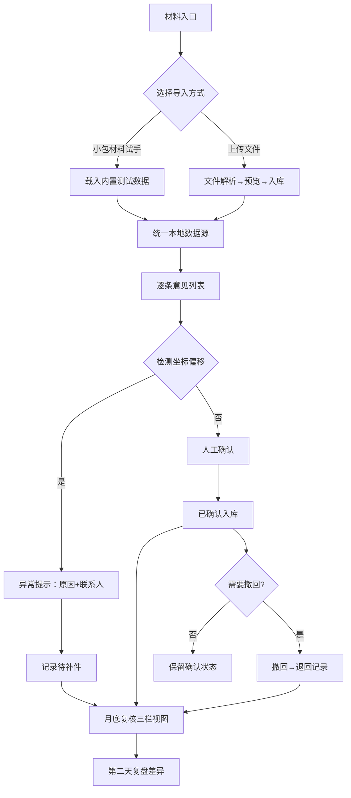

## 1. 产品概述

"消防分区交底清单"是面向施工经理的现场交底管理工具，解决会议纪要遗漏、人工改判追溯难、月底复核混乱等问题。核心价值在于：将导入、确认、撤回、页面摘要统一接入同一份本地数据，确保每一条意见从会议纪要到最终交底全链路可追溯。

- **目标用户**：施工经理（如阿乔）、现场工程师、月底复核人员
- **核心痛点**：旧意见遗漏、人工改判无据、复核分类不清、异常卡壳无指引

## 2. 核心功能

### 2.1 用户角色

| 角色 | 使用场景 | 核心权限 |
|------|----------|----------|
| 施工经理 | 日常交底管理 | 导入材料、人工确认/撤回、月底复核 |
| 现场工程师 | 补充说明材料 | 上传补件、查看待办 |
| 复核人员 | 月底批量复核 | 分类筛选、导出汇总 |

### 2.2 功能模块

1. **交底清单主页**：材料入口卡片、数据摘要面板、状态分类导航
2. **材料导入页面**：小包测试材料导入（会议纪要+人工改判+补充说明）
3. **交底详情页面**：单条意见溯源、人工确认弹窗、差异对比复盘
4. **月底复核页面**：已确认/待补件/退回三栏视图、批量操作
5. **异常处理提示**：模型坐标偏移时的卡住原因说明+下一步联系人指引

### 2.3 页面详情

| 页面名称 | 模块名称 | 功能描述 |
|----------|----------|----------|
| 交底清单主页 | 材料入口卡片 | 上传按钮+小包材料快速载入按钮，附带文字说明 |
| 交底清单主页 | 数据摘要面板 | 总数/已确认/待补件/退回四项实时统计 |
| 交底清单主页 | 分类导航栏 | 全部/已确认/待补件/退回四个Tab切换 |
| 材料导入页面 | 三步导入向导 | 选择文件→解析预览→确认入库 |
| 材料导入页面 | 小包材料按钮 | 一键载入内置测试数据（会议纪要+改判+说明） |
| 交底详情页面 | 意见溯源链 | 展示会议纪要原文→人工改判→补充说明的链路 |
| 交底详情页面 | 人工确认弹窗 | 确认前内容+确认后内容并排对比，含备注输入 |
| 交底详情页面 | 撤回按钮 | 已确认项可撤回，记录撤回原因和操作人 |
| 交底详情页面 | 差异对比面板 | 前后变化高亮标注，操作时间+操作人留痕 |
| 月底复核页面 | 三栏看板 | 已确认/待补件/退回分列展示，支持拖拽 |
| 月底复核页面 | 筛选器 | 按分区、负责人、时间范围筛选 |
| 异常处理弹窗 | 卡壳原因说明 | 模型坐标偏移量、影响区域、风险等级 |
| 异常处理弹窗 | 下一步指引 | 具体联系人姓名+岗位+联系电话，一键拨号 |

## 3. 核心流程

施工经理阿乔日常操作流程：打开交底清单→载入小包测试材料→系统自动从会议纪要抽取意见→逐条核对→碰到模型坐标偏移时弹出异常提示（说明原因+找谁补）→无异常则人工确认→确认后发现问题可撤回→月底进入复核页面按三栏分类查看→第二天可在详情页查看人工确认前后的差异复盘。

## 4. 用户界面设计

### 4.1 设计风格

- **主色调**：消防安全橙（#E85D26）+ 工程蓝（#1E40AF），形成警示与专业的平衡
- **辅助色**：确认绿（#059669）、待办黄（#D97706）、退回红（#DC2626）
- **按钮风格**：方角微圆（6px），强调按钮带2px下边框营造立体感，hover时有轻微上浮
- **字体**：标题用"思源黑体 Heavy"，正文用"思源宋体 Regular"，数字用"JetBrains Mono"
- **布局风格**：顶部导航+左侧摘要+右侧主内容的三栏工程化布局，卡片带细微边框分隔
- **图标风格**：Lucide线性图标，操作按钮配图标+文字双编码

### 4.2 页面设计概览

| 页面名称 | 模块名称 | UI要素 |
|----------|----------|--------|
| 交底清单主页 | 材料入口卡片 | 橙色渐变背景+大尺寸上传图标+说明文字，小包材料按钮用描边样式突出"试手"含义 |
| 交底清单主页 | 数据摘要面板 | 四个圆角卡片，左上数字用大号JetBrains Mono字体，底部配趋势箭头 |
| 交底清单主页 | 分类导航栏 | Tab式导航，激活态下方有3px橙色下划线，带滑动动画 |
| 材料导入页面 | 三步向导 | 时间轴式进度指示，已完成步骤打绿勾 |
| 交底详情页面 | 意见溯源链 | 竖向时间线，每个节点用不同颜色区分来源类型 |
| 交底详情页面 | 人工确认弹窗 | 前后对比用左右分栏，中间有"→"箭头连接变化项 |
| 交底详情页面 | 差异对比面板 | 变化内容用绿色新增/红色删除的diff样式高亮 |
| 月底复核页面 | 三栏看板 | 类似Trello的卡片瀑布流，卡片间有细微间距 |
| 异常处理弹窗 | 卡壳提示 | 红橙色警示边框+图标，原因区用项目符号清晰列出 |

### 4.3 响应式

- 桌面端（1280px+）：三栏完整布局，详情弹窗居中展示
- 平板端（768-1279px）：摘要栏折叠为顶部横向卡片，三栏复核变为可滑动
- 移动端（<768px）：导航变底部Tab，列表变为单列卡片堆叠
- 所有触控目标最小44×44px，弹窗支持下滑关闭手势

### 4.4 动效细节

- 页面加载：分模块错峰淡入（50ms间隔），营造有序感
- 状态变更：确认/撤回后卡片背景色有1.2s渐变过渡动画
- 异常提示：弹窗出现时边框有3次脉冲闪烁（2s内完成）
- 拖拽操作：月底复核卡片拖拽时有阴影放大+轻微旋转效果
