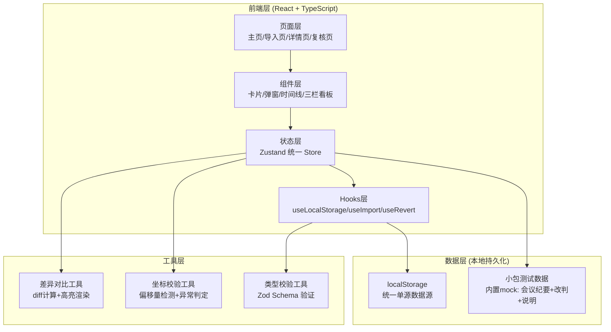
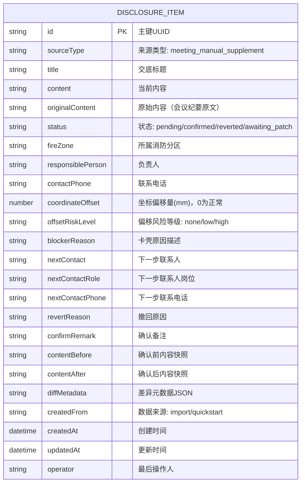

## 1. 架构设计



## 2. 技术说明

- **前端框架**：React@18 + TypeScript + Vite@5
- **样式方案**：TailwindCSS@3（工程化布局）+ CSS变量（主题色管理）
- **路由管理**：React Router DOM@6（单页应用路由）
- **状态管理**：Zustand@4（单一数据源，含持久化中间件）
- **本地存储**：localStorage + zustand-persist（自动序列化/反序列化）
- **图标库**：lucide-react@0.344（线性图标体系）
- **数据校验**：zod@3（导入数据Schema校验）
- **差异对比**：diff-match-patch（文本差异计算）
- **后端/数据库**：无（纯前端本地数据方案，接口不铺开）

## 3. 路由定义

| 路由路径 | 页面组件 | 页面用途 |
|----------|----------|----------|
| `/` | ChecklistHome | 交底清单主页：摘要+分类列表+材料入口 |
| `/import` | ImportPage | 材料导入页：三步向导+小包材料一键载入 |
| `/item/:id` | ItemDetailPage | 交底详情页：溯源链+确认/撤回+差异复盘 |
| `/review` | MonthlyReviewPage | 月底复核页：三栏看板+筛选+批量操作 |
| `*` | NotFoundPage | 404异常出口：返回主页按钮 |

## 4. 数据模型

### 4.1 ER图



### 4.2 小包测试数据（初始Mock）

| 字段 | 测试数据示例 |
|------|-------------|
| 来源类型 | 会议纪要 |
| 标题 | A区防火卷帘门安装交底 |
| 原始内容 | "2026-06-05周会：A区1-3层防火卷帘门安装位置参照图号FR-012，底标高+5.200m" |
| 人工改判内容 | "施工经理阿乔改判：底标高调整为+5.350m，因现场风管交叉需抬高150mm" |
| 补充说明 | "2026-06-08补充：已与设计院确认，结构梁底有余量，调整可行" |
| 坐标偏移 | 23mm（触发异常提示场景） |

### 4.3 本地存储Schema

```typescript
// localStorage key: fire-disclosure-store
interface PersistedState {
  items: DisclosureItem[];
  summary: {
    total: number;
    confirmed: number;
    awaitingPatch: number;
    reverted: number;
  };
  lastOperator: string;
  lastSyncAt: string;
}
```

## 5. 状态管理设计

### 5.1 Zustand Store 方法

| 方法名 | 入参 | 返回 | 副作用 |
|--------|------|------|--------|
| `importItems` | `File[] \| 'quickstart'` | `{success, count, errors}` | 解析并写入items，更新summary，持久化 |
| `confirmItem` | `id, remark, contentAfter` | `DisclosureItem` | 改status为confirmed，记录contentBefore/After，计算diff，持久化 |
| `revertItem` | `id, reason` | `DisclosureItem` | 改status为reverted，记录revertReason，持久化 |
| `flagAwaitingPatch` | `id, blockerReason, contactInfo` | `DisclosureItem` | 改status为awaiting_patch，记录异常信息，持久化 |
| `getFilteredItems` | `filter: StatusFilter` | `DisclosureItem[]` | 按状态筛选返回，不触发持久化 |
| `getItemTimeline` | `id` | `TimelineNode[]` | 组装单条意见的溯源链（原始→改判→补充→确认/撤回） |
| `computeDiff` | `id` | `DiffResult` | 计算contentBefore vs contentAfter的差异元数据 |
| `getSummary` | 无 | `SummaryStats` | 实时计算四项统计数 |
| `resetAll` | 无 | `void` | 清空所有数据（测试用） |

### 5.2 单一数据源原则

所有页面（导入→列表→详情→复核）的操作**必须**通过同一个Zustand Store的方法读写，禁止任何页面直接操作localStorage。保证：
- 导入入库后，摘要和列表立即反映
- 确认后撤回，状态流转可闭环
- 月底复核分类与列表页状态一致
- 第二天复盘差异读取同一套contentBefore/After快照

## 6. 异常出口设计

| 异常场景 | 用户可感知的出口 |
|----------|------------------|
| 导入文件格式错误 | 红色toast提示+保留在导入页重试+错误详情可展开 |
| 模型坐标偏移>阈值 | 模态弹窗：原因（偏移量/影响范围）+ 下一步联系人卡片 |
| 确认后撤回 | 确认二次弹窗+必须填写撤回原因+退回记录自动归类 |
| 数据校验失败 | Zod错误映射为中文提示+字段级标红 |
| 路由不存在 | 404页面：图标+说明+返回主页按钮（异常出口清晰可见） |
