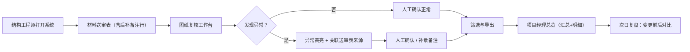

## 1. 产品概述

面向建筑工程项目的屋面排水图纸复核工具，解决结构工程师从材料送审表翻找、现场变更未同步到模型、碰撞点异常被忽略等痛点，为项目经理提供汇总口径一致的异常明细与变更追踪。

- 目标用户：结构工程师（复核执行）、项目经理（汇总与复盘）
- 核心价值：减少复核翻找成本、确保异常痕迹可追溯、对齐汇总与明细口径

## 2. 核心功能

### 2.1 用户角色

| 角色 | 使用场景 | 核心权限 |
|------|----------|----------|
| 结构工程师 | 执行屋面排水图纸复核 | 查看材料送审表、标记异常、空间位置核对、人工确认、补录备注 |
| 项目经理 | 汇总查看与复盘 | 查看总数/异常明细、变更前后对比、导出报告、复盘记录 |

### 2.2 功能模块

1. **材料送审表页面**：标准数据行 + 后补备注行展示，三四条示例数据
2. **图纸复核工作台**：空间位置示意、异常高亮、送审表来源关联、人工确认操作
3. **筛选与导出中心**：多条件筛选、异常痕迹保留、CSV/打印导出
4. **项目经理总览**：汇总卡片、异常明细钻取、变更对比时间线
5. **复盘记录页**：人工确认前后差异对比、操作日志、补录记录回溯

### 2.3 页面详情

| 页面名称 | 模块名称 | 功能描述 |
|----------|----------|----------|
| 材料送审表 | 数据表格 | 展示排水材料/管件/坡度等标准行，含一条后补备注行（非标准格式） |
| 材料送审表 | 状态标签 | 已复核/异常/待复核三色标签，异常行高亮底色 |
| 图纸复核工作台 | 平面示意图 | 屋面俯视简图，雨水斗/立管/天沟用色块标注位置 |
| 图纸复核工作台 | 异常标记点 | 红色闪烁标记碰撞/坡度异常/变更未同步点，点击弹出详情 |
| 图纸复核工作台 | 来源关联面板 | 点击图元跳转对应送审表行，显示材料批次信息 |
| 图纸复核工作台 | 人工确认操作 | 确认正常/标记异常/后补备注三按钮，操作留痕 |
| 筛选与导出中心 | 筛选面板 | 按异常类型/状态/日期/负责人筛选，异常行始终置顶 |
| 筛选与导出中心 | 导出模块 | 导出 CSV 含异常标记列 + 变更备注列，打印样式保留高亮 |
| 项目经理总览 | 汇总卡片 | 总数/异常数/已确认数/待处理数 KPI 卡片 |
| 项目经理总览 | 异常明细表 | 异常类型、位置、来源、状态、确认人，支持点击钻取 |
| 项目经理总览 | 口径对齐说明 | 汇总口径=异常明细求和的规则说明提示 |
| 复盘记录页 | 变更对比 | 左右两栏：确认前/确认后数据对比，差异部分红色下划线 |
| 复盘记录页 | 操作日志时间线 | 谁、何时、做了什么操作，带时间戳 |
| 复盘记录页 | 补录记录 | 显示所有非标准后补备注，与标准行区分展示 |

## 3. 核心流程

结构工程师打开系统 → 进入材料送审表查看 → 切换到图纸复核工作台核对空间位置 → 发现异常（碰撞/坡度错误/变更未同步）→ 点击异常点关联送审表来源 → 人工确认（正常/异常/补录备注）→ 筛选异常记录并导出 → 项目经理查看总览汇总与异常明细 → 次日复盘打开变更对比，查看确认前后改了什么 → 复盘完成

## 4. 用户界面设计

### 4.1 设计风格

- 主色：工程蓝 `#1E40AF`（专业、稳重），辅色：警示橙 `#F59E0B`、异常红 `#DC2626`、成功绿 `#059669`
- 背景：浅灰渐变 + 细微网格纹理（工程图纸感）
- 字体：标题用 "Noto Serif SC" 宋体（工程文档气质），正文用 "JetBrains Mono" 等宽（数据表格对齐）
- 按钮：方中带小圆角（4px），左侧带细竖条色标，按下有下沉感
- 卡片：浅灰描边 + 投影，异常卡片带左侧红色 4px 竖条
- 图标：线性风格 + 工程感图标（尺、图纸、水滴、管道、警示三角）
- 布局：左侧导航栏 + 顶部面包屑 + 右侧工作区（三栏式）

### 4.2 页面设计概述

| 页面名称 | 模块名称 | UI 元素 |
|----------|----------|----------|
| 材料送审表 | 数据表格 | 斑马纹行、异常行红底、后补备注行带黄色便签角标、状态胶囊标签 |
| 图纸复核工作台 | 平面示意图 | SVG 屋面轮廓、渐变色块分区、红点脉动动画、悬停放大 |
| 图纸复核工作台 | 关联面板 | 右侧抽屉滑出、送审表行复制、来源链面包屑 |
| 项目经理总览 | 汇总卡片 | 四宫格 KPI、数字大号加粗、趋势小箭头、异常卡片闪红边框 |
| 项目经理总览 | 异常明细表 | 分组折叠、口径对齐小问号提示、点击行高亮 |
| 复盘记录页 | 变更对比 | 左右对比卡、差异处红框高亮+下划线、时间戳水印 |
| 复盘记录页 | 操作日志 | 竖线时间线、圆点节点、操作类型色标 |

### 4.3 响应式

桌面优先（1280px+），表格允许横向滚动，导航栏在 <960px 折叠为汉堡菜单，卡片纵向堆叠。

### 4.4 异常高亮设计细节

- 表格异常行：`#FEE2E2` 浅红底 + `#DC2626` 左边框
- 异常标记点：SVG `circle` + 外圈 `animate` 脉动（r 从 6→10→6 循环）
- 变更对比差异：`text-decoration: underline wavy #DC2626` 波浪下划线
- 后补备注行：`#FEF3C7` 浅黄底 + 右上角折角装饰
- 筛选后异常行：`sticky` 置顶 + `z-index` 叠层高一级
