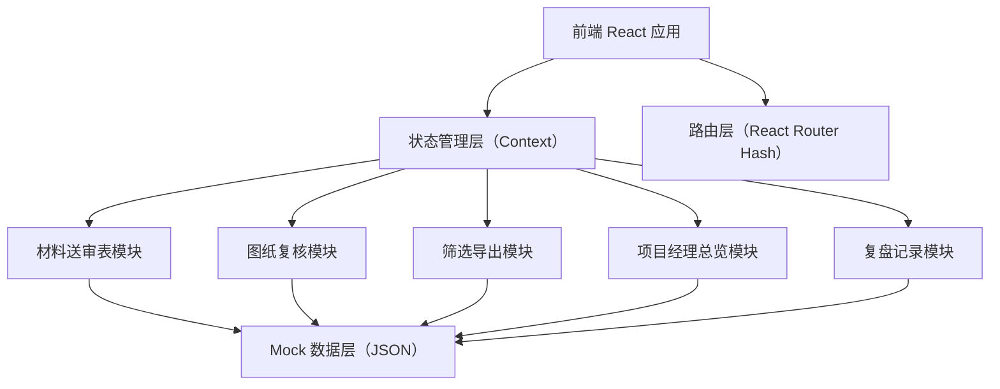
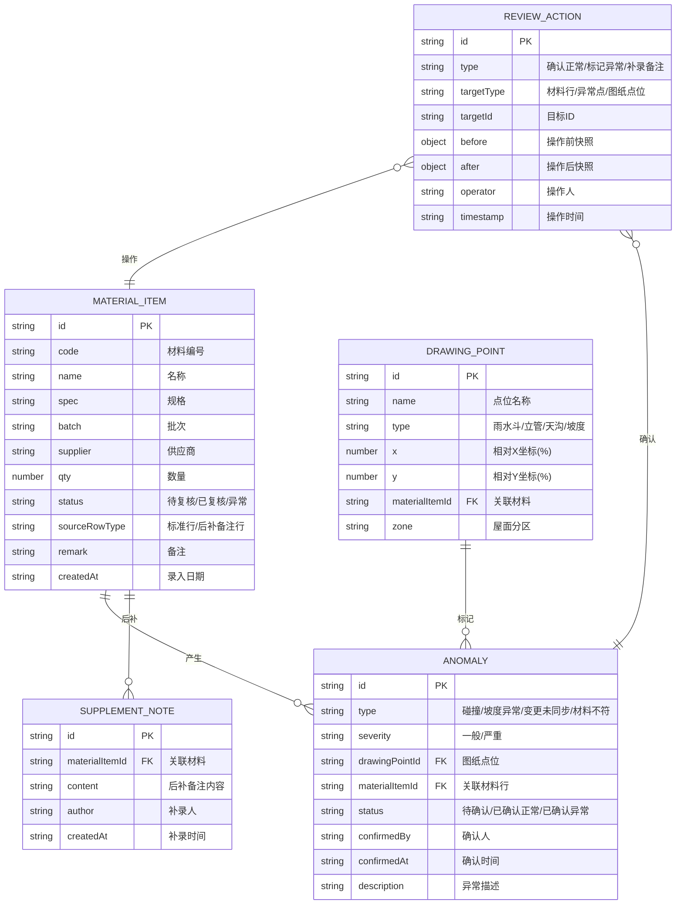

## 1. 架构设计



## 2. 技术描述

- 前端：React@18 + TypeScript + tailwindcss@3 + Vite@5
- 路由：react-router-dom@6（HashRouter，纯静态部署）
- 状态管理：React Context + useReducer（轻量，避免外部依赖）
- 图表/示意：原生 SVG + CSS 动画（无需额外图表库）
- 导出：纯前端 CSV 生成（Blob + URL.createObjectURL）+ 打印样式（@media print）
- 样式设计：Tailwind CSS + CSS 变量（主题色统一）
- 字体：Google Fonts CDN（Noto Serif SC + JetBrains Mono）
- 数据：内置 Mock 数据（三四条真实场景数据），localStorage 持久化用户操作

## 3. 路由定义

| 路由 | 页面 / 用途 |
|------|------------|
| `/` | 重定向到 `/dashboard` |
| `/dashboard` | 项目经理总览（首页，汇总 + 异常明细） |
| `/material-review` | 材料送审表页面（标准行 + 后补备注行） |
| `/drawing-review` | 图纸复核工作台（空间位置 + 异常高亮 + 来源关联） |
| `/export-center` | 筛选与导出中心 |
| `/review-log` | 复盘记录页（变更对比 + 操作日志 + 补录记录） |

## 4. 数据模型

### 4.1 数据模型定义



### 4.2 Mock 初始数据（三四条场景数据）

**材料送审表（4条，含1条后补备注）：**
1. WL-001 雨水斗 Φ110 批次202605A 宝狮塑业 12个 已复核 标准行
2. PS-003 排水立管 De160 批次202604C 宝狮塑业 8根 异常 标准行（现场安装位置变更未回模型）
3. TG-007 天沟 200×150 批次202605B 顺达金属 36米 待复核 标准行（与风机基础碰撞）
4. BZ-001 后补备注 — — — — 待复核 后补备注行（屋面东侧坡度实测2%，图纸标注1.5%，现场已按2%施工，补录人：老叶 2026-06-08）

**图纸点位（对应4处位置）：**
- A区雨水斗A1（关联WL-001）
- B区立管B3（关联PS-003，变更未同步）
- C区天沟C7（关联TG-007，碰撞点）
- D区坡度检测点（关联BZ-001，后补备注关联）

**异常（3条，覆盖3类）：**
1. 类型：变更未同步 → 立管B3 / PS-003 → 严重 → 待确认
2. 类型：碰撞 → 天沟C7 / TG-007 → 严重 → 待确认
3. 类型：坡度异常 → D区坡度 / BZ-001 → 一般 → 待确认

## 5. 核心模块实现要点

### 5.1 材料送审表模块
- 表格使用 `<table>` + Tailwind，后补备注行自定义 className
- 状态筛选：useState + filter 组合
- 点击行 ID 跳转到 `/drawing-review` 并高亮对应点位（URL hash + state）

### 5.2 图纸复核模块
- SVG 绘制 600×400 屋面轮廓矩形，内部按 A/B/C/D 四区分割
- DRAWING_POINT 的 x/y 为百分比，使用 SVG `foreignObject` 容纳脉动标记
- 点击点位：useContext 触发右侧抽屉，展示关联 MATERIAL_ITEM + ANOMALY
- 人工确认三按钮：dispatch action → 写入 REVIEW_ACTION → 更新 ANOMALY.status

### 5.3 筛选与导出模块
- 筛选器：受控表单，条件合并为 filterFn
- 异常痕迹：导出 CSV 新增两列「异常标记」「变更备注」，异常行填充说明
- CSV 导出：`text/csv;charset=utf-8;` + BOM 头（Excel 中文兼容）
- 打印：`@media print` 隐藏导航，异常行保留背景色（`print-color-adjust: exact`）

### 5.4 项目经理总览模块
- 汇总卡片：reduce 计算 ANOMALY 各状态数量，异常数 >0 时卡片边框闪红动画
- 异常明细：table 分组按 type，底部显示口径对齐说明「汇总 = Σ各异常类型明细」
- 钻取：点击行 → navigate 到 `/drawing-review` 并预设高亮

### 5.5 复盘记录模块
- 变更对比：REVIEW_ACTION 中 before/after JSON 序列化，字段级 diff 展示
- 操作日志时间线：flex + 左侧竖线，节点 color 映射操作类型
- 补录记录：filter SUPPLEMENT_NOTE，独立卡片列表 + 与标准行颜色区分

## 6. 主题与样式变量

```css
:root {
  --brand: #1E40AF;
  --brand-light: #3B82F6;
  --danger: #DC2626;
  --warning: #F59E0B;
  --success: #059669;
  --note-bg: #FEF3C7;
  --anomaly-bg: #FEE2E2;
  --grid: #E5E7EB;
}
```
